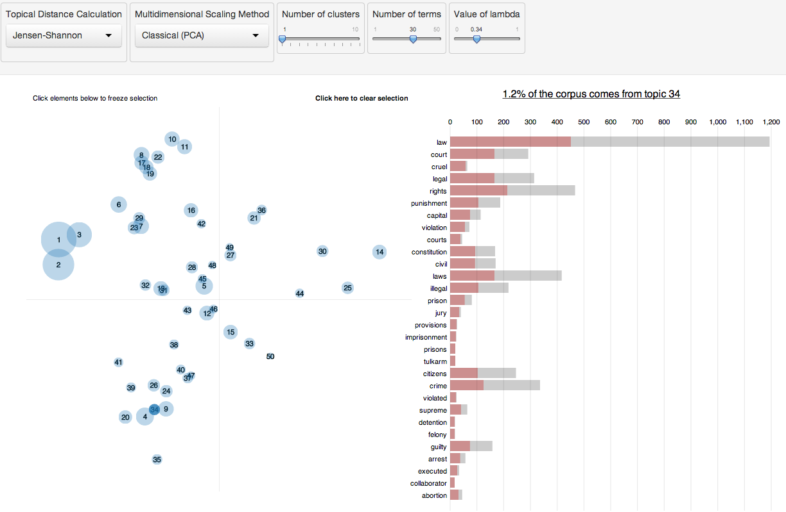

\chapter{LDAvis: A method for visualizing and interpreting topics}

This chapter is a paper published in The Proceedings of the Workshop on Interactive Language Learning, Visualization, and Interfaces (ACL 2014) [Sievert:2014b]. I am the primary author of the paper which is avaliable online here http://nlp.stanford.edu/events/illvi2014/papers/sievert-illvi2014.pdf

The formatting of paper has been modified to make for consistent typesetting across the thesis.

\specialchapt{ABSTRACT}


<!--
\usepackage{acl2014}
\usepackage{times}
\usepackage{url}
\usepackage{latexsym}
\usepackage{graphicx}
\usepackage{amsmath}
-->

We present \texttt{LDAvis}, an \texttt{R} package for creating 
We present \texttt{LDAvis}, a web-based interactive visualization of topics estimated using Latent Dirichlet Allocation that is built using a combination of R and d3. Our visualization provides a global view of the topics (and how they differ from each other), while at the same time allowing for a deep inspection of the tokens most highly associated with each individual topic. First, we propose a novel method for choosing which tokens to present to a user to aid in the task of topic interpretation, in which we define the \emph{relevance} of a token to a topic. Second, we present the results of a user study that illustrates how ranking tokens by their relevance to a given topic relates to that topic's interpretability, and we recommend a default method of computing relevance to maximize topic interpretability. Last, we incorporate relevance into \texttt{LDAvis} in a way that allows users to flexibly explore topic-token relationships to better understand a fitted LDA model.

\section{Introduction}\label{section:introduction}

Recently much attention has been paid to visualizing the output of topic models fit using Latent Dirichlet Allocation (LDA) [@Gardner]; [@Blei-2012]; [@2012-termite]; [@Gretarsson]. Such visualizations are challenging to create because of the high dimensionality of the fitted model -- LDA is typically applied to thousands of documents, which are modeled as mixtures of dozens of topics, which themselves are modeled as distributions over thousands of tokens [@Blei-2003]; [@Griffiths]. The most promising basic technique for creating LDA visualizations that are both compact and thorough is \emph{interactivity}.

We introduce an interactive visualization system that we call \texttt{LDAvis} that attempts to answer a few basic questions about a fitted topic model: (1) What is the meaning of each topic?, (2) How prevalent is each topic?, and (3) How do the topics relate to each other? Different visual components answer each of these questions, some of which are original, and some of which are borrowed from existing tools.

Our visualization (illustrated in Figure \@ref(fig:overview)) has two basic pieces. First, the left panel of our visualization presents a "global" view of the topic model, and answers questions 2 and 3. In this view, we plot the topics as circles in the two-dimensional plane whose centers are determined by computing the distance between topics (using a distance measure of the user's choice) and then by using multidimensional scaling to project the inter-topic distances onto two dimensions, as is done in [@2012-trust]. We encode each topic's overall prevalence using the areas of the circles, where we sort the topics in decreasing order of prevalence.

Second, the right panel of our visualization depicts a horizontal barchart whose bars represent the individual tokens that are the most useful for interpreting the currently selected topic on the left, and allows users to answer question 1, "What is the meaning of each topic?". A pair of overlaid bars represent both the corpus-wide frequency of a given token as well as the topic-specific frequency of the token, as in [@2012-termite].

The left and right panels of our visualization are linked such that selecting a topic (on the left) reveals the most useful tokens (on the right) for interpreting the selected topic. In addition, selecting a token (on the right) reveals the conditional distribution over topics (on the left) for the selected token. This kind of linked selection allows users to examine a large number of topic-token relationships in a compact manner.

```{r overview, echo = FALSE, fig.cap = "The layout of LDAvis, with the global topic view on the left, and the token barcharts on the right. Linked selections allow users to reveal aspects of the topic-token relationships compactly."}

```

A key innovation of our system is how we determine the most useful tokens for interpreting a given topic, and how we allow users to interactively adjust this determination. A topic in LDA is a multinomial distribution over the tokens in the vocabulary, where the vocabulary typically contains thousands of tokens. To interpret a topic, one typically examines a ranked list of the most probable tokens in that topic, using anywhere from three to thirty tokens in the list. The problem with interpreting topics this way is that common tokens in the corpus often appear near the top of such lists for multiple topics, making it hard to differentiate the meanings of these topics.

@Bischof propose ranking tokens for a given topic in terms of both the \emph{frequency} of the token under that topic as well as the token's \emph{exclusivity} to the topic, which accounts for the degree to which it appears in that particular topic to the exclusion of others. We propose a similar measure that we call the \emph{relevance} of a token to a topic to create a flexible method for ranking tokens in order of usefulness for interpreting topics. We discuss our definition of relevance, and its graphical interpretation, in detail in Section \ref{section:relevance}. We also present the results of a user study conducted to determine the optimal tuning parameter in the definition of relevance to aid the task of topic interpretation in Section~\ref{section:userstudy}, and we describe how we incorporate relevance into our interactive visualization in Section~\ref{section:system}.

\section{Related Work}\label{section:relatedwork}

Much work has been done recently regarding the interpretation of topics (i.e. measuring topic "coherence") as well as visualization of topic models.

\subsection{Topic Interpretation and Coherence}

It is well-known that the topics inferred by LDA are not always easily interpretable by humans. @Chang established via a large user study that standard quantitative measures of fit, such as those summarized by @Wallach, do not necessarily agree with measures of topic interpretability by humans. @Ramage assert that "characterizing topics is hard" and describe how using the top-$k$ tokens for a given topic might not always be best, but offer few concrete alternatives.

@AlSumait, @Mimno, and @2013-diagnostics develop quantitative methods for measuring the interpretability of topics based on experiments with data sets that come with some notion of topical ground truth, such as document metadata or expert-created topic labels. These methods are useful for understanding, in a global sense, which topics are interpretable (and why), but they don't specifically attempt to aid the user in interpreting \emph{individual} topics.

@Blei-2009 developed "Turbo Topics", a method of identifying n-grams within LDA-inferred topics that, when listed in decreasing order of probability, provide users with extra information about the usage of tokens within topics. This two-stage process yields good results on experimental data, although the resulting output is still simply a ranked list containing a mixture of tokens and n-grams, and the usefulness of the method for topic interpretation was not tested in a user study.

@Newman-JCDL describe a method for ranking tokens within topics to aid interpretability called Pointwise Mutual Information (PMI) ranking. Under PMI ranking of tokens, each of the ten most probable tokens within a topic are ranked in decreasing order of approximately how often they occur in close proximity to the nine other most probable tokens from that topic in some large, external "reference" corpus, such as Wikipedia or Google n-grams. Although this method correlated highly with human judgments of token importance within topics, it does not easily generalize to topic models fit to corpora that don't have a readily available external source of word co-occurrences.

In contrast, @Taddy uses an intrinsic measure to rank tokens within topics: a quantity called \emph{lift}, defined as the ratio of a token's probability within a topic to its marginal probability across the corpus. This generally decreases the rankings of globally frequent tokens, which can be helpful. We find that it can be noisy, however, by giving high rankings to very rare tokens that occur in only a single topic, for instance. While such tokens may contain useful topical content, if they are very rare the topic may remain difficult to interpret.

Finally, @Bischof propose and implement a new statistical topic model that infers both a token's frequency as well as its \emph{exclusivity} -- the degree to which its occurrences are limited to only a few topics. They introduce a univariate measure called a FREX score ("$\mathbf{FR}$equency and $\mathbf{EX}$clusivity") which is a weighted harmonic mean of a token's rank within a given topic with respect to frequency and exclusivity, and they recommend it as a way to rank tokens to aid topic interpretation. We propose a similar method that is a weighted average of a token's probability and its lift, and we justify it with a user study and incorporate it into our interactive visualization.

\subsection{Topic Model Visualization Systems}

A number of visualization systems for topic models have arisen in recent years. Several of them focus on allowing users to browse documents, topics, and tokens to learn about the relationships between these three canonical topic model units [@Gardner]; [@Blei-2012] [@Snyder]. These browsers typically use lists of the most probable tokens within topics to summarize the topics, and the visualization elements are limited to barcharts or word clouds of token probabilities for each topic, pie charts of topic probabilities for each document, and/or various barcharts or scatterplots related to document metadata. Although these tools can be useful for browsing a corpus, we seek a more compact visualization, with the more narrow focus of quickly and easily understanding the individual topics themselves (without necessarily visualizing documents).


@2012-termite develop such a tool, called "Termite", which visualizes the set of topic-token distributions estimated in LDA using a matrix layout. The authors introduce two measures of the usefulness of tokens for understanding a topic model: \emph{distinctiveness} and \emph{saliency}. These quantities measure how much information a token conveys about a topic by computing the Kullback-Liebler divergence between the distribution of topics given the token and the marginal distribution of topics (distinctiveness), optionally weighted by the token's overall frequency (saliency). The authors recommend saliency as a thresholding method for selecting which tokens are included in the visualization, and they further use a seriation method for ordering the most salient tokens to highlight differences between topics.

Termite is a compact, intuitive interactive visualization of the topics in a topic model, but by only including tokens that rank high in saliency or distinctiveness, which are \emph{global} properties of tokens, it is restricted to providing a \emph{global} view of the model, rather than allowing a user to deeply inspect individual topics by visualizing a potentially different set of tokens for every single topic. In fact, @2013-termite describe the use of a "topic-specific word ordering" as potentially useful future work.

\section{Relevance of tokens to topics}

Here we define \emph{relevance}, our method for ranking tokens within topics, and we describe the results of a user study to learn an optimal tuning parameter in the computation of relevance.

\subsection{Definition of Relevance}\label{section:relevance}

Let $\phi_{kw}$ denote the probability of token $w \in \{1, ..., V\}$ for topic $k\in \{1, ..., K\}$, where $V$ denotes the number of unique tokens in the vocabulary, and  let $p_w$ denote the marginal probability of token $w$ in the corpus. One typically estimates $\phi$ in LDA using Variational Bayes methods or Collapsed Gibbs Sampling, and $p_w$ from the empirical distribution of the corpus (optionally smoothed by including prior weights as pseudo-counts).

We define the \emph{relevance} of token $w$ to topic $k$ given a weight parameter $\lambda$ (where $0 \leq \lambda \leq 1$) as:
$$
r(w, k \mid \lambda) = \lambda \log(\phi_{kw}) + (1 - \lambda)\log\Bigl(\frac{\phi_{kw}}{p_w}\Bigr),
$$
where $\lambda$ determines the weight given to the probability of token $w$ under topic $k$ relative to its lift. Setting $\lambda = 1$ results in the familiar ranking of tokens in decreasing order of their topic-specific probability, and setting $\lambda = 0$ ranks tokens solely by their lift, which we found anecdotally to result in "noisy" topics full of rare tokens. We wish to learn an "optimal" value of $\lambda$ for topic interpretation from our user study.

First, though, to see how different values of $\lambda$ result in different ranked token lists, consider the plot in Figure \@ref(fig:relevance). We fit a 50-topic model to the 20 Newsgroups data (details are described in Section~\ref{section:userstudy}) and plotted $\log$(lift) on the $y$-axis vs. $\log(\phi_{kw})$ on the $x$-axis for each token in the vocabulary (which has size $V=22,524$) for a given topic. Figure \@ref(fig:relevance) shows this plot for Topic 29, which occurred mostly in documents posted to the "Motorcycles" newsgroup, but also from documents posted to the "Automobiles" newsgroup and the "Electronics" newsgroup. Graphically, the line separating the most relevant tokens for this topic, given $\lambda$, has slope $-\lambda/(1 - \lambda)$ (see Figure \@ref(fig:relevance)).

For this topic, the top-5 most relevant tokens given $\lambda = 1$ (ranking solely by probability) are {out, #emailaddress, #twodigitnumer, up, #onedigitnumber}, where a '#' symbol denotes a token that is an entity representing a class of things. In contrast to this list, which contains globally common tokens and which provides very little meaning regarding motorcycles, automobiles, or electronics, the top-5 most relevant tokens given $\lambda = 1/3$ are {oil, plastic, pipes, fluid, and lights}. The second set of tokens is much more descriptive of the topic being discussed than the first.

```{r relevance, echo = FALSE, fig.cap = "Dotted lines separating the top-10 most relevant tokens for different values of $\\lambda$, with the most relevant tokens for $\\lambda$ = 2/3 displayed and highlighted in green."}
knitr::include_graphics("images/fig_topic29")
```

\subsection{User Study}\label{section:userstudy}

We conducted a user study to determine whether there was an optimal value of $\lambda$ in the definition of relevance to aid topic interpretation. First, we fit a 50-topic model to the $D=13,695$ documents in the 20 Newsgroups data which were posted to a single Newsgroup (rather than two or more Newsgroups). We used the Collapsed Gibbs Sampler algorithm [@Griffiths] to sample the latent topics for each of the $N=1,590,376$ tokens in the data, and we saved their topic assignments from the last iteration (after convergence). We then computed the 20 by 50 table, $T$, which contains, in cell $T_{gk}$, the count of the number of times a token from topic $k \in \{1, ..., 50\}$ was assigned to Newsgroup $g \in \{1, ..., 20\}$, where we defined the Newsgroup of a token to be the Newsgroup to which the document containing that token was posted. Some of the LDA-inferred topics occurred almost exclusively ($>90$% of occurrences) in documents from a single Newsgroup, such as Topic 38, which was the estimated topic for 15,705 tokens in the corpus, 14,233 of which came from documents posted to the "Medicine" (or "sci.med") Newsgroup. Other topics occurred in a wide variety of Newsgroups. One would expect these "spread-out" topics to be harder to interpret than the "pure" topics like Topic 38.

In the study we recruited 29 subjects among our colleagues, and each subject completed an online experiment consisting of 50 tasks, one for each topic in the fitted LDA model. Task $k$ (for $k \in \{1, ..., 50\}$) was to read a list of five tokens, ranked from 1-5 in terms of relevance to topic $k$, where $\lambda \in (0, 1)$ was randomly sampled to compute relevance. The user was instructed to identify which "topic" the list of tokens discussed from a list of three possible "topics", where their choices were names of the  Newsgroups. The correct answer for task $k$ (i.e. our "ground truth") was defined as the Newsgroup that contributed the most tokens to topic $k$ (i.e. the Newsgroup with the largest count in the $k$th column of the table $T$), and the two alternative choices were the Newsgroups that contributed the second and third-most tokens to topic $k$. 

We anticipated that the effect of $\lambda$ on the probability of a user making the correct choice could be different across topics. In particular, for "spread-out" topics that were inherently difficult to interpret, because their tokens were drawn from a wide variety of Newsgroups (similar to a "fused" topic in @2013-diagnostics), we expected the proportion of correct responses to be roughly 1/3 no matter the value of $\lambda$ used to compute relevance. Similarly, for very "pure" topics, whose tokens were drawn almost exclusively from one Newsgroup, we expected the task to be easy for any value of $\lambda$. To account for this, we analyzed the experimental data by fitting a varying-intercepts logistic regression model to allow each of the fifty topics to have its own baseline difficulty level, where the effect of $\lambda$ is shared across topics. We used a quadratic function of $\lambda$ in the model (linear, cubic and quartic functions were explored and rejected).

As expected, the baseline difficulty of each topic varied widely. In fact, seven of the topics were correctly identified by all 29 users, and one topic was incorrectly identified by all 29 users. For the remaining 42 topics we estimated a topic-specific intercept term to control for the inherent difficulty of identifying the topic (not just due to its tokens being spread among multiple Newsgroups, but also to account for the inherent familiarity of each topic to our subject pool -- subjects, on average, were more familiar with "Cars" than "The X Window System", for example).

```{r lambda, echo = FALSE, fig.cap = "A plot of the proportion of correct responses in a user study vs. the value of $\\lambda$ used to compute the most relevant tokens for each topic."}
knitr::include_graphics("images/fig_lambda")
```

The estimated effects of $\lambda$ and $\lambda^2$ were 2.74 and -2.34, with standard errors 1.03 and 1.00. Taken together, their joint effect was statistically significant ($\chi^2$ p-value = 0.018).
%, but the signs of their coefficients agreed with out intuition, and in a similarly designed large-scale user study (on Mechanical Turk, for instance), we expect that their joint effect would be statistically significant.
To see the estimated effect of $\lambda$ on the probability of correctly identifying a topic, consider Figure \@ref(fig:lambda). We plot binned proportions of correct responses (on the y-axis) vs. $\lambda$ (on the x-axis) for the 14 topics whose estimated topic-specific intercepts fell into the middle tercile among the 42 topics that weren't trivial  or impossible to identify. Among these topics there was roughly a 67\% baseline probability of correct identification. As Figure \@ref(fig:lambda) shows, for these topics, the "optimal" value of $\lambda$ was about 0.6, and it resulted in a 70\% - 75\% probability of correct identification, whereas for values of $\lambda$ near 0 or 1, the proportion of correct responses was closer to 55\% or 60\%. We view this as evidence that ranking tokens according to relevance, where $\lambda < 1$, can aid topic interpretation, even if this precise task (selecting a known topic label from a list of pre-defined labels associated with each document as metadata) is not always the goal. A similar conclusion might be drawn from an experiment to study the FREX token ranking method of @Bischof.

Note that in our experiment, we used the collection of single-posted 20 Newsgroups documents to define our "ground truth" data. An alternative method for collecting "ground truth" data would have been to recruit experts to label topics from an LDA model. We chose against this option because doing so would present a classic "chicken-or-egg" problem: If we use expert-labeled topics in an experiment to learn how to summarize topics so that they can be interpreted (i.e. "labeled"), we would only re-learn the way that our experts were instructed, or allowed, to label the topics in the first place! If, for instance, the experts were presented with a ranked list of the most probable tokens for each topic, this would influence the interpretations and labels they give to the topics, and the experimental result would be the circular conclusion that ranking tokens by probability allows users to recover the "expert" labels most easily. To avoid this, we felt strongly that we should use data in which documents have metadata associated with them. The 20 Newsgroups data provides an externally validated source of topic labels, in the sense that the labels were presented to users (in the form of Newsgroup names), and users subsequently filled in the content. It represents, essentially, a crowd-sourced collection of tokens, or content, for a certain set of topic labels.


\section{Our Visualization System}\label{section:system}

Our interactive, web-based visualization system, \texttt{LDAvis}, has two core functionalities that enable users to understand the topic-token relationships in a fitted LDA model, and a number of extra features that provide additional perspectives on the model.
%Usually these questions can not be answered easily with a few simple plots and/or metrics. Instead, an interactive layout such as \texttt{LDAvis} allows one to quickly explore model output, form new hypotheses and verify findings. 

```{r file, echo = FALSE, fig.cap = "The user has chosen to segment the topics into four clusters, and has selected the green cluster to populate the barchart with the most relevant tokens for that cluster. Then, the user hovered over the ninth bar from the top, 'file', to display the conditional distribution over topics for this token."}
knitr::include_graphics("images/fig_file_new2")
```


First and foremost, \texttt{LDAvis} allows one to select a topic to reveal the most relevant tokens for that topic. In Figure \@ref(fig:overview), Topic 34 is selected, and its 30 most relevant tokens (given $\lambda$ = 0.34, in this case) populate the bar chart to the right (ranked in order of relevance from top to bottom). The widths of the gray bars represent the corpus-wide frequencies of each token, and the widths of the red bars represent the topic-specific frequencies of each token. A slider allows users to change the value of $\lambda$, which can alter the rankings of tokens to aid topic interpretation. By default, $\lambda$ is set to 0.6, as suggested by our user study in Section~\ref{section:userstudy}. If $\lambda = 1$, tokens are ranked solely by $\phi_{kw}$, which implies the red bars would be sorted from widest (at the top) to narrowest (at the bottom). By comparing the widths of the red and gray bars for a given token, users can quickly understand whether a token is highly relevant to the selected topic because of its lift (a high ratio of red to gray), or its probability (absolute width of red). The top 3 most relevant tokens in Figure \@ref(fig:overview) are "law", "rights", and "court". Note that "law" is a common word which is generated by Topic 34 in about 40\% of its corpus-wide occurrences, whereas "cruel" is a relatively rare word with very high lift -- it occurs almost exclusively in Topic 34. Such properties of the topic-token relationship are readily visible in \texttt{LDAvis} for every topic.

On the left panel, two visual features provide a global perspective of the topics. First, the areas of the circles are proportional to the relative prevalences of the topics in the corpus, $\theta_k$, which can be computed as $\theta_k = \sum_d N_d\theta_{dk}$ for documents $d = 1, ..., D$, where document $d$ contains $N_d$ tokens. In the 50-topic model fit to the 20 Newsgroups data, the first three topics comprise 12\%, 9\%, and 6\% of the corpus, and all contain common, non-specific tokens (although there are differences: Topic 2 contains formal debate-related language such as "conclusion", "evidence", and "argument", whereas Topic 3 contains slang conversational language such as "kinda", "like", and "yeah"). In addition to visualizing topic prevalence, the left pane shows inter-topic differences.  The default for computing inter-topic distances is Jensen-Shannon divergence, although other metrics are enabled. The default for scaling the set of inter-topic distances defaults to Principal Components, but other other algorithms are also enabled.


The second core feature of \texttt{LDAvis} is the ability to select a token (by hovering over it) to reveal its conditional distribution over topics. This distribution is visualized by altering the areas of the topic circles such that they are proportional to the token-specific frequencies across the corpus. This allows the user to verify, as discussed in @2012-trust, whether the multidimensional scaling of topics has faithfully clustered similar topics in two-dimensional space. For example, in Figure \@ref(fig:file), the token "file" is selected. In the majority of this token's occurrences, it is drawn from one of several topics located in the upper left-hand region of the global topic view. Upon inspection, this group of topics can be interpreted broadly as a discussion of computer hardware and software. This verifies, to some extent, their placement, via multidimensional scaling, into the same two-dimensional region. It also suggests that the word "file" used in this context refers to a computer file. However, there is also conditional probability mass for the token "file" on Topic 34. As shown in Figure \@ref(fig:overview), Topic 34 can be interpreted as discussing the criminal punishment system where "file" refers to court filings. Similar discoveries can be made for any word that exhibits polysemy (such as "drive" appearing in computer- and automobile-related topics, or "ground" occurring in electrical- and baseball-related topics). 

Beyond its within-browser interaction capability, \texttt{LDAvis} leverages the \texttt{R} language to allow users to easily alter the topical distance measurement as well as the multidimensional scaling algorithm to produce the global topic view. In addition, there is an option to apply $k$-means clustering to the topics (as a function of their two-dimensional locations in the global topic view). This is merely an effort to facilitate semantic zooming in an LDA model with many topics where `after-the-fact' clustering may be an easier way to learn clusters of topics, rather than fitting a hierarchical topic model [@Blei-hierarchical], for example. Selecting a cluster (or region) of topics reveals the most relevant tokens for that group of topics, where the token distribution of a cluster of topics is defined as the average of the token distributions of the individual topics in the cluster. In Figure \@ref(fig:file), the green cluster of topics is selected, and the most relevant tokens are predominantly related to computer hardware and software.


\section{Discussion}\label{section:futurework}

We have described a web-based, interactive visualization system, \texttt{LDAvis}, that enables deep inspection of topic-token relationships in an LDA model, while simultaneously providing a "global" view of the topics, via their prevalences and similarities to each other, in a compact space. We also propose a novel way to rank tokens within topics to aid in the task of topic interpretation, and we present a user study that attempts to not only \emph{measure} the interpretability of a topic, but also how to \emph{maximize} the interpretability of the topic.

For future work, we anticipate performing a larger user study to further understand how to facilitate topic interpretation in fitted LDA models, including a comparison of multiple methods, such as ranking by Turbo Topics [@Blei-2009] or FREX scores [@Bischof], in addition to relevance. We also note the need to visualize correlations between topics, as this can provide insight into what is happening on the document level without actually displaying entire documents. Last, we seek a solution to the problem of visualizing a large number of topics (say, from 100 - 500 topics) in a compact way.
