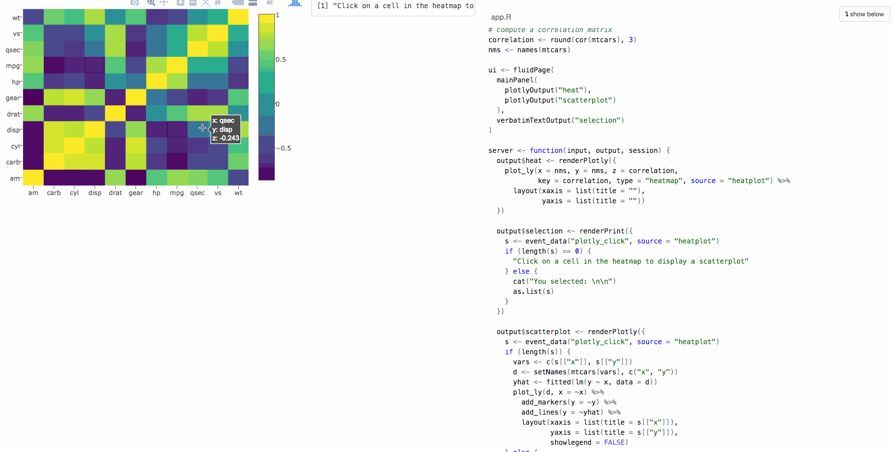

```{r, include=FALSE}
options(
  dplyr.print_min = 6, dplyr.print_max = 6, width = 70,
  digits = 3, htmltools.dir.version = FALSE
)
knitr::opts_chunk$set(
  comment = "#>",
  collapse = TRUE,
  warning = FALSE,
  message = FALSE,
  cache = TRUE
)
```


\chapter{Problem statement}

> "[The web] has helped broaden the focus of statistics from the modeling stage to all stages of data science: finding relevant data, accessing data, reading and transforming data, visualizing the data in rich ways, modeling, and presenting the results and conclusions with compelling, interactive displays." - [@nolan-lang]

The web enables broad distribution and presentation of applied statistics products and research. Partaking often requires a non-trivial understanding of web technologies, unless a custom interface is designed for the particular task. The CRAN task views on _open data_ [@OpenData] and _web services_ [@WebServices] document such interfaces for the R language, the world's leading open source data science software [@RCore]. This large community effort helps R users make their work easily accessible, portable, and interactive.

R has a long history of serving as an interface to computational facilities for the use of people doing data analysis and statistics research. In fact, the motivation behind the birth of R's predecessor, S, was to provide a direct, consistent, and interactive interface to the best computational facilities already available in languages such as FORTRAN and C [@S:1978]. This empowers users to focus on the primary goal of statistical modeling and data analysis problems, rather than the computational implementation details. By providing more and better interfaces to web services, we can continue to empower R users in a similar way, by making it easier to acquire and/or share data, create interactive web graphics and reports, distribute research products to a large audience in a portable way, and more generally, take advantage of modern web services.

Portability prevents the broad dissemination of statistical computing research, especially interactive statistical graphics. Interactive graphics software traditionally depend on software toolkits like GTK+ or openGL that provide widgets for making interface elements, and also event loops for catching user input. These toolkits need to be installed locally on a user's computer, across various platforms, which adds to installation complexity, impeding portability. Modern web browsers with HTML5 support are now ubiquitous, and provide a cross-platform solution for sharing interactive statistical graphics. However, interfacing web-based visualizations with statistical analysis software remains difficult, and still requires juggling many languages and technologies. By providing better interfaces for creating web-based interactive statistical graphics, we can make them more accessible, and therefore make it easier to share statistical research to a wider audience. This research addresses this gap. 

\chapter{Overview}

# What makes a good statistical software interface?

## Synergy between interfaces

Roughly speaking, there are two broad categories of software interfaces: graphical user interfaces (GUIs) and programming interfaces. Within the domain of statistical computing and data analysis, @Unwin:1999vp explores the strengths and weaknesses of each category, and argues that an effective combination of both is required in order to use statistical software to its full potential. Their main argument is that, since programming interfaces are precise and repeatable, they are preferable when we can describe exactly what we want, but a GUI is better when: "Searching for information and interesting structures without fully specified questions."

@Unwin:1999vp further discuss the different audiences these interfaces tend to attract. Programming interfaces attract power users who need flexibility, such as applied statisticians and statistical researchers in a university, whereas more casual users of statistical software prefer GUIs since they help hide implementation details and allow the focus to be on data analysis. GUIs are still certainly useful for power users in their own work, especially when performing data analysis tasks that are more exploratory (data first, hypothesis second) than confirmatory (hypothesis first, data second) in nature. At the end of the day, all software interfaces are fundamentally _user_ interfaces, and the interface which enables one to do their work most effectively should be preferable.

Unfortunately, as @Unwin:1999vp says, "There is a tendency to judge software by the most powerful tools they provide (whether its a good interface or not), rather than by whether they do the simple things well". This echoes similar thinking found in the Unix philosophy, a well-known set of software engineering principles which derived from work at Bell Laboratories creating the Unix operating system [@unix]; [@unix-philosophy]. The Unix philosophy primarily values interfaces that each do one simple thing, do it well, and most importantly, **work well with each other**. It is all too common that we evaluate interfaces in isolation, but as @eopl writes: "No matter how complex and polished the individual operations are, it is often the quality of the glue that most directly determines the power of the system".

<!-- Bring Unix philosophy to GUIs -->
The next section discusses work that brings this philosophy towards statistical _programming_ interfaces, but it can also be useful to apply this philosophy towards GUI design. The concept of a GUI can be made much more broad than some may realize. For example, most would not think to consider graphical elements of a plot to be elements of a GUI; but for good reason, this is a key feature in interactive graphics software. In other words, interactive graphics could themselves be considered a GUI, which can (in theory) be embedded inside a larger GUI system. For this reason, interactive graphics software should strive to work well with other software so users can combine their relative strengths.

@Buja:1991vh first described direct manipulation (of graphical elements) in multiple linked plots to perform data base queries and visually reveal high-dimensional structure in real-time. @Cook:2007uk argues this framework is preferable to posing data base queries dynamically via a menus, as described by @Ahlberg:1991, and goes on to state that "Multiple linked views are the optimal framework for posing queries about data". @Unwin:1999vp agrees with this perspective, and more generally state that: "The emphasis with GUIs should be on direct manipulation systems and not on menu (indirect manipulation) systems." Ideally, one would be able to directly manipulate views linked between different interactive statistical graphics software systems, but traditionally this has not been possible. 

<!-- Limitations of a desktop GUI approach -->
As with any GUI, any interactive graphics system has its own special set of strengths and limitations that power users are bound to run up against. This is especially true of systems that are entirely GUI-based, as forcing every possible option into a GUI generally reduces its ease of use. The classic way to resolve the problem is to provide a _programming_ interface designed to enhance the GUI itself. A great example is the R package __rggobi__ which provides a programming interface to the GUI-based interactive statistical graphics software GGobi -- a descendant of the X-Windows based system XGobi [@ggobi:2007]; [@rggobi]; [@xgobi]. This interface allows users to leverage both the strengths of R (statistical modeling, data manipulation, etc) and GGobi (interactive and dynamic graphics). Although GGobi allows one to link multiple views of high-dimensional data in numerous windows and/or dynamic displays, this extension does not enable linked views between GGobi and another graphics rendering system.

<!-- The pipeline -->
As with any GUI, any interactive graphics system requires a reactive programming framework which handles scene updates when certain user events occur. To minimize computations and optimize efficacy in scene updates, these programming frameworks are typically based on the Model-View-Controller (MVC) paradigm. In this paradigm, the model contains all the data and logic necessary to generate view(s). The controller can be thought of as a component on top of a view that listens for certain events, and feeds those events to the model so that the model can update view(s) accordingly. In interactive _statistical_ graphics, controllers can trigger the model to perform statistical computations, and @viewing-pipeline first proposed some general stages that the model (aka. "data pipeline") should possess. 

<!-- Pipeline implementations -->
@plumbing and @Xie:2014co provide a comprehensive overview of data pipeline implementation approaches in notable interactive statistical graphics software. All of the systems considered assume that the software runs as a desktop application on the user's machine. Furthermore, they all take a rather monolithic view on the framework used to link and render graphics. As a result, the only way to allow users to extend their interface is to plug custom methods into certain stages of the pipeline [@orca]; [@ggobi-pipeline-design], but this fails to address other limitations in the overall system. From a user perspective, its much more powerful to be able to combine relative strengths of each system (e.g., imagine a combination of GGobi for continous data and MANET for categorical/missing data [@MANET]). Moreover, it is difficult to share graphics produced with these systems  many of these systems have strong software requirements

<!-- New meaning of extending features -->
Most of the fundamental issues with traditional approaches to interactive statistical graphics software can be addressed using a web-based approach. First off, since the web browser is now ubiquitous, web-based visualization are easy to run, deploy, and share.  Taking a web-based approach also opens the possibility of linking views with (a huge number of!) other interactive web graphics systems. This broadens the scope of what is possible when extending an interactive graphics systems by combining multiple systems. However, in a web-based approach, special attention should be taken to where computations occur since its much more preferrable to have the system operate entirely in a web browser, rather than making calls to an external web server (to execute R commands, for instance).

<!-- Linking different systems -->
As discussed further in [linking views without shiny](#linking-views-without-shiny), it is now possible to create a standalone web pages with linked views from R within or even between two different interactive graphics systems. @North:1999vi describes a similar framework for linking views on a Windows platform, but provides no examples beyond simple filter/subset operations. Usually what distinguishes interactive _statistical_ graphics from interactive graphics is the ability to perform statistical computations on dynamically changing data (i.e., the data pertaining to the selection). Compared to something like R, the language of the web browser (JavaScript) has very limited resources for doing statistical computing, so interactive web graphics need to interface with other languages in some way to become more statistical.

<!-- Adding R to the mix -->
Numerous R packages which create interactive web graphics have some native support^[Native support here implies that all computations can be performed entirely inside the web browser, without any external calls to a separate process (e.g. R).] for focusing and linking multiple plots, but most are lacking strong native support for the data pipeline necessary to perform statistical computations in real-time within the browser [@animint]; [@plotly]; [@rbokeh]. This is partly by design as JavaScript (the language of the web) has poor support for statistical computing algorithms and requiring an external R process introduces a significant amount of complexity required to view and share visualizations. There are some promising JavaScript projects that are attempting to provide the statistical resources necessary to build pipelines entirely within the browser, but they are still fairly limited [@datalib]; [@vega-dataflow]; [@bayes-js]. 

<!-- Precomputing -->
The data pipeline computes transform(s)/statistic(s) given different input data which represents user selection(s). If the number of selection states is relatively small, it may be possible to precompute every possible output (in R), and push the results to the browser, creating a standalone web page. On the other hand, if the number of selection states is large, a client-server model (i.e., a web application) is more appropriate. In a web application, the web browser (client) requests computations to be performed on a web server which then returns some output. Figure \@ref(client-server) shows a visual depiction of this difference (standalone web page vs web application) in a linked views environment. 

There are a number of ways to request R computations from a web browser [@opencpu]; [@FastRWeb]; [@plumber], but the R package __shiny__ is by far the most popular approach since authors can create web applications entirely within R (without HTML/JavaScript knowlegde) via an approachable reactive programming framework [@shiny].^[There are also many convenient shortcuts for creating attractive HTML input forms, making it incredibly easy to go from R script to a nice looking web app powered by R that dynamically updates when users alter input values (thereby enabling indirect manipulation).] Going forward, there is no doubt the reactive programming framework that __shiny__ provides will be useful for implementing the data pipeline necessary for creating web-based interactive statistical graphics.

```{r server-client, echo = FALSE, fig.cap = "A basic visual depiction of linked views in a standalone web page (A) versus a client-server model (B). In some cases (A), linked views can be resolved within a web browser, which generally leads to a better user experience. In other cases (B), updating views may require calls to a web server running special software."}
knitr::include_graphics("images/server-client")
```

<!-- Using R to control/create a GUI -->
At some rudimentary level, a programming interface like **shiny** provides a way to design a graphical interface around programming interface(s). This type of software not only enables people to share their work with others in a user friendly fashion, but it can also make their own work more efficient. In order to be efficient, the time invested to create the GUI must be less than the amount of time it saves by automating the programming task(s). And to empower this type of efficiency, it helps tremendously to have programming interfaces that work well together.

## Synergy among programming interfaces

A typical data analysis workflow involves many different tasks, from data acquistion, import, wrangling, visualization, modeling, and reporting. @r4ds points out the non-linear iteration between wrangling, visualization, and modeling required to derive insights from data. Often times, each stage requires one or more programming interface, and switching from one interface to another can be frustrating since different interfaces often have different philosophies. In some cases, the frustation involved from transitioning from one interface to another is unavoidable, but in most cases, working with a collection of interfaces that share the same underlying principles helps alleviate friction. This is the motivation behind the R package __tidyverse__ which bundles numerous interfaces for doing fundamental data analysis tasks based largely on the tidy data framework [@tidyverse]; [@tidy-data].

<!-- TODO: Not all of tidyverse is "tidy data"...Pure functional programming! -->

<!-- TODO: "Batteries included" approach that Jereon is doing? -->

While tidy tools provide a nice cognitive framework for many common data analysis tasks, sometimes it's necessary to work with messy (i.e., non-rectangular) data structures. In fact, @r4ds argues that 80% of data analysis tasks can be solved with tidy tools while the remaining 20% requires other tools. Probably the most common non-tidy data structure in R is the nested list which is the most flexible and reliable way to represent web-based data structures, such as JSON and XML, in R.

<!--
Before authoring an interface, one should establish the target audience, the class of problems it should address, and loosely define how the interface should actually work. During this process, it may also be helpful to identify your audience as being primarily composed of _software developers_ or _data analysts_. Developers are typically more interested in using the interface to develop novel software or incorporating the functionality into a larger scientific computing environment [@embedded-computing]. In this case, interactive exploration and troubleshooting is not always a luxury, so robust functionality is of utmost importance. On the other hand, analysts interfaces should work well in an interactive environment since this caters to rapid prototyping of ideas and troubleshooting of errors.

Good developer interfaces often make it easier to implement good analyst interfaces. A great recent example of a good developer interface is the R package __Rcpp__, which provides a seamless interface between R with C++ [@Rcpp]. To date, more than 500 R packages use __Rcpp__ to make interfaces that are both expressive and efficient, including the highly influential analyst interfaces such as __tidyr__ and __dplyr__ [@tidy-data]; [@dplyr]. These interfaces help analysts focus on the primary task of wrangling data into a form suitable for visualization and statistical modeling, rather than focusing on the implementation details behind how the transformations are performed. @Donoho:2015tu argues that these interfaces "May have more impact on today’s practice of data analysis than many highly-regarded theoretical statistics papers".

## Usability

As a result, all too often, analysts must spend time gaining the skills of a software developer. Good analyst interfaces often abstract functionality from developer interfaces in a way that allow analysts to focus on their primary task of acquiring/analyzing/modeling/visualizing data, rather than the implementation details. The following focuses on such work with respect to acquiring data from the web and interactive statistical web graphics. 
-->


# Acquiring and wrangling web content in R

## Interfaces for working with web content

R has a rich history of interfacing with web technologies for accomplishing a variety of tasks such as requesting, manipulating, and creating web content. As an important first step, extending ideas from [@Chambers:1999], Brian Ripley implemented the connections interface for file-oriented input/output in R [@Connections]. This interface supports a variety of common transfer protocols (HTTP, HTTPS, FTP), providing access to most files on the web that can be identified with a Uniform Resource Locator (URL). Connection objects are actually external pointers, meaning that, instead of immediately reading the file, they just point to the file, and make no assumptions about the actual contents of the file.

Many functions in the base R distribution for reading data (e.g., `scan`, `read.table`, `read.csv`, etc.) are built on top of connections, and provide additional functionality for parsing well-structured plain-text into basic R data structures (vector, list, data frame, etc.). However, the base R distribution does not provide functionality for parsing common file formats found on the web (e.g., HTML, XML, JSON). In addition, the standard R connection interface provides no support for communicating with web servers beyond a simple HTTP GET request [@Lang:2006us].

The __RCurl__, __XML__, and __RJSONIO__ packages were major contributions that drastically improved our ability to request, manipulate, and create web content from R [@nolan-lang]. The __RCurl__ package provides a suite of high and low level bindings to the C library libcurl, making it possible to transfer files over more network protocols, communicate with web servers (e.g., submit forms, upload files, etc.), process their responses, and handle other details such as redirects and authentication [@RCurl]. The __XML__ package provides low-level bindings to the C library libxml2, making it possible to download, parse, manipulate, and create XML (and HTML) [@XML]. To make this possible, __XML__ also provides some data structures for representing XML in R. The __RJSONIO__ package provides a mapping between R objects and JavaScript Object Notation (JSON) [@RJSONIO]. These packages were heavily used for years, but several newer interfaces have made these tasks easier and more efficient.

The __curl__, __httr__, and __jsonlite__ packages are more modern R interfaces for requesting content on the web and interacting with web servers. The __curl__ package provides a much simpler interface to libcurl that also supports streaming data (useful for transferring large data), and generally has better performance than __RCurl__ [@curl]. The __httr__ package builds on __curl__ and organizes it's functionality around HTTP verbs (GET, POST, etc.) [@httr]. Since most web application programming interfaces (APIs) organize their functionality around these same verbs, it is often very easy to write R bindings to web services with __httr__. The __httr__ package also builds on __jsonlite__ since it provides consistent mappings between R/JSON and most most modern web APIs accept and send messages in JSON format [@jsonlite]. These packages have already had a profound impact on the investment required to interface R with web services, which are useful for many things beyond data acquisition. For example, it is now easy to install R packages hosted on the web (__devtools__), perform cloud computing (__analogsea__), and archive/share computational outputs (__dvn__, __rfigshare__, __RAmazonS3__, __googlesheets__, __rdrop2__, etc.).

The __rvest__ package builds on __httr__ and makes it easy to manipulate content in HTML/XML files [@rvest]. Using __rvest__ in combination with [SelectorGadget](http://selectorgadget.com/), it is often possible to extract structured information (e.g., tables, lists, links, etc) from HTML with almost no knowledge/familiarity with web technologies. The __XML2R__ package has a similar goal of providing an interface to acquire and manipulate XML content into tabular R data structures without any working knowledge of XML/XSLT/XPath [@Sievert:2014a]. As a result, these interfaces reduce the start-up costs required for analysts to acquire data from the web.

Packages such as __XML__, __XML2R__, and __rvest__ can download and parse the source of web pages, which is _static_, but extracting _dynamic_ web content requires additional tools. The R package __rdom__ fills this void and makes it easy to render and access the Document Object Model (DOM) using the headless browsing engine phantomjs [@rdom]. The R package __RSelenium__ can also render dynamic web pages and simulate user actions, but its broad scope and heavy software requirements make it harder to use and less reliable compared to __rdom__ [@RSelenium]. __rdom__ is also designed to work seamlessly with __rvest__, so that one may use the `rdom()` function instead of `read_html()` to render, parse, and return the DOM as HTML (instead of just the HTML page source).

Any combination of these R packages may be useful in acquiring data for personal use and/or providing a higher-level interface to specific data source(s) to increase their accessibility. The next section focuses on such interfaces.

## Interfaces for acquiring data on the web

The web provides access to the world's largest repository of publicly available information and data. This provides a nice _potential_ resource both teaching and practicing applied statistics, but to be practical useful, it often requires a custom interface to make data more accessible. If publishers follow best practices, a custom interface to the data source usually is not needed, but this is rarely the case. Many times structured data is embedded within larger unstructured documents, making it difficult to incorporate into a data analysis workflow. This is especially true of data used to inform downstream web applications, typically in XML and/or JSON format. There are two main ways to make such data more accessible: (1) package, document, and distribute the data itself (2) provide functionality to acquire the data.

If the data source is fairly small, somewhat static, and freely available with an open license, then we can directly provide data via R packaging mechanism. In this case, it is best practice for package authors include scripts used to acquire, transform, and clean the data. This model is especially nice for both teaching and providing examples, since users can easily access data by installing the R package. @rpkgs provides a nice section outlining the details of bundling data with R packages.^[This section is freely available online <http://r-pkgs.had.co.nz/data.html>.]

R packages that just provide functionality to acquire data can be more desirable than bundling it for several reasons. In some cases, it helps avoid legal issues with re-hosting copyrighted data. Furthermore, the source code of R packages can always be inspected, so users can verify the cleaning and transformations performed on the data to ensure its integrity, and suggest changes if necessary. They are also versioned, which makes the data acquisition, and thus any downstream analysis, more reproducible and transparent. It is also possible to handle dynamic data with such interfaces, meaning that new data can be acquired without any change to the underlying source code. As explained in [Taming PITCHf/x Data with XML2R and pitchRx](#taming-pitchfx-data-with-xml2r-and-pitchrx), this is an important quality of the __pitchRx__ R package since new PITCHf/x data is made available on a daily basis.

Perhaps the largest centralized effort in this domain is lead by [rOpenSci](https://ropensci.org), a community of R developers that, at the time of writing, maintains more than 50 packages providing access to scientific data ranging from bird sightings, species occurrence, and even text/metadata from academic publications. This provides a tremendous service to researchers who want to spend their time building models and deriving insights from data, rather than learning the programming skills necessary to acquire and clean it.

It's becoming increasingly clear that "meta" packages that standardize the interface to data acquisition/curation in a particular domain would be tremendously useful. However, it is not clear how such interfaces should be designed. The R package __etl__ is one step in this direction and aims to provide a standardized interface for _any_ data access package that fits into an Extract-Transform-Load paradigm [@etl]. The package provides generic `extract`-`transform`-`load` functions, but requires package authors to write custom `extract`-`transform` methods for the specific data source. In theory, the default `load` method works for any application; as well as other database management operations such as `update` and `clean`.

# Interactive statistical web graphics

## Why interactive graphics?

Unlike computer graphics which focuses on representing reality, virtually; data visualization is about garnering abstract relationships between multiple variables from visual representation. The dimensionality of data, the number of variables can be anything, usually more than 3D, which summons a need to get beyond 2D canvasses for display. Technology enables this, allowing one to link multiple low-dimensional displays in meaningful ways to reveal high-dimensional structure. As demonstrated in Figure \@ref(fig:touR) using the R package __tourbrush__ [@tourbrush], interactive and dynamic statistical graphics allow us to go beyond the constraints of low-dimensional displays to perceive high-dimensional relationships in data.

```{r touR, echo = FALSE, fig.cap = "A video demonstration of interactive and dynamic techniques for visualizing high-dimensional relationships in data using the R package **tourbrush**. You can view this movie online at <https://vimeo.com/148050343>."}
knitr::include_graphics("images/tourbrush")
```

Interactive statistical graphics are a useful tool for descriptive statistics, as well as for building better inferential models. Any statistician is familiar with diagnosing a model by plotting data in the model space (e.g., residual plot, qqplot). This works well for determining if the assumptions of a model are adequate, but rarely suggests that our model neglects important features in the data. To combat this problem, @Wickham:2015ur suggest to plot the model in the data space and use dynamic interactive statistical graphics to do so. Interactive graphics have also proved to be useful for exploratory model analysis, a situation where we have many models to evaluate, compare, and critique [@Unwin:2003uy]; [@Urbanek:2004]; [@Ripley:2004]; [@Unwin:2006]; [@Wickham:2007wq]. With such power comes responsibility that we can verify that visual discoveries are real, and not due to random chance [@Buja:2009hp]; [@Majumder:2013ie].

Even within the statistical graphics community, the term _interactive_ graphics can mean wildly different things to different people [@swayne-klinke]. Some early statistical literature on the topic uses interactive in the sense that a command-line prompt allows users to create graphics on-the-fly [@S:1984]. That is, users enter commands into a prompt, the prompts evaluates the command, and prints the result (known as the read–eval–print loop (REPL)). Modifying a command to generate another variation of a particular result (e.g., to restyle a static plot) can be thought of as a type of interaction that some might call _indirect manipulation_.

Indirect manipulation can be achieved via a GUI or a programming (i.e., command-line) interface. Indirect manipulation from the command-line is more flexible since we have complete control over the commands, but it is also more cumbersome since we must translate our thoughts into code. Indirect manipulation via a GUI is more restrictive, but it helps reduces the gulf of execution (i.e., easier to generate desired output) for end-users [@Hutchins:1985wu]. In this sense, a GUI can be useful, even for experienced programmers, when the command-line interface impedes the primary task of deriving insight from data. 

In many cases, the gulf of execution can be further reduced through direct manipulation. Roughly speaking, within the context of interactive graphics, direct manipulation occurs whenever direct interaction with plotting elements refocuses or reveals new information tied to the event. @ggobi:2007 use the terms dynamic graphics and direct manipulation to characterize "plots that respond in real time to an analyst's queries and change dynamically to re-focus, link to information from other sources, and re-organize information."

Although this thesis focuses on linked views, direct manipulation encompasses many useful techniques that could be used, for example, to re-focus a particular view. A simple example would be directly manipulating the ordering of boxplots to enhance graphical analysis of variance (ANOVA). By default, most plotting libraries sort categories alphabetically, but this is usually not optimal for visual comparison of groups. With a static plotting library such as __ggplot2__, we could indirectly manipulate the default by going back to the command-line, reordering the factor levels of the categorical variables, and regenerate the plot [@ggplot2]. This is flexible and precise since we may order the levels by any measure we wish (e.g., Median, Mean, IQR, etc.), but it would be much quicker and easier if we had a GUI with a drop-down menu for most of the reasonable sorting options. In a general purpose interactive graphics system such as Mondrian, one can use direct manipulation to directly click and drag on the categories to reorder them, making it quick and easy to compare any two groups of interest [@mondrianbook].

The ASA Section on Statistical Computing and Graphics maintains a video library which captures many useful interactive statistical graphics techniques. Several videos show how XGobi (predecessor to GGobi), a dynamic interactive statistical graphics system, can be used to reveal high-dimensional relationships and structures that cannot be easily identified using numerical methods alone [@xgobi].^[For example, <http://stat-graphics.org/movies/xgobi.html> and <http://stat-graphics.org/movies/grand-tour.html>] Another notable video shows how the interactive graphics system Mondrian can be used to quickly find interesting patterns in high-dimensional data using exploratory data analysis (EDA) techniques [@mondrianbook].^[<http://stat-graphics.org/movies/tour-de-france.html>] The most recent video shows how dynamic interactive techniques can help interpret a topic model (a statistical mixture model applied to text data) using the R package __LDAvis__ [@Sievert:2014b], which is the first web-based visualization in the library, and is discussed at depth in [LDAvis: A method for visualizing and interpreting topics](#ldavis-a-method-for-visualizing-and-interpreting-topics).

In order to be practically useful, interactive statistical graphics must be fast, flexible, accessible, portable, and reproducible. In general, over the last 20-30 years interactive graphics systems were fast and flexible, but were generally not easily accessible, portable, or reproducible. The web browser provides a convenient platform to combat these problems. For example, any visualization created with __LDAvis__ can be shared through a Uniform Resource Locator (URL), meaning that anyone with a web browser and an internet connection can view and interact with a visualization. Furthermore, we can link anyone to any possible state of the visualization by encoding selections with a URL fragment identifier. This makes it possible to link readers to an interesting state of a visualization from an external document, while still allowing them to independently explore the same visualization and assess conclusions drawn from it.^[A good example is <http://cpsievert.github.io/LDAvis/reviews/reviews.html>]

## Web graphics

Thanks to the constant evolution and eventual adoption of HTML5 as a web standard, the modern web browser now provides a viable platform for building an interactive statistical graphics systems. HTML5 refers to a collection of technologies, each designed to perform a certain task, that work together in order to present content in a web browser. The Document Object Model (DOM) is a convention for managing all of these technologies to enable _dynamic_ and _interactive_ web pages. Among these technologies, there are several that are especially relevant for interactive web graphics: 

1. HTML: A markup language for structuring and presenting web content.
2. SVG: A markup language for drawing scalable vector graphics.
3. CSS: A language for specifying styling of web content.
4. JavaScript: A language for manipulating web content.

Juggling all of these technologies just to create a simple statistical plot is a tall order. Thankfully, HTML5 technologies are publicly available, and benefit from thriving community of open source developers and volunteers. In the context of web-based visualization, the most influential contribution is Data Driven Documents (D3), a JavaScript library which provides high-level semantics for binding data to web content (e.g., SVG elements) and orchestrating scene updates/transitions [@Bostock:2011]. D3 is wildly successful because is builds upon web standards, without abstracting them away, which fosters customization and interoperability. However, compared to a statistical graphics environments like R, creating basic charts is complicated, and a large amount of code must be customized for each visualization. As a result, web graphics are widely used for presentation graphics (visualization type is known), but are not (yet!) practically useful for exploratory graphics (visualization type is not known).

There are a number of projects attempting to make interactive web graphics more practically useful for ad-hoc data analysis tasks. For statisticians and other people working with data, this means the interface should look and feel like other graphing interfaces in R where many of the rendering details are abstracted away allowing the user to focus on data analysis. The next section discusses some approaches that provide a direct translation of R graphics to a web-based format -- requiring essentially no additional effort by existing R users to take advantage of them. The section afterwards discusses other approaches which design a brand-new R interface for creating web graphics.

## Translating R graphics to the web

There are a few ways to translate R graphics to a web format, such as SVG. R has built-in support for a SVG graphics device, made available through the `svg()` function, but it can be quite slow, which inspired the new __svglite__ package [@svglite]. The `grid.export()` function from the __gridSVG__ package also provides an SVG device, designed specifically for __grid__ graphics (e.g., __ggplot2__, __lattice__, etc.).^[The **gridGraphics** package makes it possible to draw __base__ graphics as __grid__ graphics -- meaning that **gridSVG** can (indirectly) convert any R graphic.]  It adds the ability to retain structured information about grid objects in the SVG output, making it possible to layer on interactive functionality [@gridSVGreport]. The __rvg__ package is a similar project, but implements its own set of graphics devices to support SVG output as well as proprietary XML-based formats (e.g., Word, Powerpoint, XLSX) [@rvg].

A number of projects attempt to layer interactivity on top of a SVG output generated from R code an SVG graphics device. The __SVGAnnotation__ package was the first attempt at post-processing SVG files (created via `svg()`) to add some basic interactivity including: tooltips, animation, and even linked brushing via mouse hover [@SVGAnnotation].^[Unfortunately, this package now serves as a proof of concept as most examples are now broken, and no one has contributed to the project in 3 years.] The __ggiraph__ package is a more modern approach using a similar idea. It uses the __rvg__ package to generate SVG output via a custom graphics device; but focuses specifically on extending __ggplot2__'s interface, and currently has no semantics for linking plots [@ggiraph]. There are also a number of notable projects that layer interactivity on top of SVG output provided by __gridSVG__'s graphics device, including __vdmR__ which enables (very limited support for) linked brushing between __ggplot2__ graphics and __svgPanZoom__ which adds zooming and panning [@vdmR]; [@svgPanZoom]. Translating R graphics at this level is a fundamentally limited approach, however, because it loses information about the raw data and its mapping to visual space.

The __animint__ and __plotly__ packages take a different approach in translating __ggplot2__ graphics to a web format [@animint]; [@plotly]. Instead of translating directly to SVG via __gridSVG__, they extract relevant information from the internal representation of a __ggplot2__ graphic^[For a visual display of the internal representation used to render a __ggplot2__ graph, see my __shiny__ app here <https://gallery.shinyapps.io/ggtree>.], store it in JavaScript Object Notation (JSON), and pass the JSON as an input to a JavaScript function, which then produces a web based visualization. This design pattern is popular among modern web-based graphing libraries, since it separates out _what_ information is contained in the graphic from _how_ to actually draw it. This has a number of advantages; for example, __plotly__ graphics can be rendered in SVG, or using WebGL (based on HTML5 canvas, not SVG) which allows the browser to render many more graphical marks by leveraging the GPU. It also has the advantage of more extensible from R since novel features can be enabled by adding to and/or modifying the underlying data structure (instead of writing ad-hoc JavaScript code to modify the DOM).

Translating existing R graphics to a web-based format is useful for quickly enabling some basic interactivity, but an extension of the underlying graphics interface may be required to enable more advanced features (e.g. linked views). For example, in both __animint__ and __plotly__, we automatically provide tooltips (which reveal more information about each graphical mark on mouse hover) and clickable legends that show/hide graphical marks corresponding to the legend entry. The __animint__ package extends __ggplot2__'s grammar of graphics implementation to enable animations and linked views with relatively small amount of effort required by those familiar with __ggplot2__. This extension is discussed at length in the chapter [Extending ggplot2’s grammar of graphics implementation for linked and dynamic graphics on the web](#animint). The __plotly__ package supersedes __animint__ to support a larger taxonomy of interaction types (e.g., hover, click, click+drag), interaction modes (e.g., dynamically controllable persistent brush), chart types (e.g., 3D surfaces), and even provides a consistent interface for enabling animation/linked-views across graphs created via __ggplot2__ or its own custom (non-ggplot2) interface. These features are discussed in [plotly for R](https://cpsievert.github.io/plotly_book/).

## Interfacing with interactive web graphics

Although it is more onerous for users to learn a new interface, there are a number of advantages to designing a new R interface (that is independent of any translation) to a web graphics system. For one, the translation may require assumptions about internal workings of another system, making it vulnerable to changes in that system. Moreover, a new interface may be designed to take advantage of _all_ the features available in the web graphics system. In some cases, the custom interface can even be used to provide an elegant way to extend the functionality of a translation mechanism, as described in [Extending `ggplotly()`](#extending-ggplotly()).

An early attempt to design an R interface for general purpose interactive web graphics was the R package __rCharts__ whose R interface is heavily inspired by __lattice__ [@rCharts]; [@lattice]. The most innovative part of __rCharts__ was its ability to interface with many different JavaScript graphing libraries using a single R interface. As the number of JavaScript graphing libraries began to explode, it became obvious this was not a sustainable model, as the R package must bundle each JavaScript library that it supports. However, a lot of the infrastructure, such as providing the glue to render plots in various contexts (e.g., the R console, shiny apps, and __rmarkdown__ documents), have evolved into the R package __htmlwidgets__ [@htmlwidgets]. Having built similar bridges for __animint__ and __LDAvis__, I personally know and appreciate the amount of time and effort this package saves other package authors.

The __htmlwidgets__ framework is not constrained to just graphics, it simply provides a set of conventions for authoring web content from R. Numerous JavaScript data visualization libraries are now made available using this framework, and most are designed for particular use cases, such as __leaflet__ for geo-spatial mapping, __dygraphs__ for time-series, and __networkD3__ for networks [@leaflet]; [@dygraphs]; [@networkD3]^[For more examples and information, see <http://www.htmlwidgets.org/> and <http://hafen.github.io/htmlwidgetsgallery/>]. There are also HTML widgets that provide an interface to more general purpose visualization JavaScript libraries such as __plotly__ and __rbokeh__ [@plotly]; [@rbokeh]. 

Many __htmlwidgets__ provide at least some native support for direct manipulation such as identifying (i.e., mousing over points to reveal labels), focusing (i.e., pan and zoom), and sometimes linking multiple views (i.e., animation, brushing over points to highlight points in another view, etc). In some cases, this interactivity is handled entirely by the underlying JavaScript library, but __htmlwidgets__ authors may also provide an R interface to custom JavaScript based logic to extend the interface's functionality. The R package __plotly__ uses this approach to enable features not found in plotly.js' JSON specification, such as linked views. To understand how it works, it helps to know about Model-View-Controller (MVC) paradigm, and the different ways to approach MVC in a web-based environment. 

## Multiple MVC paradigms

The Model-View-Controller (MVC) paradigm is a popular programming technique for designing graphical user interfaces with a minimal amount of dependencies which helps increase responsiveness. Responsiveness is absolutely crucial for interactive graphics since it greatly impacts our ability to make observations, draw generalizations, and generate hypotheses [@2014-latency]. In a MVC paradigm, the model contains all the data and logic necessary to generate view(s). The controller can be thought of as a component on top of a view that listens for certain events, and feeds those events to the model so that the model can update view(s) accordingly. As Figure \@ref(fig:mvc) shows, modern R interfaces to interactive web graphics should have multiple model(s) that reside in different places (depending the event type). 

```{r mvc, echo = FALSE, fig.cap = "Four different MVC paradigms. In all the scenarios, the graph acts as the controller, but the model (i.e., the data and logic which updates the view) exists in different places. In Scenario A, a mouse hover event manipulates the model within the underlying JavaScript library. In Scenario B, a window resizing manipulates the model within the HTMLwidget.resize() method, defined by the widget author. In Scenario C, a mouse hover event manipulates the model within the underlying JavaScript library _and_ a model defined by both the user (in R) and the widget author (in JavaScript). In Scenario D, removing outliers from the raw data may require R code to be executed."}
knitr::include_graphics("images/mvc")
```

For relatively simple interactions, like identification (scenario A/C) and resizing (scenario B) in Figure \@ref(fig:mvc), the model should reside within the web browser. Many JavaScript libraries have a native MVC paradigm for manipulating a single graph, like drawing tooltips on mouse hover (scenario A), but there may be other useful manipulation events that the paradigm doesn't support. This could be result of the fact that the JavaScript library simply does not know about the R interface. For example, resizing should work consistently across various contexts (whether viewing in RStudio, __shiny__ apps, __rmarkdown__ documents, etc). Thankfully the __htmlwidgets__ package provides a JavaScript library that triggers a `resize()` event whenever the window size changes within any of these contexts -- allowing the widget author to focus on the resizing model rather defining all the possible controllers.

For more complicated interactions, the model may have to be defined in R by the user, even when manipulating a single graph. Even when the model is defined in R, that does not necessarily imply the controller requires a hook back to re-execute R code. For example, scenario C in Figure \@ref(fig:mvc) details a situation where the R user has specified that lines should be highlighted upon hover from the R interface, which is not natively supported by the underlying JavaScript graphing library, but can be implemented by the widget author by providing a framework which translates a model from R to JSON (+ custom JavaScript). In any case, the widget author should take special care not to trigger a full redraw of the plot, and do the minimal amount of work necessary to update the view. For example, in scenario C, the lines are highlighted by simply reducing the opacity of the non-selected lines. In fact, all of the examples in the section [linking views without shiny](#linking-views-without-shiny) follow this paradigm (scenario C).

A callback to re-execute R code is only necessary if the model requires information that is not already contained in the JSON object and JavaScript logic. So, for scenario D in Figure \@ref(fig:mvc), it is theoretically possible to precompute linear models for every possible view and let the browser handle the MVC paradigm. However, this approach does not scale well, so it is often more practical to have the controller trigger callbacks to R. To provide access to a controller in __shiny__, htmlwidget authors need to leverage the JavaScript function `Shiny.onInputChange()` to inform the __shiny__ server (i.e., the model) about a certain event. Here is a hypothetical and over-simplified example where `view` is an object representing a particular graph/view which has an `on()` method that triggers the execution of a function whenever a `"mouse_hover"` on this view happens.

```javascript
view.on("mouse_hover", function(d) {
  Shiny.onInputChange("mouse_hover", d);
})
```

Users may then subscribe to the event in a __shiny__ app by accessing the event in the server logic (a R function which allows one to access `input` values, manipulate them, and generate output). Assuming the data attached the event (`d`) simply contains the `id` property defined in `scatterplot()`, this is one way you could modify the color of a point by hovering on it.

```r
function(input, output) {
  x <- 1:10
  y <- rnorm(10)
  output$view <- renderWidget({
    isSelected <- x == input$mouse_hover
    scatterplot(x, y, id = x, color = isSelected)
  })
}
```

As previously mentioned, this example is over-simplified for the purpose of demonstrating the basic approach to subscribing a controller in __shiny__. A proper implementation should also scope input values by view, so users can distinguish events from different views. The section on [Targeting views](#targeting-views) gives an example of why scoping is important.

Recently, __shiny__ used this approach to allows users to add controllers on top of static R graphics^[This website shows what information is sent from the client to the server when users interact with plot(s) via mouse event(s) -- <http://shiny.rstudio.com/gallery/plot-interaction-basic.html>], effectively allowing developers to coordinate views in a web app, with no JavaScript involved. Although this is a useful tool, it is fundamentally limited, since updates to a static image will always require a full redraw. More specifically, within the MVC paradigm context, static images require the entire model (the logic for updating the view) to reside on the server and very rarely can images be sent to the client fast enough to appear instantaneous. 

The touring video in Figure \@ref(fig:touR) helps point out why these limitations matter. Notice that when a brush event occurs on the left hand panel (a static graphic), the entire view must be flushed and repopulated to provide a visual clue for the selection, resulting in a "glitch" effect. If that view was web-based, it would be possible to provide a visual clue without the glitch effect. This glitching effect would seriously limit the usefulness of the visualization if the right hand panel of Figure \@ref(fig:touR) also had to be flushed for every animation frame. Fortunately, that view is web-based, and can smoothly transition from one frame to the next when it receives new data from the R server, thanks to its hybrid MVC paradigm.

## Hybrid MVC for one interface

Without a doubt, the MVC paradigm depicted in scenario D of Figure \@ref(fig:mvc) provides a powerful foundation for interactive statistical graphics. In fact, if interactive web graphics are to replicate and extend classical approaches to the subject, they should follow this paradigm to leverage the statistical facilities that R provides, but _only_ when it is necessary, since requiring the browser to communicate with an external R process is costly on multiple levels. That being said, assuming the additional infrastructure is required, it can be very useful to share semantics between R and JSON/JavaScript so that the browser can receive dynamically changing data from an R server and be smart and efficient when updating the view.

A great example of a hybrid MVC can be found in the R package __ggvis__, a reworking of ggplot2's grammar of graphics to incorporate interactivity [@ggvis]. In __ggvis__, graphs are created with either an ordinary data frame or a special _reactive_ data frame (i.e., a reactive expression in __shiny__ that outputs a data frame). The JavaScript model is aware of these special reactive data frames, and there mapping to visual space, so that when the JavaScript model receives new data, it can avoid a full redraw and only modify the visual properties for values that have changed. This not only enables updates from one view to the next to appear instaneous to the user, it also opens up the possibility of smoothly transitioning specific objects from one view to the next (i.e., interpolating between views). Smooth transitions help facilitate object constancy (i.e., tracking an object from one view to the next) which can improve graphical perception [@animated-transitions].

Another nice example of a hybrid MVC can be found in the R package __leaflet__, an interface to the popular JavaScript library for interactive maps. Although its hybrid MVC requires the map to be embedded within a __shiny__ app, it allows one to modify graphical markings laid on top of a map without redrawing the map itself. 

A hybrid MVC does not have to rely on __shiny__, and in fact, it can be used link multiple views without requiring a full redraw or R code to be re-executed. Furthermore, it can be implemented in such a way that is arguably easier to express from R compared to a full-blown __shiny__ app. Figure \@ref(fig:scenarios) gives a high-level overview of how this works in the __plotly__ package. Scenario B shows a situation where a brush event manipulates a model defined in a __shiny__ app (via the `event_data()` function) which requires a full redraw. Scenario A shows a situation where a brush event directly manipulates a linked view via a __plotly__'s hybrid MVC model; and in this case, the JavaScript function `Plotly.restyle()` is used to simply modify the color the selected points in both views and reduce the opacity of non-selected points.

```{r scenarios, echo = FALSE, fig.cap = "Linking views in plotly with shiny (scenario B) versus without shiny (scenario A)."}
knitr::include_graphics("images/scenarios")
```

<!--
From an implementation perspective, the __htmlwidgets__ packages provides a convenient controller between the view and the __shiny__ server model. It does this by calling the `renderValue()` JavaScript method on the view everytime new output is received from the shiny server. 
-->

## MVC for multiple interfaces

As mentioned in [Interfacing with interactive web graphics](#interfacing-with-interactive-web-graphics), there is now a diverse collection of R packages that interface with JavaScript graphing libraries. Since these interfaces generate web-based output, we may start to envision a hybrid MVC paradigm for linking views between different interfaces _without_ a client-server infrastructure like __shiny__. For convenience, I will refer to this paradigm as a _centralized_ pipeline, which is depicted on the right-hand side of Figure \@ref(fig:central-pipeline). Since centralized pipelines cannot dynamically re-execute R code, they are somewhat limited in their ability to dynamically transform raw data compared to data pipelines discussed by @viewing-pipeline and @ggobi-pipeline-design. Figure \@ref(fig:central-pipeline) attempts to show this limitation in direct comparison to the GGobi pipeline, but also highlight the benefit of enabling linked views between arbitrary systems (and easily sharing them). As it turns out, a centralized pipeline is sufficient for creating a fairly large class of useful interactive graphics, and thanks to tools like __shiny__, users may still opt into a server-client infrastructure, if need be.

```{r central-pipeline, echo = FALSE, fig.cap = "The GGobi pipeline, as described by @ggobi-pipeline-design, in comparison to a centralized pipeline. The GGobi pipeline is shown in peach color while the centralized pipeline is in both yellow and blue to point out multiple interfaces can be linked in a centralized pipeline."}
knitr::include_graphics("images/ggobi-pipeline")
```

In a centralized pipeline, the first thing that is needed is a way to declare a link between the views from R. There are multiple ways to approach linking, but Figure \@ref(fig:crosstalk) defines a link between views using a primary key relationship (in the data sets used to create each view), analogous to an approach first described by @Buja:1991vh. A primary key relationship is more flexible than a unique key in the sense that the column used to define the key can have multiple rows with the same value. This flexibility allows m-to-n linking (e.g. select m rows in one data set and n in another) to happen. For example, in Figure \@ref(fig:crosstalk), a brush selects three cities, which is tied to 30 about rows in the data behind the parallel coordinate plot, but only 3 rows in the data behind the map. Assuming this primary key is translated to JSON, the client has _access to_ enough information to update the views -- but the model (i.e., the logic for updating view(s)) has to be implemented separately by each interface (in JavaScript).

```{r crosstalk, echo = FALSE, fig.cap = "The MVC design for linking multiple htmlwidgets with crosstalk"}
knitr::include_graphics("images/crosstalk")
```

To enable linked views between multiple R interfaces, as in Figure \@ref(fig:crosstalk),
it helps to have standards for both defining a primary key from R (done by the user) and to set/access primary key selections in JavaScript (done by the developer). The new R package __crosstalk__ proposes a `SharedData` class in R that allows one to add this primary key attribute to data frames [@crosstalk]. It also provides a JavaScript library for setting, storing, and accessing selection values in the browser, but leaves the actual logic for updating views to widget authors. In a sense, this project is similar to the work of @North:1999vi, which provided standards for "snapping together" arbitrary views that are aware of a relational database schema, but __crosstalk__ does so in a web-based environment, rather than requiring a machine running Windows.

The first HTML widget to leverage __crosstalk__ was @d3scatter, but is currently limited to linked scatterplot brushing.^[See, for example, <http://rpubs.com/jcheng/crosstalk-demo>] Currently, there are a couple other R packages with __crosstalk__ support, including __leaflet__ and __DT__ [@DT], but __plotly__ is the only package with some support for the data pipeline, different selection modes (transient vs persistent selection), and different interaction types (e.g., mouse hover, click, and multiple types of click+drag selections). The pedestrians case study in [plotly for R](#plotly-for-R) provides an example of linking views between __leaflet__ and __plotly__ via __crosstalk__ to quickly pose queries about high-dimensional data. The section [linking views without shiny](#linking-views-without-shiny) provides many examples designed to teach the reader how to use __plotly__ and __crosstalk__ to link views in numerous scenarios.


\chapter{Scope}

Explain your contributions to each project

https://github.com/ropensci/plotly/graphs/contributors


<!--
## New challenges

As interactive graphics become more accessible and portable, they are being used more and more for presentation, rather than just a tool for discovery used by experts. Nowhere is this more evident than at major news outlets like the New York Times and The UpShot, where interactive graphics are constantly used in web publications to encourage readers to explore data that supplement a narrative. There are some exceptions to the rule[^12], but all too often, these graphics ignore measures of uncertainty, and instead focus on conveying the most amount of information is the most effective way possible. To some degree, this highlights the difference in goals between the statistical graphics and InfoVis communities [@Gelman:2013et].

[^12]: This report does a good job of demonstrating uncertainty in the Labor Department's monthly jobs report using dynamic interactive graphics <http://www.nytimes.com/2014/05/02/upshot/how-not-to-be-misled-by-the-jobs-report.html>

* How to handle multiple, concurrent users?
  > opencpu and FastRWeb enjoy better overall performance compared to shiny since R sessions are stateless.

* What is missing is something akin to the mutaframe (__mutatr__?), that can work entirely client-side (inside the browser), but can also easily integrate with an R server framework (e.g. __shiny__). 
-->

<!--
Functional programming paradigm works well for computational problems with well defined input/output. With interactive web graphics you want to the output to be dynamic, meaning that users can modify the "inputs" even after the output has been determined.
-->

<!--
Numerous JavaScript charting libraries provide wrappers around D3 to simplify certain charts, but these wrappers are rarely designed with multiple linked views in mind. A few notable exceptions are the JavaScript libraries [crossfilter.js](https://github.com/square/crossfilter) and [dc.js](https://github.com/dc-js/dc.js).
These libraries allow for coordinated linked views, but require a heavy amount of JavaScript code, are limited to a predefined set of chart types, and do not support many statistical computations. 
-->

<!--
## GUI Toolkits

A wide array of GUI toolkits have been available in R for years, and many of them interface to GUI construction libraries written in lower-level languages. A couple fairly recent and popular examples include the __RGtk2__ package which provides R bindings to the GTK+ 2.0 library written C and the __rJava__ package which provides R bindings to Java [@RGtk2]; [@rJava]. More recently, GUI development has moved to the web browser. Probably the most attractive consequence of writing a GUI for the web browser is that users do not have to install any software in order to use the interface. 
-->


<!-- TODO

Historically, open source interactive graphics software is often hard to install and practically impossible to distribute to a wider audience. The web browser provides a viable solution to this problem, as sharing an interactive graphics (and even a specific _state_ of the visualization) can be as easy as sharing a Uniform Resource Locator (URL). The web browser doesn't come without some restrictions; however, since it is impossible to maintain the state of multiple windows, a fundamental characteristic of most interactive graphics software. Fortunately, we can still produce linked views by putting multiple plots in a single window.
-->


<!-- TODO: WHERE DOES THIS GO????

In addition to adding infrastructure for testing __animint__'s renderer, I've made a number of other contributions:

1. Wrote bindings for embedding __animint__ plots inside of knitr/rmarkdown/shiny documents, before the advent of __htmlwidgets__, which provides standard conventions for writing such bindings [@htmlwidgets]. At the time of writing, __htmlwidgets__ can only be rendered from the R console, the R Studio viewer, and using R Markdown (v2). For this reason, we decide to not use __htmlwidgets__ since users may want to incorporate this work into a different workflow. 

2. Wrote `animint2gist`, which uploads an __animint__ visualization as a GitHub gist, which allows users to easily share the visualizations with others via a URL link.

3. Implemented __ggplot2__ facets (i.e., `facet_wrap` and `facet_grid`) as well as the fixed coordinate system (i.e., `coord_fixed`).

4. Mentored and assisted Kevin Ferris during his 2015 Google Summer of Code project where he implemented theming options (i.e., `theme`), legend interactivity, and selectize widgets for selecting values via a drop-down menu.

When I started on __plotly__, it's core functionality and philosophy was very similar to __animint__: create interactive web-based visualizations using __ggplot2__ syntax [@plotly]. However, plotly's `JavaScript` graphing library supports chart types and certain customization that __ggplot2__'s syntax doesn't support. Realizing this, I initiated and designed a new domain-specific language (DSL) for using plotly's `JavaScript` graphing library from R. Although it's design is inspired by __ggplot2__'s `qplot` syntax, the DSL does not rely on __ggplot2__, which is desirable since its functionality won't break when __ggplot2__ internals change.

plotly's 'native' R DSL is heavily influenced by concepts deriving from pure functional programming. The output of a pure function is completely determined by its input(s), and because we don't need any other context about the state of the program, it easy to read and understand the intention of any pure function. When a suite of pure functions are designed around a central object type, we can combine these simple pieces into a pipeline to solve complicated tasks, as is done in many popular R packages such as __dplyr__, __tidyr__, __rvest__, etc [@pipelines].

__plotly__'s pure functions are deliberately designed around data frames so we can conceptualize a visualization as a pipe-able sequence of data transformations, model specifications, and mappings from the data/model space to visual space. With the R package __ggvis__ [@ggvis], one can also mix data transformation and visual specifications in a single pipeline, but it does so by providing S3 methods for __dplyr__'s generic functions, so all data transformations in a __ggvis__ pipeline have to use these generics. By directly modeling visualizations as data frames, __plotly__ removes this restriction that transformation must derive from a generic function, and removes the burden of exporting transformation methods on its developers.

__plotly__ even respects transformations that remove attributes used to track visual properties and data mappings. To demonstrate, in the example below, we plot the raw time series with `plot_ly()`, fit a local polynomial regression with `loess()`, obtain the observation-level characteristics of the model with `augment()` from the __broom__ package, layer on the fitted values to the original plot with `add_trace()`, and add a title with `layout()`. 

```{r, eval = FALSE}
library(plotly)
library(broom)
economics %>%
  transform(rate = unemploy / pop) %>%
  plot_ly(x = date, y = rate, name = "raw") %>%
  loess(rate ~ as.numeric(date), data = .) %>%
  augment() %>%
  add_trace(y = .fitted, name = "smooth") %>%
  layout(title = "Proportion of U.S. population that is unemployed")
```


To make this possible, a special environment within __plotly__'s namespace tracks not only visual mappings/properties, but also the order in which they are specified. So, if a __plotly__ function used to modify a visualization (e.g., `add_trace()` or `layout()`) receives a data frame without any special attributes, it retrieves the last plot created, and modifies that plot. 

__animint__ and __plotly__ could be classified as general purpose software for web-based interactive and dynamic statistical graphics; whereas __LDAvis__, could be classified as software for solving a domain specific problem. The __LDAvis__ package creates an interactive web-based visualization of a topic model fit to a corpus of text data using Latent Dirichlet Allocation (LDA) to assist in interpretation of topics. The visualization itself is written entirely with HTML5 technologies and makes use of the `JavaScript` library d3js [@Bostock:2011] to implement advanced interaction techniques that higher-level tools such as __plotly__, __animint__, and/or __shiny__ do not currently support. 
-->

<!-- TODO
  * Make argument that problem-driven vis requires lower-level tools?
  * Explain which parts I/Kenny did on LDAvis?
    * Designed and authored most of the initial implementation -> https://gallery.shinyapps.io/LDAelife
    * Helped implement the completely client-side application ->
https://cpsievert.github.io/LDAvis/reviews/vis/
-->

<!--chapter:end:index.Rmd-->

\chapter{Taming PITCHf/x Data with XML2R and pitchRx}

This chapter is a paper published in _The R Journal_ [@Sievert:2014a]. I am the sole author of the paper which is avaliable online here https://journal.r-project.org/archive/2014-1/sievert.pdf 

The formatting of paper has been modified to make for consistent typesetting across the thesis.

\specialchapt{ABSTRACT}

\textbf{XML2R} is a framework that reduces the effort required to transform
XML content into tables in a way that preserves parent to child relationships.
\textbf{pitchRx} applies \textbf{XML2R}'s grammar for XML manipulation
to Major League Baseball Advanced Media (MLBAM)'s Gameday data. With
\textbf{pitchRx}, one can easily obtain and store Gameday data in a
remote database. The Gameday website hosts a wealth of XML data, but
perhaps most interesting is PITCHf/x. Among other things, PITCHf/x
data can be used to recreate a baseball's flight path from a pitcher's
hand to home plate. With \textbf{pitchRx}, one can easily create animations
and interactive 3D scatterplots of the baseball's flight path. PITCHf/x
data is also commonly used to generate a static plot of baseball locations
at the moment they cross home plate. These plots, sometimes called
\textit{strike-zone plots}, can also refer to a plot of event probabilities
over the same region. \textbf{pitchRx} provides an easy and robust way
to generate strike-zone plots using the \textbf{ggplot2} package.

# Introduction

## What is PITCHf/x?

PITCHf/x is a general term for a system that generates a series of
3D measurements of a baseball's path from a pitcher's hand to home
plate [@patent].
\footnote{A \textit{pitcher} throws a ball to the opposing \textit{batter}, who
stands besides home plate and tries to hit the ball into the field
of play.
} In an attempt to estimate the location of the ball at any time point,
a quadratic regression model with nine parameters (defined by the
equations of motion for constant linear acceleration) is fit to each
pitch. Studies with access to the actual measurements suggest that
this model is quite reasonable -- especially for non-knuckleball pitches
[@trajecoryAnalysis]. That is, the fitted path often provides
a reasonable estimate (within a couple of inches) of the actual locations.
Unfortunately, only the parameter estimates are made available to
the public. The website that provides these estimates is maintained
by MLBAM and hosts a wealth of other baseball related data used to
inform MLB's Gameday webcast service in near real time.


## Why is PITCHf/x important?

On the business side of baseball, using statistical analysis to scout
and evaluate players has become mainstream. When PITCHf/x was first
introduced, @slate proclaimed it as, \begin{quote} ``The new technology that will change statistical analysis [of baseball] forever.'' \end{quote}
PITCHf/x has yet to fully deliver this claim, partially due to the
difficulty in accessing and deriving insight from the large amount
of complex information. By providing better tools to collect and visualize
this data, \textbf{pitchRx} makes PITCHf/x analysis more accessible
to the general public.


## PITCHf/x applications

PITCHf/x data is and can be used for many different projects. It can
also complement other baseball data sources, which poses an interesting
database management problem. Statistical analysis of PITCHf/x data
and baseball in general has become so popular that it has helped expose
statistical ideas and practice to the general public. If you have
witnessed television broadcasts of MLB games, you know one obvious
application of PITCHf/x is locating pitches in the strike-zone as
well as recreating flight trajectories, tracking pitch speed, etc.
Some on-going statistical research related to PITCHf/x includes: classifying
pitch types, predicting pitch sequences, and clustering pitchers with
similar tendencies [@curve].


\subsection[Contributions of pitchRx and XML2R]{Contributions of \textbf{pitchRx} and \textbf{XML2R}}

The \textbf{pitchRx} package has two main focuses [@pitchRx]. The first focus
is to provide easy access to Gameday data. Not only is \textbf{pitchRx}
helpful for collecting this data in bulk, but it has served as a helpful
teaching and research aide (\url{http://baseballwithr.wordpress.com/}
is one such example). Methods for collecting Gameday data existed
prior to \textbf{pitchRx}; however, these methods are not easily extensible
and require juggling technologies that may not be familiar or accessible
[@database]. Moreover, these working environments are less desirable
than R for data analysis and visualization. Since \textbf{pitchRx} is
built upon \textbf{XML2R}'s united framework, it can be easily modified
and/or extended [@XML2R]. For this same reason, \textbf{pitchRx}
serves as a model for building customized XML data collection tools
with \textbf{XML2R}.

The other main focus of \textbf{pitchRx} is to simplify the process
creating popular PITCHf/x graphics. Strike-zone plots and animations
made via \textbf{pitchRx} utilize the extensible \textbf{ggplot2}
framework as well as various customized options [@ggplot2].
\textbf{ggplot2} is a convenient framework for generating strike-zone
plots primarily because of its facet schema which allows one to make
visual comparisons across any combination of discrete variable(s).
Interactive 3D scatterplots are based on the \textbf{rgl} package
and useful for gaining a new perspective on flight trajectories [@rgl].


# Getting familiar with Gameday

Gameday data is hosted and made available for free thanks to MLBAM
via \url{http://gd2.mlb.com/components/game/mlb/}.
\footnote{Please be respectful of this service and store any information after
you extract it instead of repeatedly querying the website. Before
using any content from this website, please also read the \href{http://gdx.mlb.com/components/copyright.txt}{copyright}.
} From this website, one can obtain many different types of data besides
PITCHf/x. For example, one can obtain everything from \href{http://gd2.mlb.com/components/game/mlb/year_2013/month_07/day_16/gid_2013_07_16_aasmlb_nasmlb_1/media/instadium.xml}{structured media metadata}
to \href{http://gd2.mlb.com/components/game/mlb/twitter/anaInsiderTweets.xml}{insider tweets}.
In fact, this website's purpose is to serve data to various \url{http://mlb.com}
web pages and applications. As a result, some data is redundant and
the format may not be optimal for statistical analysis. For these
reasons, the \texttt{scrape} function is focused on retrieving data
that is useful for PITCHf/x analysis and providing it in a convenient
format for data analysis. 

Navigating through the MLBAM website can be overwhelming, but it helps
to recognize that a homepage exists for nearly every day and every
game. For example, \url{http://gd2.mlb.com/components/game/mlb/year_2011/month_02/day_26/}
displays numerous hyperlinks to various files specific to February
26th, 2011. On this page is a hyperlink to \href{http://gd2.mlb.com/components/game/mlb/year_2011/month_02/day_26/miniscoreboard.xml}{miniscoreboard.xml}
which contains information on every game played on that date. This
page also has numerous hyperlinks to game specific pages. For example,
\href{http://gd2.mlb.com/components/game/mlb/year_2011/month_02/day_26/gid_2011_02_26_phimlb_nyamlb_1/}{gid\_2011\_02\_26\_phimlb\_nyamlb\_1/}
points to the homepage for that day's game between the NY Yankees
and Philadelphia Phillies. On this page is a hyperlink to the \href{http://gd2.mlb.com/components/game/mlb/year_2011/month_02/day_26/gid_2011_02_26_phimlb_nyamlb_1/players.xml}{players.xml}
file which contains information about the players, umpires, and coaches
(positions, names, batting average, etc.) coming into that game. 

Starting from a particular game's homepage and clicking on the \href{http://gd2.mlb.com/components/game/mlb/year_2011/month_02/day_26/gid_2011_02_26_phimlb_nyamlb_1/inning/}{inning/}
directory, we \emph{should} see another page with links to the \href{http://gd2.mlb.com/components/game/mlb/year_2011/month_02/day_26/gid_2011_02_26_phimlb_nyamlb_1/inning/inning_all.xml}{inning\_all.xml}
file and the \href{http://gd2.mlb.com/components/game/mlb/year_2011/month_02/day_26/gid_2011_02_26_phimlb_nyamlb_1/inning/inning_hit.xml}{inning\_hit.xml}
file. If it is available, the \texttt{inning\_all.xml} file contains
the PITCHf/x data for that game. It's important to note that this
file won't exist for some games, because some games are played in
venues that do not have a working PITCHf/x system in place. This is
especially true for preseason games and games played prior to the
2008 season when the PITCHf/x system became widely adopted.
\footnote{In this case, \texttt{scrape} will print ``failed to load HTTP resource''
in the R console (after the relevant file name) to indicate that no
data was available.
} The \texttt{inning\_hit.xml} files have manually recorded spatial
coordinates of where a home run landed or where the baseball made
initial contact with a defender after it was hit into play.

The relationship between these XML files and the tables returned by
\texttt{scrape} is presented in Table \@ref(tab:pitchfx). The \texttt{pitch}
table is extracted from files whose name ends in \texttt{inning\_all.xml}.
This is the only table returned by \texttt{scrape} that contains data
on the pitch-by-pitch level. The \texttt{atbat}, \texttt{runner}, \texttt{action}
and \texttt{hip} tables from this same file are commonly labeled somewhat
ambiguously as play-by-play data. The \texttt{player}, \texttt{coach},
and \texttt{umpire} tables are extracted from \texttt{players.xml} and
are classified as game-by-game since there is one record per person
per game. Figure \@ref(fig:relations) shows how these tables can
be connected to one another in a database setting. The direction of
the arrows represent a one to possibly many relationship. For example,
at least one pitch is thrown for each \textit{at bat} (that is, each
bout between pitcher and batter) and there are numerous at bats within
each game. 

In a rough sense, one can relate tables returned by \texttt{scrape}
back to XML nodes in the XML files. For convenience, some information
in certain XML nodes are combined into one table. For example, information
gleaned from the 'top', 'bottom', and 'inning' XML nodes within \texttt{inning\_all.xml}
are included as \texttt{inning} and \texttt{inning\_side} fields in
the \texttt{pitch}, \texttt{po}, \texttt{atbat}, \texttt{runner}, and
\texttt{action} tables. This helps reduce the burden of merging many
tables together in order to have inning information on the play-by-play
and/or pitch-by-pitch level. Other information is simply ignored simply
because it is redundant. For example, the 'game' node within the \texttt{players.xml}
file contains information that can be recovered from the \texttt{game}
table extracted from the \texttt{miniscoreboard.xml} file. If the reader
wants a more detailed explanation of fields in these tables, @baseball
provide nice overview. 

```{r pitchfx, echo = FALSE}
tab <- tibble::tibble(
  `Source file` = c("miniscoreboard.xml", "", 
                    "players.xml", "", 
                    "inning_all.xml", "", "",
                    "inning_hit.xml"),
  Information = c("game-by-game", "",
                  "game-by-game", "",
                  "play-by-play,","pitch-by-pitch", "",
                  "play-by-play"),
  `XML nodes` = c("games, game", "game_media, media",
                  "game, team, player,", "coach, umpire",
                  "game, inning, bottom,", "top, atbat, po,", "pitch, runner action",
                  "hitchart, hip"),
  `Tables Returned` = c("game, media", "",
                        "player, coach,", "umpire",
                        "atbat, po,", "pitch, runner,", "action",
                        "hip")
)
knitr::kable(
  tab, booktabs = TRUE, format.args = list(width = 10),
  caption = "Structure of PITCHf/x and related Gameday data sources accessible to `scrape()`"
)
```

```{r relations, echo = FALSE, fig.cap = "Table relations between Gameday data accessible via `scrape()`. The direction of the arrows indicate a one to possibly many relationship."}
knitr::include_graphics("images/Drawing1")
```

# Introducing XML2R

\textbf{XML2R} adds to the \href{http://cran.r-project.org/web/views/WebTechnologies.html}{CRAN Task View on Web Technologies and Services}
by focusing on the transformation of XML content into a collection
of tables. Compared to a lower-level API like the \textbf{XML} package,
it can significantly reduce the amount of coding and cognitive effort
required to perform such a task. In contrast to most higher-level
APIs, it does not make assumptions about the XML structure or its
source. Although \textbf{XML2R} works on any structure, performance
and user experience are enhanced if the content has an inherent relational
structure. \textbf{XML2R}'s novel approach to XML data collection breaks
down the transformation process into a few simple steps and allows
the user to decide how to apply those steps.

The next few sections demonstrate how \textbf{pitchRx} leverages \textbf{XML2R}
in order to produce a collection of tables from \texttt{inning\_all.xml}
files. A similar approach is used by \texttt{pitchRx::scrape} to construct
tables from the other Gameday files in Table \@ref(table:pitchfx).
In fact, \textbf{XML2R} has also been used in the R package \href{https://github.com/cpsievert/bbscrapeR}{bbscrapeR}
which collects data from \href{http://nba.com}{nba.com} and \href{http://wnba.com}{wnba.com}.


## Constructing file names

Sometimes the most frustrating part of obtaining data in bulk off
of the web is finding the proper collection of URLs or file names
of interest. Since files on the Gameday website are fairly well organized,
the \texttt{makeUrls} function can be used to construct \texttt{urls}
that point to every game's homepage within a window of dates.


```{r}
urls <- pitchRx::makeUrls(start = "2011-06-01", end = "2011-06-01") 
sub("http://gd2.mlb.com/components/game/mlb/", "", head(urls))
```

## Extracting observations

Once we have a collection of XML \texttt{files}, the next step is to
parse the content into a list of \textit{observations}. An observation
is technically defined as a matrix with one row and some number of
columns. The columns are defined by XML attributes and the XML value
(if any) for a particular XML lineage. The name of each observation
tracks the XML hierarchy so observations can be grouped together in
a sensible fashion at a later point.


```{r}
library(XML2R)
files <- paste0(urls, "/inning/inning_all.xml")
obs <- XML2Obs(files, url.map = TRUE, quiet = TRUE) 
table(names(obs))
```

This output tells us that 247
pitches were thrown in the bottom inning and 278
were thrown in the top inning on June 1st, 2011. Also, there are 12
different levels of observations. The list element named \texttt{url\_map}
is not considered an observation and was included since \texttt{url.map = TRUE}.
This helps avoid repeating long file names in the \texttt{url\_key}
column which tracks the mapping between observations and file names. 


```{r}
obs[1]
```


## Renaming observations

Before grouping observations into a collection tables based on their
names, one may want to \texttt{re\_name} observations. Observations
with names \texttt{'game//inning//bottom//atbat'} and \texttt{'game//inning//top//atbat'}
should be included in the same table since they share XML attributes
(in other words, the observations share variables). 


```{r}
tmp <- re_name(obs, equiv = c("game//inning//top//atbat",                             
  "game//inning//bottom//atbat"), diff.name = "inning_side") 
```


By passing these names to the \texttt{equiv} argument, \texttt{re\_name}
determines the difference in the naming scheme and suppresses that
difference. In other words, observation names that match the \texttt{equiv}
argument will be renamed to \texttt{'game//inning//atbat'}. The information
removed from the name is not lost; however, as a new column is appended
to the end of each relevant observation. For example, notice how the
\texttt{inning\_side} column contains the part of the name we just
removed:


```{r}
tmp[grep("game//inning//atbat", names(tmp))][1:2]
```

For similar reasons, other observation name pairs are renamed in a
similar fashion.


```{r}
tmp <- re_name(tmp, equiv = c("game//inning//top//atbat//runner",                             
  "game//inning//bottom//atbat//runner"), diff.name = "inning_side")
tmp <- re_name(tmp, equiv = c("game//inning//top//action",                             
  "game//inning//bottom//action"), diff.name = "inning_side")  
tmp <- re_name(tmp, equiv = c("game//inning//top//atbat//po",                            
  "game//inning//bottom//atbat//po"), diff.name = "inning_side")
obs2 <- re_name(tmp, equiv = c("game//inning//top//atbat//pitch",                             
  "game//inning//bottom//atbat//pitch"), diff.name = "inning_side") 
table(names(obs2))
```


## Linking observations

After all that renaming, we now have 7
different levels of observations. Let's examine the first three observations
on the \texttt{game//inning} level:


```{r}
obs2[grep("^game//inning$", names(obs2))][1:3] 
```


Before grouping observations into tables, it is usually important
preserve the parent-to-child relationships in the XML lineage. For
example, one may want to map a particular pitch back to the inning
in which it was thrown. Using the \texttt{add\_key} function, the relevant
value of \texttt{num} for \texttt{game//inning} observations can be
\texttt{recycle}d to its XML descendants.


```{r}
obswkey <- add_key(obs2, parent = "game//inning", recycle = "num", key.name = "inning")
```


As it turns out, the \texttt{away\_team} and \texttt{home\_team} columns
are redundant as this information is embedded in the \texttt{url} column.
Thus, there is only one other informative attribute on this level
which is \texttt{next}. By recycling this value among its descendants,
we remove any need to retain a \texttt{game//inning} table.


```{r}
obswkey <- add_key(obswkey, parent = "game//inning", recycle = "next")
```

It is also imperative that we can link a \texttt{pitch}, \texttt{runner},
or \texttt{po} back to a particular \texttt{atbat}. This can be done
as follows:

```{r}
obswkey <- add_key(obswkey, parent = "game//inning//atbat", recycle = "num")
```


## Collapsing observations

Finally, we are in a position to pool together observations that have
a common name. The \texttt{collapse\_obs} function achieves this by
row binding observations with the same name together and returning
a list of matrices. Note that \texttt{collapse\_obs} does not require
that observations from the same level to have the same set of variables
in order to be bound into a common table. In the case where variables
are missing, \texttt{NA}s will be inserted as values.


```{r}
tables <- collapse_obs(obswkey) 
#As mentioned before, we do not need the 'inning' table 
tables <- tables[!grepl("^game//inning$", names(tables))]      
table.names <- c("game", "action", "atbat", "pitch", "po", "runner") 
tables <- setNames(tables, table.names) 
head(tables[["runner"]])
```


# Collecting Gameday data with pitchRx

The main scraping function in \textbf{pitchRx}, \texttt{scrape}, can
be used to easily obtain data from the files listed in Table \@ref(table:pitchfx).
In fact, any combination of these files can be queried using the \texttt{suffix}
argument. In the example below, the \texttt{start} and \texttt{end}
arguments are also used so that all available file types for June
1st, 2011 are queried.


```{r, eval=FALSE}
library(pitchRx)
files <- c("inning/inning_all.xml", "inning/inning_hit.xml", 
  "miniscoreboard.xml", "players.xml")
dat <- scrape(start = "2011-06-01", end = "2011-06-01", suffix = files)
```


The \texttt{game.ids} option can be used instead of \texttt{start} and
\texttt{end} to obtain an equivalent \texttt{dat} object. This option
can be useful if the user wants to query specific games rather than
all games played over a particular time span. When using this \texttt{game.ids}
option, the built-in \texttt{gids} object, is quite convenient.


```{r}
data(gids, package = "pitchRx")
gids11 <- gids[grep("2011_06_01", gids)]
head(gids11)
```

```{r, eval=FALSE}
dat <- scrape(game.ids = gids11, suffix = files)
```

The object \texttt{dat} is a list of data frames containing all data
available for June 1st, 2011 using \texttt{scrape}. The list names
match the table names provided in Table \@ref(table:pitchfx). For
example, \texttt{dat\$atbat} is data frame with every at bat on June
1st, 2011 and \texttt{dat\$pitch} has information related to the outcome
of each pitch (including PITCHf/x parameters). The \texttt{object.size}
of \texttt{dat} is nearly 300MB. Multiplying this number by 100 days
exceeds the memory of most machines. Thus, if a large amount of data
is required, the user should exploit the R database interface [@DBI].


# Storing and querying Gameday data

Since PITCHf/x data can easily exhaust memory, one should consider
establishing a database instance before using \texttt{scrape}. By passing
a database connection to the \texttt{connect} argument, \texttt{scrape}
will try to create (and/or append to existing) tables using that connection.
If the connection fails for some reason, tables will be written as
csv files in the current working directory. The benefits of using
the \texttt{connect} argument includes improved memory management which
can greatly reduce run time. \texttt{connect} will support a MySQL
connection, but creating a SQLite database is quite easy with \textbf{dplyr}
[@dplyr]. 


```{r, eval=FALSE}
library(dplyr)
db <- src_sqlite("GamedayDB.sqlite3", create = TRUE)
# Collect and store all PITCHf/x data from 2008 to now
scrape(start = "2008-01-01", end = Sys.Date(), 
  suffix = "inning/inning_all.xml", connect = db$con)
```


In the later sections, animations of four-seam and cut fastballs thrown
by Mariano Rivera and Phil Hughes during the 2011 season are created.
In order to obtain the data for those animations, one could query
\texttt{db} which now has PITCHf/x data from 2008 to date. This query
requires criteria on: the \texttt{pitcher\_name} field (in the \texttt{atbat}
table), the \texttt{pitch\_type} field (in the \texttt{pitch} table),
and the \texttt{date} field (in both tables). To reduce the time required
to search those records, one should create an index on each of these
three fields.


```{r, eval=FALSE}
library(DBI)
dbSendQuery(db$con, "CREATE INDEX pitcher_index ON atbat(pitcher_name)") 
dbSendQuery(db$con, "CREATE INDEX type_index ON pitch(pitch_type)") 
dbSendQuery(db$con, "CREATE INDEX date_atbat ON atbat(date)") 
```


As a part of our query, we'll have to join the \texttt{atbat} table
together with the \texttt{pitch} table. For this task, the \texttt{gameday\_link}
and \texttt{num} fields are helpful since together they provide a way
to match pitches with at bats. For this reason, a multi-column index
on the \texttt{gameday\_link} and \texttt{num} fields will further reduce
run time of the query.


```{r, eval=FALSE}
dbSendQuery(db$con, 'CREATE INDEX pitch_join ON pitch(gameday_link, num)') 
dbSendQuery(db$con, 'CREATE INDEX atbat_join ON atbat(gameday_link, num)')
```


Although the query itself could be expressed entirely in SQL, \textbf{dplyr}'s
grammar for data manipulation (which is database agnostic) can help
to simplify the task. In this case, \texttt{at.bat} is a tabular \emph{representation}
of the remote \texttt{atbat} table restricted to cases where Rivera
or Hughes was the pitcher. That is, \texttt{at.bat} does not contain
the actual data, but it does contain the information necessary to
retrieve it from the database.

```{r, eval=FALSE}
at.bat <- tbl(db, "atbat") %>%   
  filter(pitcher_name %in% c("Mariano Rivera", "Phil Hughes"))
```

Similarly, \texttt{fbs} is a tabular representation of the \texttt{pitch}
table restricted to four-seam (FF) and cut fastballs (FC).

```{r, eval=FALSE}
fbs <- tbl(db, "pitch") %>%      
  filter(pitch_type %in% c("FF", "FC"))
```


An \texttt{inner\_join} of these two filtered tables returns a tabular
representation of all four-seam and cut fastballs thrown by Rivera
and Hughes. Before \texttt{collect} actually performs the database
query and brings the relevant data into the R session, another restriction
is added so that only pitches from 2011 are included.


```{r, eval=FALSE}
pitches <- inner_join(fbs, at.bat) %>% 
  filter(date >= "2011_01_01" & date <= "2012_01_01") %>%
  collect()
```


# Visualizing PITCHf/x

## Strike-zone plots and umpire bias

Amongst the most common PITCHf/x graphics are strike-zone plots. Such
a plot has two axes and the coordinates represent the location of
baseballs as they cross home plate. The term strike-zone plot can
refer to either \emph{density} or \emph{probabilistic} plots. Density
plots are useful for exploring what \emph{actually} occurred, but
probabilistic plots can help address much more interesting questions
using statistical inference. Although probabilistic plots can be used
to visually track any event probability across the strike-zone, their
most popular use is for addressing umpire bias in a strike versus
ball decision [@bias]. The probabilistic plots section demonstrates
how \textbf{pitchRx} simplifies the process behind creating such plots
via a case study on the impact of home field advantage on umpire decisions.

In the world of sports, it is a common belief that umpires (or referees)
have a tendency to favor the home team. PITCHf/x provides a unique
opportunity to add to this discussion by modeling the probability
of a called strike at home games versus away games. Specifically,
conditioned upon the umpire making a decision at a specific location
in the strike-zone, if the probability that a home pitcher receives
a called strike is higher than the probability that an away pitcher
receives a called strike, then there is evidence to support umpire
bias towards a home pitcher.

There are many different possible outcomes of each pitch, but we can
condition on the umpire making a decision by limiting to the following
two cases. A \textit{called strike} is an outcome of a pitch where the
batter does not swing and the umpire declares the pitch a strike (which
is a favorable outcome for the pitcher). A \textit{ball} is another
outcome where the batter does not swing and the umpire declares the
pitch a ball (which is a favorable outcome for the batter). All \texttt{decisions}
made between 2008 and 2013 can be obtained from \texttt{db} with the
following query using \textbf{dplyr}.


```{r, eval=FALSE}
# First, add an index on the pitch description to speed up run-time
dbSendQuery(db$con, "CREATE INDEX des_index ON pitch(des)")

pitch <- tbl(db, "pitch") %>%   
  filter(des %in% c("Called Strike", "Ball")) %>%   
  # Keep pitch location, descriptions    
  select(px, pz, des, gameday_link, num) %>%   
  # 0-1 indicator of strike/ball   
  mutate(strike = as.numeric(des == "Called Strike"))

atbat <- tbl(db, "atbat") %>%   
  # Select variables to be used later as covariates in probabilistic models
  select(b_height, p_throws, stand, inning_side, date, gameday_link, num)    

decisions <- inner_join(pitch, atbat) %>%   
  filter(date <= "2014_01_01") %>%   
  collect()
```

\subsubsection{Density plots}

The \texttt{decisions} data frame contains data on over 2.5 million
pitches thrown from 2008 to 2013. About a third of them are called
strikes and two-thirds balls. Figure \@ref(fig:STRIKES) shows the
density of all called strikes. Clearly, most called strikes occur
on the outer region of the strike-zone. Many factors could contribute
to this phenomenon; which we will not investigate here.


```{r, eval=FALSE}
# strikeFX uses the stand variable to calculate strike-zones 
# Here is a slick way to create better facet titles without changing data values
relabel <- function(variable, value) { 
  value <- sub("^R$", "Right-Handed Batter", value) 
  sub("^L$", "Left-Handed Batter", value) 
}
strikes <- subset(decisions, strike == 1)
strikeFX(strikes, geom = "raster", layer = facet_grid(. ~ stand, labeller = relabel))
```

```{r STRIKES, echo = FALSE, fig.cap = "Density of called strikes for right-handed batters and left-handed batters (from 2008 to 2013)."}
knitr::include_graphics("images/strikes")
```

Figure \@ref(fig:STRIKES) shows one static rectangle (or strike-zone)
per plot automatically generated by \texttt{strikeFX}. The definition
of the strike-zone is notoriously ambiguous. As a result, the boundaries
of the strike-zone may be noticeably different in some situations.
However, we can achieve a fairly accurate representation of strike-zones
using a rectangle defined by batters' average height and stance [@Strikezones].
As Figure \@ref(fig:strike-probs) reinforces, batter stance makes
an important difference since the strike-zone seems to be horizontally
shifted away from the batter. The batter's height is also important
since the strike-zone is classically defined as approximately between
the batter's knees and armpits.

Figure \@ref(fig:STRIKES) has is one strike-zone per plot since the
\texttt{layer} option contains a \textbf{ggplot2} argument that facets
according to batter stance. Facet layers are a powerful tool for analyzing
PITCHf/x data because they help produce quick and insightful comparisons.
In addition to using the \texttt{layer} option, one can add layers
to a graphic returned by \texttt{strikeFX} using \textbf{ggplot2} arithmetic.
It is also worth pointing out that Figure \@ref(fig:STRIKES) could
have been created without introducing the \texttt{strikes} data frame
by using the \texttt{density1} and \texttt{density2} options. 

```{r, eval=FALSE}
strikeFX(decisions, geom = "raster", density1 = list(des = "Called Strike"),          
  density2 = list(des = "Called Strike")) + facet_grid(. ~ stand, labeller = relabel)
```

In general, when \texttt{density1} and \texttt{density2} are identical,
the result is equivalent to subsetting the data frame appropriately
beforehand. More importantly, by specifying \emph{different} values
for \texttt{density1} and \texttt{density2}, differenced densities are
easily generated. In this case, a grid of density estimates for \texttt{density2}
are subtracted from the corresponding grid of density estimates for
\texttt{density1}. Note that the default \texttt{NULL} value for either
density option infers that the entire data set defines the relevant
density. Thus, if \texttt{density2} was \texttt{NULL} (when \texttt{density1 = list(des = 'Called Strike')}),
we would obtain the density of called strikes minus the density of
\emph{both} called strikes and balls. In Figure \@ref(fig:strikesVSballs),
we define \texttt{density1} as called strikes and define \texttt{density2}
as balls. As expected, we see positive density values (in blue) inside
the strike-zone and negative density values (in red) outside of the
strike-zone. 

```{r, eval=FALSE}
strikeFX(decisions, geom = "raster", density1 = list(des = "Called Strike"), 
  density2 = list(des = "Ball"), layer = facet_grid(. ~ stand, labeller = relabel)) 
```

```{r strikesVSballs, echo = FALSE, fig.cap = "Density of called strikes minus density of balls for both right-handed batters and left-handed batters (from 2008 to 2013). The blue region indicates a higher frequency of called strikes and the red region indicates a higher frequency of balls."}
knitr::include_graphics("images/strikesVSballs")
```


These density plots are helpful for visualizing the observed frequency
of events; however, they are not very useful for addressing our umpire
bias hypothesis. Instead of looking simply at the \emph{density},
we want to model the \emph{probability} of a strike called at each
coordinate given the umpire has to make a decision. 


\subsubsection{Probabilistic plots}

There are many approaches to probabilistic modeling over a two dimensional
spatial region. Since our response is often categorical, generalized
additive models (GAMs) is a popular and desirable approach to modeling
events over the strike-zone [@loess]. There are numerous R package
implementations of GAMs, but the \texttt{bam} function from the \textbf{mgcv}
package has several desirable properties [@mgcv]. Most importantly,
the smoothing parameter can be estimated using several different methods.
In order to have a reasonable estimate of the smooth 2D surface, GAMs
require fairly large amount of observations. As a result, run time
can be an issue -- especially when modeling 2.5 million observations!
Thankfully, the \texttt{bam} function has a \texttt{cluster} argument
which allows one to distribute computations across multiple cores
using the built in \textbf{parallel} package.


```{r, eval=FALSE}
library(parallel) 
cl <- makeCluster(detectCores() - 1)
library(mgcv) 
m <- bam(strike ~ interaction(stand, p_throws, inning_side) +                
  s(px, pz, by = interaction(stand, p_throws, inning_side)),              
  data = decisions, family = binomial(link = 'logit'), cluster = cl)
```


This formula models the probability of a strike as a function of the
baseball's spatial location, the batter's stance, the pitcher's throwing
arm, and the side of the inning. Since home pitchers always pitch
during the top of the inning, \texttt{inning\_side} also serves as
an indication of whether a pitch is thrown by a home pitcher. In this
case, the \texttt{interaction} function creates a factor with eight
different levels since every input factor has two levels. Consequently,
there are 8 different levels of smooth surfaces over the spatial region
defined by \texttt{px} and \texttt{pz}.

The fitted model \texttt{m} contains a lot of information which \texttt{strikeFX}
uses in conjunction with any \textbf{ggplot2} facet commands to infer
which and how surfaces should be plotted. In particular, the \texttt{var.summary}
is used to identify model covariates, as well their default conditioning
values. In our case, the majority of \texttt{decisions} are from right-handed
pitchers and the top of the inning. Thus, the default conditioning
values are \texttt{"top"} for \texttt{inning\_side} and \texttt{"R"}
for \texttt{p\_throws}. If different conditioning values are desired,
\texttt{var.summary} can be modified accordingly. To demonstrate, Figure \@ref(fig:strike-probs)
shows 2 of the 8 possible surfaces that correspond to a right-handed
\emph{away} pitcher.


```{r, eval=FALSE}
away <- list(inning_side = factor("bottom", levels = c("top", "bottom")))
m$var.summary <- modifyList(m$var.summary, away)
strikeFX(decisions, model = m, layer = facet_grid(. ~ stand, labeller = relabel))
```

```{r strike-probs, echo = FALSE, fig.cap = "Probability that a right-handed away pitcher receives a called strike (provided the umpire has to make a decision). Plots are faceted by the handedness of the batter."}
knitr::include_graphics("images/prob-strike")
```

Using the same intuition exploited earlier to obtain differenced density
plots, we can easily obtain differenced probability plots. To obtain
Figure \@ref(fig:diff-probs), we simply add \texttt{p\_throws} as
another facet variable and \texttt{inning\_side} as a differencing
variable. In this case, conditioning values do not matter since every
one of the 8 surfaces are required in order to produce Figure \@ref(fig:diff-probs).


```{r, eval=FALSE}
# Function to create better labels for both stand and p_throws
relabel2 <- function(variable, value) {    
  if (variable %in% "stand")      
    return(sub("^L$", "Left-Handed Batter",                 
      sub("^R$", "Right-Handed Batter", value)))   
  if (variable %in% "p_throws")      
    return(sub("^L$", "Left-Handed Pitcher",                 
      sub("^R$", "Right-Handed Pitcher", value))) 
}
strikeFX(decisions, model = m, layer = facet_grid(p_throws ~ stand, labeller = relabel2),
  density1 = list(inning_side = "top"), density2 = list(inning_side = "bottom"))
```

```{r diff-probs, echo = FALSE, fig.cap = "Difference between home and away pitchers in the probability of a strike (provided the umpire has to make a decision). The blue regions indicate a higher probability of a strike for home pitchers and red regions indicate a higher probability of a strike for away pitchers. Plots are faceted by the handedness of both the pitcher and the batter."}
knitr::include_graphics("images/prob-diff.pdf")
```


The four different plots in Figure \@ref(fig:diff-probs) represent
the four different combination of values among \texttt{p\_throws} and
\texttt{stand}. In general, provided that a pitcher throws to a batter
in the blue region, the pitch is more likely to be called a strike
if the pitcher is on their home turf. Interestingly, there is a well-defined
blue elliptical band around the boundaries of the typical strike-zone.
Thus, home pitchers are more likely to receive a favorable call --
especially when the classification of the pitch is in question. In
some areas, the home pitcher has up to a 6 percent higher probability
of receiving a called strike than an away pitcher. The subtle differences
in spatial patterns across the different values of \texttt{p\_throws}
and \texttt{stand} are interesting as well. For instance, pitching
at home has a large positive impact for a left-handed pitcher throwing
in the lower inside portion of the strike-zone to a right-handed batter,
but the impact seems negligible in the mirror opposite case.
Differenced probabilistic densities are clearly an interesting visual
tool for analyzing PITCHf/x data. With \texttt{strikeFX}, one can quickly
and easily make all sorts of visual comparisons for various situations.
In fact, one can explore and compare the probabilistic structure of
any well-defined event over a strike-zone region (for example, the
probability a batter reaches base) using a similar approach. 


## 2D animation

\texttt{animateFX} provides convenient and flexible functionality for
animating the trajectory of any desired set of pitches. For demonstration
purposes, this section animates every four-seam and cut fastball thrown
by Mariano Rivera and Phil Hughes during the 2011 season. These pitches
provide a good example of how facets play an important role in extracting
new insights. Similar methods can be used to analyze any MLB player
(or combination of players) in greater detail.

\texttt{animateFX} tracks three dimensional pitch locations over a
sequence of two dimensional plots. The animation takes on the viewpoint
of the umpire; that is, each time the plot refreshes, the balls are
getting closer to the viewer. This is reflected with the increase
in size of the points as the animation progresses. Obviously, some
pitches travel faster than others, which explains the different sizes
within a particular frame. Animations revert to the initial point
of release once \emph{all} of the baseballs have reached home plate.
During an interactive session, \texttt{animateFX} produces a series
of plots that may not viewed easily. One option available to the user
is to wrap \texttt{animation::saveHTML} around \texttt{animateFX} to
view the animation in a browser with proper looping controls [@animation].

To reduce the time and thinking required to produce these animations,
\texttt{animateFX} has default settings for the geometry, color, opacity
and size associated with each plot. Any of these assumptions can be
altered - except for the point geometry. In order for animations to
work, a data frame with the appropriately named PITCHf/x parameters
(that is, x0, y0, z0, vx0, vy0, vz0, ax0, ay0 and az0) is required.
In Figure \@ref(fig:animate1), every four-seam and cut fastball thrown
by Rivera and Hughes during the 2011 season is visualized using the
\texttt{pitches} data frame obtained earlier (the animation is available
at \url{http://cpsievert.github.io/pitchRx/ani1}).


```{r, eval=FALSE}
animateFX(pitches, layer=list(theme_bw(), coord_equal(),
  facet_grid(pitcher_name~stand, labeller = relabel)))
```

```{r animate1, echo = FALSE, fig.cap = "The last frame of an animation of every four-seam and cutting fastballs thrown by NY Yankee pitchers Mariano Rivera and Phil Hughes during the 2011 season. The actual animation can be viewed at <http://cpsievert.github.io/pitchRx/ani1>. Pitches are faceted by pitcher and batting stance. For instance, the top left plot portrays pitches thrown by Rivera to left-handed batters."}
knitr::include_graphics("images/ani-frame1")
```

In the animation corresponding to Figure \@ref(fig:animate1), the
upper right-hand portion (Rivera throwing to right-handed batters)
reveals the clearest pattern in flight trajectories. Around the point
of release, Rivera's two pitch types are hard to distinguish. However,
after a certain point, there is a very different flight path among
the two pitch types. Specifically, the drastic left-to-right movement
of the cut fastball is noticeably different from the slight right-to-left
movement of the four-seam fastball. In recent years, cut fastballs
have gained notoriety among the baseball community as a coveted pitch
for pitchers have at their disposal. This is largely due to the difficulty
that a batter has in distinguishing the cut fastball from another
fastball as the ball travels toward home plate. Clearly, this presents
an advantage for the pitcher since they can use deception to reduce
batter's ability to predict where the ball will cross home plate.
This deception factor combined with Rivera's ability to locate his
pitches explain his accolades as one of the greatest pitchers of all
time [@NYT].

Although we see a clear pattern in Rivera's pitches, MLB pitchers
are hardly ever that predictable. Animating that many pitches for
another pitcher can produce a very cluttered graphic which is hard
to interpret (especially when many pitch types are considered). However,
we may still want to obtain an indication of pitch trajectory over
a set of many pitches. A way to achieve this is to average over the
PITCHf/x parameters to produce an overall sense of pitch type behavior
(via the \texttt{avg.by} option). Note that the facet variables are
automatically considered indexing variables. That is, in Figure \@ref(fig:animate2),
there are eight 'average' pitches since there are two pitch types,
two pitchers, and two types of batting stance (the animation is available
at \url{http://cpsievert.github.io/pitchRx/ani2}).


```{r, eval=FALSE}
animateFX(pitches, avg.by = "pitch_types", layer = list(coord_equal(), theme_bw(),
  facet_grid(pitcher_name~stand, labeller = relabel)))
```

```{r animate2, echo = FALSE, fig.cap = "The last frame of an animation of averaged four-seam and cutting fastballs thrown by NY Yankee pitchers Mariano Rivera and Phil Hughes during the 2011 season. The actual animation can be viewed at <http://cpsievert.github.io/pitchRx/ani2>. PITCHf/x parameters are averaged over pitch type, pitcher and batting stance. For instance, the bottom right plot portrays an average four-seam and average cutter thrown by Hughes to right-handed batters."}
knitr::include_graphics("images/ani-frame2")
```


## Interactive 3D graphics

\textbf{rgl} is an R package that utilizes OpenGL for graphics rendering.
\texttt{interactiveFX} utilizes \textbf{rgl} functionality to reproduce
flight paths on an interactive 3D platform. Figure \@ref(fig:rgl)
has two static pictures of Mariano Rivera's 2011 fastballs on this
interactive platform. This is great for gaining new perspectives on
a certain set of pitches, since the trajectories can be viewed from
any angle. Figure \@ref(fig:rgl) showcases the difference in trajectory
between Rivera's pitch types.


```{r, eval=FALSE}
Rivera <- subset(pitches, pitcher_name == "Mariano Rivera")
interactiveFX(Rivera, avg.by = "pitch_types")
```

```{r rgl, echo = FALSE, fig.show = 'hold', fig.cap = "3D scatterplot of pitches from Rivera. Pitches are plotted every one-hundredth of a second. Cutting fastballs are shown in red and four-seam fastballs are shown in blue. The left hand plot takes a viewpoint of Rivera and the right hand plot takes a viewpoint near the umpire. Note these are static pictures of an interactive object."}
knitr::include_graphics("images/rgl")
```

# Conclusion

\textbf{pitchRx} utilizes \textbf{XML2R}'s convenient framework for manipulating
XML content in order to provide easy access to PITCHf/x and related
Gameday data. \textbf{pitchRx} removes access barriers which allows
the average R user and baseball fan to spend their valuable time analyzing
Gameday's enormous source of baseball information. \textbf{pitchRx}
also provides a suite of functions that greatly reduce the amount
of work involved to create popular PITCHf/x graphics. For those interested
in obtaining other XML data, \textbf{pitchRx} serves as a nice example
of leveraging \textbf{XML2R} to quickly assemble custom XML data collection
mechanisms.

<!--chapter:end:pitchRx.Rmd-->

\chapter{LDAvis: A method for visualizing and interpreting topics}

This chapter is a paper published in The Proceedings of the Workshop on Interactive Language Learning, Visualization, and Interfaces (ACL 2014) [@Sievert:2014b]. I am the primary author of the paper which is avaliable online here http://nlp.stanford.edu/events/illvi2014/papers/sievert-illvi2014.pdf

The formatting of paper has been modified to make for consistent typesetting across the thesis.

\specialchapt{ABSTRACT}


<!--
\usepackage{acl2014}
\usepackage{times}
\usepackage{url}
\usepackage{latexsym}
\usepackage{graphicx}
\usepackage{amsmath}
-->

We present \texttt{LDAvis}, an \texttt{R} package for creating 
We present \texttt{LDAvis}, a web-based interactive visualization of topics estimated using Latent Dirichlet Allocation that is built using a combination of R and d3. Our visualization provides a global view of the topics (and how they differ from each other), while at the same time allowing for a deep inspection of the tokens most highly associated with each individual topic. First, we propose a novel method for choosing which tokens to present to a user to aid in the task of topic interpretation, in which we define the \emph{relevance} of a token to a topic. Second, we present the results of a user study that illustrates how ranking tokens by their relevance to a given topic relates to that topic's interpretability, and we recommend a default method of computing relevance to maximize topic interpretability. Last, we incorporate relevance into \texttt{LDAvis} in a way that allows users to flexibly explore topic-token relationships to better understand a fitted LDA model.

\section{Introduction}\label{section:introduction}

Recently much attention has been paid to visualizing the output of topic models fit using Latent Dirichlet Allocation (LDA) [@Gardner]; [@Blei-2012]; [@2012-termite]; [@Gretarsson]. Such visualizations are challenging to create because of the high dimensionality of the fitted model -- LDA is typically applied to thousands of documents, which are modeled as mixtures of dozens of topics, which themselves are modeled as distributions over thousands of tokens [@Blei-2003]; [@Griffiths]. The most promising basic technique for creating LDA visualizations that are both compact and thorough is \emph{interactivity}.

We introduce an interactive visualization system that we call \texttt{LDAvis} that attempts to answer a few basic questions about a fitted topic model: (1) What is the meaning of each topic?, (2) How prevalent is each topic?, and (3) How do the topics relate to each other? Different visual components answer each of these questions, some of which are original, and some of which are borrowed from existing tools.

Our visualization (illustrated in Figure \@ref(fig:overview)) has two basic pieces. First, the left panel of our visualization presents a "global" view of the topic model, and answers questions 2 and 3. In this view, we plot the topics as circles in the two-dimensional plane whose centers are determined by computing the distance between topics (using a distance measure of the user's choice) and then by using multidimensional scaling to project the inter-topic distances onto two dimensions, as is done in [@2012-trust]. We encode each topic's overall prevalence using the areas of the circles, where we sort the topics in decreasing order of prevalence.

Second, the right panel of our visualization depicts a horizontal barchart whose bars represent the individual tokens that are the most useful for interpreting the currently selected topic on the left, and allows users to answer question 1, "What is the meaning of each topic?". A pair of overlaid bars represent both the corpus-wide frequency of a given token as well as the topic-specific frequency of the token, as in [@2012-termite].

The left and right panels of our visualization are linked such that selecting a topic (on the left) reveals the most useful tokens (on the right) for interpreting the selected topic. In addition, selecting a token (on the right) reveals the conditional distribution over topics (on the left) for the selected token. This kind of linked selection allows users to examine a large number of topic-token relationships in a compact manner.

```{r overview, echo = FALSE, fig.cap = "The layout of LDAvis, with the global topic view on the left, and the token barcharts on the right. Linked selections allow users to reveal aspects of the topic-token relationships compactly."}
knitr::include_graphics("images/fig_topic34b")
```

A key innovation of our system is how we determine the most useful tokens for interpreting a given topic, and how we allow users to interactively adjust this determination. A topic in LDA is a multinomial distribution over the tokens in the vocabulary, where the vocabulary typically contains thousands of tokens. To interpret a topic, one typically examines a ranked list of the most probable tokens in that topic, using anywhere from three to thirty tokens in the list. The problem with interpreting topics this way is that common tokens in the corpus often appear near the top of such lists for multiple topics, making it hard to differentiate the meanings of these topics.

@Bischof propose ranking tokens for a given topic in terms of both the \emph{frequency} of the token under that topic as well as the token's \emph{exclusivity} to the topic, which accounts for the degree to which it appears in that particular topic to the exclusion of others. We propose a similar measure that we call the \emph{relevance} of a token to a topic to create a flexible method for ranking tokens in order of usefulness for interpreting topics. We discuss our definition of relevance, and its graphical interpretation, in detail in Section \ref{section:relevance}. We also present the results of a user study conducted to determine the optimal tuning parameter in the definition of relevance to aid the task of topic interpretation in Section~\ref{section:userstudy}, and we describe how we incorporate relevance into our interactive visualization in Section~\ref{section:system}.

\section{Related Work}\label{section:relatedwork}

Much work has been done recently regarding the interpretation of topics (i.e. measuring topic "coherence") as well as visualization of topic models.

\subsection{Topic Interpretation and Coherence}

It is well-known that the topics inferred by LDA are not always easily interpretable by humans. @Chang established via a large user study that standard quantitative measures of fit, such as those summarized by @Wallach, do not necessarily agree with measures of topic interpretability by humans. @Ramage assert that "characterizing topics is hard" and describe how using the top-$k$ tokens for a given topic might not always be best, but offer few concrete alternatives.

@AlSumait, @Mimno, and @2013-diagnostics develop quantitative methods for measuring the interpretability of topics based on experiments with data sets that come with some notion of topical ground truth, such as document metadata or expert-created topic labels. These methods are useful for understanding, in a global sense, which topics are interpretable (and why), but they don't specifically attempt to aid the user in interpreting \emph{individual} topics.

@Blei-2009 developed "Turbo Topics", a method of identifying n-grams within LDA-inferred topics that, when listed in decreasing order of probability, provide users with extra information about the usage of tokens within topics. This two-stage process yields good results on experimental data, although the resulting output is still simply a ranked list containing a mixture of tokens and n-grams, and the usefulness of the method for topic interpretation was not tested in a user study.

@Newman-JCDL describe a method for ranking tokens within topics to aid interpretability called Pointwise Mutual Information (PMI) ranking. Under PMI ranking of tokens, each of the ten most probable tokens within a topic are ranked in decreasing order of approximately how often they occur in close proximity to the nine other most probable tokens from that topic in some large, external "reference" corpus, such as Wikipedia or Google n-grams. Although this method correlated highly with human judgments of token importance within topics, it does not easily generalize to topic models fit to corpora that don't have a readily available external source of word co-occurrences.

In contrast, @Taddy uses an intrinsic measure to rank tokens within topics: a quantity called \emph{lift}, defined as the ratio of a token's probability within a topic to its marginal probability across the corpus. This generally decreases the rankings of globally frequent tokens, which can be helpful. We find that it can be noisy, however, by giving high rankings to very rare tokens that occur in only a single topic, for instance. While such tokens may contain useful topical content, if they are very rare the topic may remain difficult to interpret.

Finally, @Bischof propose and implement a new statistical topic model that infers both a token's frequency as well as its \emph{exclusivity} -- the degree to which its occurrences are limited to only a few topics. They introduce a univariate measure called a FREX score ("$\mathbf{FR}$equency and $\mathbf{EX}$clusivity") which is a weighted harmonic mean of a token's rank within a given topic with respect to frequency and exclusivity, and they recommend it as a way to rank tokens to aid topic interpretation. We propose a similar method that is a weighted average of a token's probability and its lift, and we justify it with a user study and incorporate it into our interactive visualization.

\subsection{Topic Model Visualization Systems}

A number of visualization systems for topic models have arisen in recent years. Several of them focus on allowing users to browse documents, topics, and tokens to learn about the relationships between these three canonical topic model units [@Gardner]; [@Blei-2012] [@Snyder]. These browsers typically use lists of the most probable tokens within topics to summarize the topics, and the visualization elements are limited to barcharts or word clouds of token probabilities for each topic, pie charts of topic probabilities for each document, and/or various barcharts or scatterplots related to document metadata. Although these tools can be useful for browsing a corpus, we seek a more compact visualization, with the more narrow focus of quickly and easily understanding the individual topics themselves (without necessarily visualizing documents).


@2012-termite develop such a tool, called "Termite", which visualizes the set of topic-token distributions estimated in LDA using a matrix layout. The authors introduce two measures of the usefulness of tokens for understanding a topic model: \emph{distinctiveness} and \emph{saliency}. These quantities measure how much information a token conveys about a topic by computing the Kullback-Liebler divergence between the distribution of topics given the token and the marginal distribution of topics (distinctiveness), optionally weighted by the token's overall frequency (saliency). The authors recommend saliency as a thresholding method for selecting which tokens are included in the visualization, and they further use a seriation method for ordering the most salient tokens to highlight differences between topics.

Termite is a compact, intuitive interactive visualization of the topics in a topic model, but by only including tokens that rank high in saliency or distinctiveness, which are \emph{global} properties of tokens, it is restricted to providing a \emph{global} view of the model, rather than allowing a user to deeply inspect individual topics by visualizing a potentially different set of tokens for every single topic. In fact, @2013-termite describe the use of a "topic-specific word ordering" as potentially useful future work.

\section{Relevance of tokens to topics}

Here we define \emph{relevance}, our method for ranking tokens within topics, and we describe the results of a user study to learn an optimal tuning parameter in the computation of relevance.

\subsection{Definition of Relevance}\label{section:relevance}

Let $\phi_{kw}$ denote the probability of token $w \in \{1, ..., V\}$ for topic $k\in \{1, ..., K\}$, where $V$ denotes the number of unique tokens in the vocabulary, and  let $p_w$ denote the marginal probability of token $w$ in the corpus. One typically estimates $\phi$ in LDA using Variational Bayes methods or Collapsed Gibbs Sampling, and $p_w$ from the empirical distribution of the corpus (optionally smoothed by including prior weights as pseudo-counts).

We define the \emph{relevance} of token $w$ to topic $k$ given a weight parameter $\lambda$ (where $0 \leq \lambda \leq 1$) as:
$$
r(w, k \mid \lambda) = \lambda \log(\phi_{kw}) + (1 - \lambda)\log\Bigl(\frac{\phi_{kw}}{p_w}\Bigr),
$$
where $\lambda$ determines the weight given to the probability of token $w$ under topic $k$ relative to its lift. Setting $\lambda = 1$ results in the familiar ranking of tokens in decreasing order of their topic-specific probability, and setting $\lambda = 0$ ranks tokens solely by their lift, which we found anecdotally to result in "noisy" topics full of rare tokens. We wish to learn an "optimal" value of $\lambda$ for topic interpretation from our user study.

First, though, to see how different values of $\lambda$ result in different ranked token lists, consider the plot in Figure \@ref(fig:relevance). We fit a 50-topic model to the 20 Newsgroups data (details are described in Section~\ref{section:userstudy}) and plotted $\log$(lift) on the $y$-axis vs. $\log(\phi_{kw})$ on the $x$-axis for each token in the vocabulary (which has size $V=22,524$) for a given topic. Figure \@ref(fig:relevance) shows this plot for Topic 29, which occurred mostly in documents posted to the "Motorcycles" newsgroup, but also from documents posted to the "Automobiles" newsgroup and the "Electronics" newsgroup. Graphically, the line separating the most relevant tokens for this topic, given $\lambda$, has slope $-\lambda/(1 - \lambda)$ (see Figure \@ref(fig:relevance)).

For this topic, the top-5 most relevant tokens given $\lambda = 1$ (ranking solely by probability) are {out, #emailaddress, #twodigitnumer, up, #onedigitnumber}, where a '#' symbol denotes a token that is an entity representing a class of things. In contrast to this list, which contains globally common tokens and which provides very little meaning regarding motorcycles, automobiles, or electronics, the top-5 most relevant tokens given $\lambda = 1/3$ are {oil, plastic, pipes, fluid, and lights}. The second set of tokens is much more descriptive of the topic being discussed than the first.

```{r relevance, echo = FALSE, fig.cap = "Dotted lines separating the top-10 most relevant tokens for different values of $\\lambda$, with the most relevant tokens for $\\lambda$ = 2/3 displayed and highlighted in green."}
knitr::include_graphics("images/fig_topic29")
```

\subsection{User Study}\label{section:userstudy}

We conducted a user study to determine whether there was an optimal value of $\lambda$ in the definition of relevance to aid topic interpretation. First, we fit a 50-topic model to the $D=13,695$ documents in the 20 Newsgroups data which were posted to a single Newsgroup (rather than two or more Newsgroups). We used the Collapsed Gibbs Sampler algorithm [@Griffiths] to sample the latent topics for each of the $N=1,590,376$ tokens in the data, and we saved their topic assignments from the last iteration (after convergence). We then computed the 20 by 50 table, $T$, which contains, in cell $T_{gk}$, the count of the number of times a token from topic $k \in \{1, ..., 50\}$ was assigned to Newsgroup $g \in \{1, ..., 20\}$, where we defined the Newsgroup of a token to be the Newsgroup to which the document containing that token was posted. Some of the LDA-inferred topics occurred almost exclusively ($>90$% of occurrences) in documents from a single Newsgroup, such as Topic 38, which was the estimated topic for 15,705 tokens in the corpus, 14,233 of which came from documents posted to the "Medicine" (or "sci.med") Newsgroup. Other topics occurred in a wide variety of Newsgroups. One would expect these "spread-out" topics to be harder to interpret than the "pure" topics like Topic 38.

In the study we recruited 29 subjects among our colleagues, and each subject completed an online experiment consisting of 50 tasks, one for each topic in the fitted LDA model. Task $k$ (for $k \in \{1, ..., 50\}$) was to read a list of five tokens, ranked from 1-5 in terms of relevance to topic $k$, where $\lambda \in (0, 1)$ was randomly sampled to compute relevance. The user was instructed to identify which "topic" the list of tokens discussed from a list of three possible "topics", where their choices were names of the  Newsgroups. The correct answer for task $k$ (i.e. our "ground truth") was defined as the Newsgroup that contributed the most tokens to topic $k$ (i.e. the Newsgroup with the largest count in the $k$th column of the table $T$), and the two alternative choices were the Newsgroups that contributed the second and third-most tokens to topic $k$. 

We anticipated that the effect of $\lambda$ on the probability of a user making the correct choice could be different across topics. In particular, for "spread-out" topics that were inherently difficult to interpret, because their tokens were drawn from a wide variety of Newsgroups (similar to a "fused" topic in @2013-diagnostics), we expected the proportion of correct responses to be roughly 1/3 no matter the value of $\lambda$ used to compute relevance. Similarly, for very "pure" topics, whose tokens were drawn almost exclusively from one Newsgroup, we expected the task to be easy for any value of $\lambda$. To account for this, we analyzed the experimental data by fitting a varying-intercepts logistic regression model to allow each of the fifty topics to have its own baseline difficulty level, where the effect of $\lambda$ is shared across topics. We used a quadratic function of $\lambda$ in the model (linear, cubic and quartic functions were explored and rejected).

As expected, the baseline difficulty of each topic varied widely. In fact, seven of the topics were correctly identified by all 29 users, and one topic was incorrectly identified by all 29 users. For the remaining 42 topics we estimated a topic-specific intercept term to control for the inherent difficulty of identifying the topic (not just due to its tokens being spread among multiple Newsgroups, but also to account for the inherent familiarity of each topic to our subject pool -- subjects, on average, were more familiar with "Cars" than "The X Window System", for example).

```{r lambda, echo = FALSE, fig.cap = "A plot of the proportion of correct responses in a user study vs. the value of $\\lambda$ used to compute the most relevant tokens for each topic."}
knitr::include_graphics("images/fig_lambda")
```

The estimated effects of $\lambda$ and $\lambda^2$ were 2.74 and -2.34, with standard errors 1.03 and 1.00. Taken together, their joint effect was statistically significant ($\chi^2$ p-value = 0.018).
%, but the signs of their coefficients agreed with out intuition, and in a similarly designed large-scale user study (on Mechanical Turk, for instance), we expect that their joint effect would be statistically significant.
To see the estimated effect of $\lambda$ on the probability of correctly identifying a topic, consider Figure \@ref(fig:lambda). We plot binned proportions of correct responses (on the y-axis) vs. $\lambda$ (on the x-axis) for the 14 topics whose estimated topic-specific intercepts fell into the middle tercile among the 42 topics that weren't trivial  or impossible to identify. Among these topics there was roughly a 67\% baseline probability of correct identification. As Figure \@ref(fig:lambda) shows, for these topics, the "optimal" value of $\lambda$ was about 0.6, and it resulted in a 70\% - 75\% probability of correct identification, whereas for values of $\lambda$ near 0 or 1, the proportion of correct responses was closer to 55\% or 60\%. We view this as evidence that ranking tokens according to relevance, where $\lambda < 1$, can aid topic interpretation, even if this precise task (selecting a known topic label from a list of pre-defined labels associated with each document as metadata) is not always the goal. A similar conclusion might be drawn from an experiment to study the FREX token ranking method of @Bischof.

Note that in our experiment, we used the collection of single-posted 20 Newsgroups documents to define our "ground truth" data. An alternative method for collecting "ground truth" data would have been to recruit experts to label topics from an LDA model. We chose against this option because doing so would present a classic "chicken-or-egg" problem: If we use expert-labeled topics in an experiment to learn how to summarize topics so that they can be interpreted (i.e. "labeled"), we would only re-learn the way that our experts were instructed, or allowed, to label the topics in the first place! If, for instance, the experts were presented with a ranked list of the most probable tokens for each topic, this would influence the interpretations and labels they give to the topics, and the experimental result would be the circular conclusion that ranking tokens by probability allows users to recover the "expert" labels most easily. To avoid this, we felt strongly that we should use data in which documents have metadata associated with them. The 20 Newsgroups data provides an externally validated source of topic labels, in the sense that the labels were presented to users (in the form of Newsgroup names), and users subsequently filled in the content. It represents, essentially, a crowd-sourced collection of tokens, or content, for a certain set of topic labels.


\section{Our Visualization System}\label{section:system}

Our interactive, web-based visualization system, \texttt{LDAvis}, has two core functionalities that enable users to understand the topic-token relationships in a fitted LDA model, and a number of extra features that provide additional perspectives on the model.
%Usually these questions can not be answered easily with a few simple plots and/or metrics. Instead, an interactive layout such as \texttt{LDAvis} allows one to quickly explore model output, form new hypotheses and verify findings. 

```{r file, echo = FALSE, fig.cap = "The user has chosen to segment the topics into four clusters, and has selected the green cluster to populate the barchart with the most relevant tokens for that cluster. Then, the user hovered over the ninth bar from the top, 'file', to display the conditional distribution over topics for this token."}
knitr::include_graphics("images/fig_file_new2")
```


First and foremost, \texttt{LDAvis} allows one to select a topic to reveal the most relevant tokens for that topic. In Figure \@ref(fig:overview), Topic 34 is selected, and its 30 most relevant tokens (given $\lambda$ = 0.34, in this case) populate the bar chart to the right (ranked in order of relevance from top to bottom). The widths of the gray bars represent the corpus-wide frequencies of each token, and the widths of the red bars represent the topic-specific frequencies of each token. A slider allows users to change the value of $\lambda$, which can alter the rankings of tokens to aid topic interpretation. By default, $\lambda$ is set to 0.6, as suggested by our user study in Section~\ref{section:userstudy}. If $\lambda = 1$, tokens are ranked solely by $\phi_{kw}$, which implies the red bars would be sorted from widest (at the top) to narrowest (at the bottom). By comparing the widths of the red and gray bars for a given token, users can quickly understand whether a token is highly relevant to the selected topic because of its lift (a high ratio of red to gray), or its probability (absolute width of red). The top 3 most relevant tokens in Figure \@ref(fig:overview) are "law", "rights", and "court". Note that "law" is a common word which is generated by Topic 34 in about 40\% of its corpus-wide occurrences, whereas "cruel" is a relatively rare word with very high lift -- it occurs almost exclusively in Topic 34. Such properties of the topic-token relationship are readily visible in \texttt{LDAvis} for every topic.

On the left panel, two visual features provide a global perspective of the topics. First, the areas of the circles are proportional to the relative prevalences of the topics in the corpus, $\theta_k$, which can be computed as $\theta_k = \sum_d N_d\theta_{dk}$ for documents $d = 1, ..., D$, where document $d$ contains $N_d$ tokens. In the 50-topic model fit to the 20 Newsgroups data, the first three topics comprise 12\%, 9\%, and 6\% of the corpus, and all contain common, non-specific tokens (although there are differences: Topic 2 contains formal debate-related language such as "conclusion", "evidence", and "argument", whereas Topic 3 contains slang conversational language such as "kinda", "like", and "yeah"). In addition to visualizing topic prevalence, the left pane shows inter-topic differences.  The default for computing inter-topic distances is Jensen-Shannon divergence, although other metrics are enabled. The default for scaling the set of inter-topic distances defaults to Principal Components, but other other algorithms are also enabled.


The second core feature of \texttt{LDAvis} is the ability to select a token (by hovering over it) to reveal its conditional distribution over topics. This distribution is visualized by altering the areas of the topic circles such that they are proportional to the token-specific frequencies across the corpus. This allows the user to verify, as discussed in @2012-trust, whether the multidimensional scaling of topics has faithfully clustered similar topics in two-dimensional space. For example, in Figure \@ref(fig:file), the token "file" is selected. In the majority of this token's occurrences, it is drawn from one of several topics located in the upper left-hand region of the global topic view. Upon inspection, this group of topics can be interpreted broadly as a discussion of computer hardware and software. This verifies, to some extent, their placement, via multidimensional scaling, into the same two-dimensional region. It also suggests that the word "file" used in this context refers to a computer file. However, there is also conditional probability mass for the token "file" on Topic 34. As shown in Figure \@ref(fig:overview), Topic 34 can be interpreted as discussing the criminal punishment system where "file" refers to court filings. Similar discoveries can be made for any word that exhibits polysemy (such as "drive" appearing in computer- and automobile-related topics, or "ground" occurring in electrical- and baseball-related topics). 

Beyond its within-browser interaction capability, \texttt{LDAvis} leverages the \texttt{R} language to allow users to easily alter the topical distance measurement as well as the multidimensional scaling algorithm to produce the global topic view. In addition, there is an option to apply $k$-means clustering to the topics (as a function of their two-dimensional locations in the global topic view). This is merely an effort to facilitate semantic zooming in an LDA model with many topics where `after-the-fact' clustering may be an easier way to learn clusters of topics, rather than fitting a hierarchical topic model [@Blei-hierarchical], for example. Selecting a cluster (or region) of topics reveals the most relevant tokens for that group of topics, where the token distribution of a cluster of topics is defined as the average of the token distributions of the individual topics in the cluster. In Figure \@ref(fig:file), the green cluster of topics is selected, and the most relevant tokens are predominantly related to computer hardware and software.


\section{Discussion}\label{section:futurework}

We have described a web-based, interactive visualization system, \texttt{LDAvis}, that enables deep inspection of topic-token relationships in an LDA model, while simultaneously providing a "global" view of the topics, via their prevalences and similarities to each other, in a compact space. We also propose a novel way to rank tokens within topics to aid in the task of topic interpretation, and we present a user study that attempts to not only \emph{measure} the interpretability of a topic, but also how to \emph{maximize} the interpretability of the topic.

For future work, we anticipate performing a larger user study to further understand how to facilitate topic interpretation in fitted LDA models, including a comparison of multiple methods, such as ranking by Turbo Topics [@Blei-2009] or FREX scores [@Bischof], in addition to relevance. We also note the need to visualize correlations between topics, as this can provide insight into what is happening on the document level without actually displaying entire documents. Last, we seek a solution to the problem of visualizing a large number of topics (say, from 100 - 500 topics) in a compact way.

<!--chapter:end:LDAvis.Rmd-->

\chapter{Extending ggplot2's grammar of graphics implementation for linked and dynamic graphics on the web} \label{sec:animint}

This chapter is a paper currently under revision with intention of submitting to the Journal of Computational and Graphical Statistics. I am the primary author of the paper and there is a working draft available here -- https://github.com/tdhock/animint-paper/blob/jcgs/HOCKING-animint.pdf

The formatting of paper has been modified to make for consistent typesetting across the thesis.

\specialchapt{ABSTRACT}

The web is the most popular medium for sharing interactive data visualizations thanks to the portability of the web browser and the accessibility of the internet. Unfortunately, creating interactive web graphics often requires a working knowledge of numerous web technologies that are foreign to many people working with data. As a result, web graphics are rarely used for exploratory data analysis where quick iteration between different visualizations is of utmost importance. This is the core strength of ggplot2, a popular data visualization package for R, the world's leading open-source statistical programming language. The conceptual framework behind ggplot2 is based on the grammar of graphics, which lays a foundation for describing any static graphic as a small set of independent components. Perhaps the most fundamental component is the mapping from abstract data to the visual space, sometimes referred to as the aesthetic mapping. We propose adding two new aesthetics to the grammar, which together are sufficient for elegantly describing both animations and certain classes of coordinated linked views. We implement this extension in the open-source R package animint, which converts ggplot2 objects to interactive web visualizations via D3.

\section{Introduction}
\label{sec:intro}

<!--
%% In general, there are three influential roles involving an Animint
%% visualization: the developer, who implements the Animint library; the
%% designer, who uses the Animint library to define a visualization; and
%% the user, who selects data subsets to view in a web browser. The main
%% goal of Animint is to provide an expressive language for designers,
%% while allowing users the freedom to interact with the plot to
%% selectively view data subsets of interest. The designer specifies data
%% sets and maps variables to interactive visual elements using the
%% Animint DSL, then uses the Animint library to compile and save an
%% interactive animation. The user writes no code, but can view and
%% interact with an Animint visualization by clicking Scalable Vector
%% Graphics (SVG) elements in a web browser. The Animint library
%% developer is responsible for the plot rendering details, which allows
%% the others to focus on designing and consuming visualizations.

<<opts, echo=FALSE, message=FALSE, cache=FALSE>>=
knitr::opts_chunk$set(tidy = FALSE, eval = FALSE)
knitr::opts_knit$set(out.format = "latex")
knitr::knit_theme$set("edit-matlab")
@


%%Interactive and dynamic statistical graphics toolkits play an important role in the exploratory phase of a data analysis cycle. The web is an attractive platform for interactive graphics thanks to its portability and accessibility, but due to a lack of tools for quick iteration, web graphics are not a practical tool for exploring data. Instead, they are mostly used for the presentation of findings (i.e., when the 'correct' visualization is already known). This is a source of conflict, as one often needs different tools depending on whether the work is exploratory or intended for public consumption, which results in wasted effort.

%%The R package \texttt{ggplot2} is a popular tool for data visualization due in part to its elegant design inspired by the grammar of graphics. The fundamental concept in the grammar of graphics is that any graphic can be described through a set of mappings from data variables to visual space, referred to commonly as \texttt{aesthetic} mappings. The grammar of graphics and ggplot2 were designed for static graphics
-->

The world's leading open source statistical programming language, R, has a rich
history of interfacing with computational tools for the use of people doing data
analysis and statistics research [@RCore]. Understanding R's core audience 
is important, as they typically want to maximize their time working on data 
analysis problems, and minimize time spent learning computational tools. R 
excels in this regard, as it is designed specifically for interactive use, 
where users can quickly explore their data using highly expressive interfaces.
Another key player in R's success story is its packaging infrastructure, which
provides tools for distributing entire research conpendium(s) (code, data, 
documentation, auxiliary documents, etc) [@Gentleman:Lang]. 

One of the most widely used R packages is ggplot2 [@ggplot2-book], a data
visualization package inspired by the grammar of graphics [@wilkinson]. 
In fact, @Donoho:2015tu writes: ``This effort may have more impact on 
today’s practice of data analysis than many highly-regarded theoretical 
statistics papers". In our experience, ggplot2 has made an impact thanks to its
foundation in the grammar of graphics, carefully chosen defaults, and overall
usability. This helps data analysts rapidly iterate and discover informative
visualizations -- an essential task in exploratory data analysis (EDA). When 
dealing with high-dimensional data, however, it is often useful to produce 
interactive and/or dynamic graphics, which ggplot2 does not inherently support. 

<!--
%%Since the design space of interactive and dynamic graphics is so large, however, it is extremely difficult to design an fully featured interface that is useful in a EDA setting.
-->

Interactive graphics toolkits in R have been used for decades to enhance the EDA
workflow, but these approaches are often not easy to reproduce or distribute to 
a larger audience. It is true that most graphics generated during EDA are 
ultimately not useful, but sometimes, understanding gained during this phase 
is most easily shared via the interactive graphics themselves. Thus, there is 
value is being able to easily share, and embed interactive graphics inside a 
larger report. Unfortunately, this is typically hard, if not impossible, 
using traditional interactive graphics toolkits. As a result, there is a 
large disconnect between the visualization tools that we use for exploration 
versus presentation. 

We aim to narrow this gap in visualization tools by extending ggplot2's grammar 
of graphics implementation for interactive and dynamic web graphics. Our 
extension allows one to create animated transitions
and perform database queries via direct manipulation of linked views like those
described in [@Ahlberg:1991] and [@Buja:1991vh]. 
A conceptual model for our extension is provided in
Section \ref{sec:extension} and Section \ref{sec:animation}. In 
Section \ref{sec:worldbank}, we demonstrate our extension with an example. 
In Section \ref{sec:implementation}, we outline design decisions made in our
implementation in the R package animint. In Section \ref{sec:performance}, we
provide a sense scope for our system and its performance limitations through a
handful of examples. In Section \ref{sec:compare}, we conduct a comparison
study by replicating examples with other leading systems. Finally, in 
Section \ref{sec:limitations}, we discuss future work and limitations of
our current system.

\section{Related Work}

We aim to provide a system which empowers ggplot2 users to go beyond the 
confines of static graphics with minimal friction imposed upon their current
workflow. We acknowledge that numerous systems which support similar 
visualization techniques exist outside of the R ecosystem, but we 
intentionally focus on R interfaces since the surrounding statistical 
computing environment is crucial for enabling an efficient exploratory data 
analysis workflow.

It is important to acknowledge that ggplot2 is built on top of the R package 
grid, a low-level graphics system, which is now bundled with R itself 
[@RCore]. Neither grid, nor base R graphics, have strong support for 
handling user interaction creating a need for add-on packages. There are a 
number of approaches these packages take to rendering, each with their own 
benefits and drawbacks. Traditionally, they build on low-level R interfaces 
to graphical systems such as GTK+ [@RGtk2], Qt [@qtbase]; [@qtpaint], 
or Java GUI frameworks [@rJava]. In general, the resulting system can be 
very fast and flexible, but sharing ir reproducing output is usually a problem 
due to the heavy software requirements. Although there may be sacrifice in
performance, using the modern web browser as a canvas is more portable, 
accessible, and composable (graphics can be embedded within larger 
frameworks/documents).

Base R does provide a Scalable Vector Graphics (SVG) device, \texttt{svg()}, 
via the Cairo graphics API [@cairo]. The R package SVGAnnotation 
[@SVGAnnotation] provides functionality to post-process \texttt{svg()} 
output in order to add interactive and dynamic features. This is a powerful 
approach, since in theory it can work with any R graphic, but the package is 
self described as a proof-of-concept which reverse engineers poorly structured
\texttt{svg()} output. As a result, anyone wishing to extend or alter the 
core functionality needs a deep understanding of base graphics and SVG. 

The lack of well-structured SVG for R graphics motivated the gridSVG package 
which provides sensible structuring of SVG output for grid graphics 
[@gridSVG]. This package also provides some low-level tools for animating 
or adding interactive features, where grid objects must be referenced by name.
As a result, if one wanted to use this interface to add interactivity to a 
ggplot2 plot, they must know and understand the grid naming scheme ggplot2 uses 
internally and hope it does not change down the road. An interface where 
interactivity can be expressed by referencing the data to be visualized, 
rather than the building blocks of the graphics system, would be preferable 
since the former interface is decoupled from the implementation and does not 
require knowledge of grid.

In terms of the user interface, the R package gganimate is very similar to our
system [@gganimate]. It directly extends ggplot2 by adding a new aesthetic,
named \texttt{frame}, which splits the data into subsets (one for each unique 
value of the frame variable), produces a static plot for each subset, and uses
the animation package to combine the images into a key frame animation 
[@animation]. This is quite similar, but not as flexible as our system's
support for animation, which we fully describe in Section \ref{sec:animation}.
Either system has the ability to control the amount of time that a given frame 
is displayed, but our system can also animate the transition between frames via
the \texttt{d3.transition()} API [@d3]. Smooth transitions help us track
positions between frames, which is useful in many scenarios, such as the 
touring example discussed in Section~6.

Tours are a useful visualization technique for exploring high-dimensional data
which requires interactive and dynamic graphics. The open source software ggobi 
is currently the most fully-featured tool for touring data and has support
for interactive techniques such as linking, zooming, panning, and identifying 
[@ggobi:2007]. The R package rggobi [@rggobi] provides an R interface 
to ggobi's graphical interface, but unfortunately, the software requirements 
for installation and use of this toolchain are heavy and stringent. Furthermore,
sharing the interactive versions of these graphics are not possible. The R 
package cranvas aims to be the successor to ggobi, with support for similar
interactive techniques, but with a more flexible interface for describing 
plots inspired by the grammar of graphics [@cranvas]. Cranvas also has 
heavy and stringent software requirements which limits the portability and
accessibility of the software.

Another R package for interactive graphics which draws design inspiration from 
the grammar of graphics is ggvis [@ggvis]. It does not directly extend 
ggplot2, but instead provides a brand new purely functional interface which 
is designed with interactive graphics in mind. It currently relies on Vega to
render the SVG graphics from JSON [@vega], and the R package shiny to 
enable many of its interactive capabilities [@shiny]. The interface gives
tremendous power to R users, as it allows one to write R functions to handle 
user events. This power does come with a cost, though, as sharing and hosting 
ggvis graphics typically requires special web server software, even when the
interaction logic could be handled entirely client-side. As we outline in 
Section \ref{sec:implementation}, our system does not require a web server, 
but can also be used inside shiny web applications, when desired.

\section{Extending the layered grammar of graphics}

In this section, we propose an extension to the layered grammar of graphics
[@ggplot2-paper] which enables declarative expression of animations and
database queries via direct manipulation. In the ggplot2 system, there are five
essential components that define a layer of graphical markings: data, mappings 
(i.e., aesthetics), geometry, statistic, and position. These simple components 
are easily understood in isolation and can be combined in many ways to express
a wide array of graphics. For a simple example, here is one way to create a
scatterplot in ggplot2 of variables named \texttt{<X>} and \texttt{<Y>} in 
\texttt{<DATA>}:


```r
ggplot() + layer(
  data = <DATA>, 
  mapping = aes(x = <X>, y = <Y>), 
  geom = "point", 
  stat = "identity",
  position = "identity"
)
```

For every geometry, ggplot2 provides a convenient wrapper around 
\texttt{layer()} which provides sensible defaults for the statistic and 
position (in this case, both are "identity"):

```r
ggplot() + geom_point(
  data = <DATA>, 
  aes(x = <X>, y = <Y>)
)
```

A single ggplot2 plot can be comprised of multiple layers, and different layers 
can correspond to different data. Since each graphical mark within a ggplot2 
layer corresponds to one (or more) observations in \texttt{<DATA>}, aesthetic
mappings provide a mechanism for mapping graphical selections to the original 
data (and vice-versa) which is essential to any interactive graphics system
[@viewing-pipeline]; [@plumbing]. Thus, given a way to combine multiple 
ggplot2 plots into a single view, this design can be extended to support a 
notion of multiple linked views, as those discussed in [@Ahlberg:1991] 
and [@Buja:1991vh].

\subsection{Direct Manipulation of Database Queries}
\label{sec:extension}

@ggobi:2007 use SQL queries to formalize the direct manipulation methods
discussed in @Ahlberg:1991 and @Buja:1991vh. As it turns out, we 
can embed this framework inside the layered grammar of graphics with two classes
of new aesthetics: one class to define a selection source and one to define a
target. This is most easily seen using our animint implementation, which has a
\texttt{clickSelects} aesthetic for defining the selection source (via mouse 
click) and a \texttt{showSelected} aesthetic for defining the target. Here we 
use animint to create a linked view between a bar chart and a scatter plot, 
where the user can click on bars to control the points shown in the scatterplot,
as shown in the video in Figure \ref{fig:tips}. As a result, we can quickly see
how the relationship among tip amount and total bill amount depends on whether 
the customer is smoker.

```{r, eval = FALSE}
library(animint)
p1 <- ggplot() + geom_bar(
  data = reshape2::tips, 
  aes(x = smoker, clickSelects = smoker)
)
p2 <- ggplot() + geom_point(
  data = reshape2::tips, 
  aes(x = total_bill, y = tip, 
      showSelected = smoker)
)
animint2dir(list(p1 = p1, p2 = p2))
```

```{r tips, echo = FALSE, fig.cap = "Linked database querying via direct manipulation using animint. A video demonstration can be viewed online at <https://vimeo.com/160496419>"}
knitr::include_graphics("images/tips")
```

In essense, the R code above allows us to use direct manipulation to dynamically
perform SQL queries of the form:

```sql
SELECT total_bill, tip FROM tips
  WHERE smoker IN clickSelects
```

In this example, \texttt{clickSelects} is either "Yes" or "No", but as we show 
in later examples, \texttt{clickSelects} can also be an array of values. 
Although \texttt{clickSelects} is tied to a mouseclick event, this same 
framework supports other selection events, such as hover or click+drag. 
Statistically speaking, this is useful for visualizing and navigating through 
joint distributions conditional upon discrete values. In this sense, our 
extension is closely related to the same a basis which leads to trellis 
displays [@trellis] and linked scatterplot brushing 
[@brushing-scatterplots]. The major differences are that conditioning: 
is layer (i.e., not plot) specific, is not tied to a particular geometry, and 
can be controlled through direct manipulation or animation controls.
%% TODO: make connections to scagnostics? trelliscope?

\subsection{Adding animation}
\label{sec:animation}

In some sense, the \texttt{showSelected} aesthetic splits the layer into subsets
-- one for every unique value of the \texttt{showSelected} variable. The 
\texttt{clickSelects} aesthetics provides a mechanism to alter the visibility 
of those subset(s) via direct manipulation, but our system also provides a 
mechanism for automatically looping through selections to produce animation(s).
We acheive this by reserving the name \texttt{time} to specify which variable 
to select as well as the amount of time to wait before changing the selection 
(in milliseconds). We also reserve the name \texttt{duration} to specify the 
amount of time used to smoothly transition between frames (with linear easing). 
The code below was used to generate Figure \ref{fig:animation} which 
demonstrates a simple animation with smooth transitions between 10 frames of a
single point. Note that the resulting web page has controls for interactively
altering the \texttt{time} and \texttt{duration} parameters. 

```{r, eval = FALSE}
d <- data.frame(v = 1:10)
plotList <- list(
  plot = ggplot() + geom_point(
    data = d, aes(x=v, y=v, showSelected=v)
  ),
  time = list(variable = "v", ms = 1000),
  duration = list(v = 1000)
)
animint2dir(plotList)
```

```{r animation, echo = FALSE, fig.cap = "A simple animation with smooth transitions and interactively altering transition durations. A video demonstration can be viewed online at <https://vimeo.com/160505146>"}
knitr::include_graphics("images/animation")
```


\subsection{World Bank Example}
\label{sec:worldbank}

<!--
%% In the system we propose, the central concept of interactivity is a
%% selection variable, such as year or region in Figure~1. For each
%% selection variable, one or several values can be selected at a time,
%% e.g. year=1979 and country=\{United States, Vietnam\}.  Like
%% Cleveland's system, we also use enhanced linking to highlight the
%% selected value(s) of each selection variable. In contrast to
%% Cleveland's single rectangular brush that selects points in plots of a
%% single data table, we propose several selection variables in linked
%% plots of several data tables. Linking is accomplished using common
%% names when declaring \texttt{clickSelects} and \texttt{showSelected}
%% selection variables.

%% For example, to declare a clickable plot element that changes the
%% selected value of the year variable, a designer writes
%% \texttt{clickSelects=year} (tallrect in Figure~1). And to show only
%% the data subset for the selected value of year, a designer writes
%% \texttt{showSelected=year} (point and text in Figure~1).

%% Using just the \texttt{clickSelects} and \texttt{showSelected}
%% keywords, a wide variety of interactive visualizations can be
%% defined. To make the selection automatically change over time
%% (animation), a designer may declare one variable as the \texttt{time}
%% variable. Since it is perceptually advantageous to have smooth
%% transitions in data-driven animations \citep{animated-transitions}, a
%% designer may also declare a \texttt{duration} list of selection
%% variables which should have smooth transitions.
-->

Figure \ref{fig:worldbank} shows an interactive animation of the World Bank
data set [@WorldBank] created with our animint implementation. The 
visualization helps us explore the change in the relationship between life 
expectancy and fertility over time for 205 countries. By default, the year 
1979 and the countries United States and Vietnam are
selected, but readers are encouraged to watch the video of the animation 
and/or interact the visualization using a web 
browser.\footnote{\url{http://bl.ocks.org/tdhock/raw/8ce47eebb3039263878f/}}
In the interactive version, the selected value of the year variable is
automatically incremented every few seconds, using animation to
visualize yearly changes in the relationship between life expectancy
and fertility rate.

```{r worldbank, echo = FALSE, fig.cap = "An interactive animation of World Bank demographic data of several countries, designed using `clickSelects` and `showSelected` keywords (top).  Left: a multiple time series from 1960 to 2010 of life expectancy, with bold lines showing the selected countries and a vertical grey tallrect showing the selected year. Right: a scatterplot of life expectancy versus fertility rate of all countries. The legend and text elements show the current selection: year=1979, country= {United States, Vietnam}, and region={East Asia & Pacific, North America}"}
knitr::include_graphics("images/figure-1")
```

When viewing the interactive version of Figure \ref{fig:worldbank}, suppose
we wish to select Thailand. Direct manipulation is not very useful in 
this case since it is not easy to identify and select Thailand based
on graphical marks on a plot. For this reason, animint also provides 
dropdown menu(s) for each selection variable to aid the selection process.
Figure \ref{fig:widgets} shows what the user sees after typing ``th'' in 
the search box. Note that these dropdowns support selection of multiple
values and coordinate sensibly with selections made via direct manipulation.

```{r widgets, echo = FALSE, fig.cap = "Animint provides a menu to update each selection variable. In this example, after typing 'th' the country menu shows the subset of matching countries."}
knitr::include_graphics("images/Screenshot-toggle-selected-value")
```

We anticipate that some ggplot2 users will be able to reverse engineer the
animint code which creates Figure \ref{fig:worldbank}, simply by looking at it.
In fact, this is a big reason why ggplot2 is so widely used: 
it helps minimize the amount of time required to translate a figure that exists
in your head into computer code. Note that, in the left hand plot of 
Figure \ref{fig:worldbank}, we have a time series 
of the life expectancy where each line is a country (i.e., we \texttt{group} by
country) and lines are colored by region. By clicking on a line, we also want 
the country label to appear in the right hand plot, so we also need to set 
\texttt{clickSelects=country}. Lastly, by setting \text{showSelected=region},
we can hide/show lines by clicking on the color legend entries.

```{r, eval = FALSE}
timeSeries <- ggplot() + geom_line(
  data = WorldBank,
  aes(x = year, y = life.expectancy,
      group = country, color = region,
      clickSelects = country, 
      showSelected = region)
)
```

We want to provide a visual clue for the selected year in the 
time series, so we also layer some ``tall rectangles" onto the time series.
These tall rectangles will also serve as a way to directly modify the 
selected year. The tallrect geometry is a special case of a rectangle
that automatically spans the entire vertical range, so we just have to 
specify the horizontal range via \texttt{xmin} and \texttt{xmax}. Also, 
since the layered grammar of graphics allows for different data in 
each layer, we supply a data frame with just the unique years in the 
entire data for this layer.

```{r, eval = FALSE}
years <- data.frame(year = unique(WorldBank$year))
timeSeries <- timeSeries + geom_tallrect(
  data = years,
  aes(xmin = year - 0.5, xmax = year + 0.5,
      clickSelects = year)
)
```

As for the right hand plot in Figure \ref{fig:worldbank}, there are 
three layers: a point layer for countries, a text layer for countries, 
and a text layer to display the selected year. By clicking on a point,
we want to display the country text label and highlight the corresponding
time series on the right hand plot, so we set \texttt{clickSelects=country}
in this layer. Furthermore, we only want to show the points for the 
selected year and region, so we also need \texttt{showSelected=year} and 
\texttt{showSelected2=region}.

```{r, eval = FALSE}
scatterPlot <- ggplot() + geom_point(
  data = WorldBank,
  aes(x = fertility.rate, y = life.expectancy,
      color = region, size = population,
      clickSelects = country,
      showSelected = year,
      showSelected2 = region)
)
```

The text layer for annotating selected countries is essentially the same as the
point layer, except we map the country name to the \texttt{label} aesthetic.

```{r, eval = FALSE}
scatterPlot <- scatterPlot + geom_text(
  data = WorldBank,
  aes(x = fertility.rate, y = life.expectancy,
      label = country,
      showSelected = country,
      showSelected2 = year,
      showSelected3 = region)
)
```

Lastly, to help identify the selected year when viewing the scatterplot, 
we add another layer of text at a fixed location.

```{r, eval = FALSE}
scatterPlot <- scatterPlot + geom_text(
  data = years, x = 5, y = 80,
  aes(label = paste("year =", year),
      showSelected = year)
)
```

Now that we have defined the plots in Figure \ref{fig:worldbank}, we can set
the \texttt{time} and \texttt{duration} options (introduced in 
Section \ref{sec:animation}) to control the animation parameters. Our animint
implementation also respects a \texttt{selector.types} option which controls
whether or not selections for a given variable can accumulate and a 
\texttt{first} option for controlling which values are selected by default.
\footnote{We maintain a complete list of (animint specific) options here --
\url{https://github.com/tdhock/animint/wiki/Advanced-features-present-animint-but-not-in-ggplot2}} 
By default, supplying the list of plots and additional options to 
\texttt{animint2dir()} will write all the files necessary to render 
the visualization to a temporary directory and prompt a web browser to 
open an HTML file.

```{r, eval = FALSE}
viz <- list(
  timeSeries = timeSeries,
  scatterPlot = scatterPlot,
  time = list(variable = "year", ms = 3000),
  duration = list(year = 1000),
  selector.types = list(
    year = "single",
    country = "multiple",
    region = "multiple"
  ),
  first = list(
    country = c("United States", "Thailand")
  )
)
animint2dir(viz)
```


\subsection{Implementation details}
\label{sec:implementation}

As shown in Figure \ref{fig:design}, the animint system is implemented
in 2 parts: the compiler and the renderer. The compiler is implemented in about 
2000 lines of R code that converts a list of ggplots and options to a JSON 
plot meta-data file and a tab-separated values (TSV) file database.

```{r design, echo = FALSE, fig.cap = "A schematic explanation of compilation and rendering in the World Bank visualization. Top: the interactive animation is a list of 4 R objects: 2 ggplots and 2 option lists. Center: animint R code compiles data in ggplot geoms to a database of TSV files (\\textcolor{red}{$\\rightarrowtriangle$}). It also compiles plot meta-data including ggplot aesthetics, animation time options, and transition duration options to a JSON meta-data file ($\\rightarrowtriangle$). Bottom: those data-dependent compiled files are combined with data-independent JavaScript and HTML files which render the interactive animation in a web browser (\\textcolor{blue}{$\\rightarrowtriangle$})."}
knitr::include_graphics("images/figure-design")
```


```{r tornado, echo = FALSE, fig.cap = "Interactive animation of tornadoes recorded from 1950 to 2012 in the United States. Left: map of the lower 48 United States with tornado paths in 1982. The text shows the selected year, and clicking the map changes the selected state, currently Texas. Right: time series of tornado counts in Texas. Clicking a bar changes the selected year, and the text shows selected state and the number of tornadoes recorded there in that year (119 tornadoes in Texas in 1982)."}
knitr::include_graphics("images/figure-tornado")
```

```{r climate, echo = FALSE, fig.cap = "Visualization containing 6 linked, interactive, animated plots of Central American climate data. Top: for the selected time (December 1997), maps displaying the spatial distribution of two temperature variables, and a scatterplot of these two variables. The selected region is displayed with a black outline, and can be changed by clicking a rect on the map or a point on the scatterplot. Bottom: time series of the two temperature variables with the selected region shown in violet, and a scatterplot of all times for that region. The selected time can be changed by clicking a background tallrect on a time series or a point on the scatterplot. The selected region can be changed by clicking a line on a time series."}
knitr::include_graphics("images/figure-climate")
```

The compiler scans the aesthetics in the ggplots to determine
how many selection variables are present, and which geoms to update
after a selection variable is updated. It uses ggplot2 to
automatically calculate the axes scales, legends, labels, backgrounds,
and borders. It outputs this information to the JSON plot meta-data
file.

The compiler also uses ggplot2 to convert data variables (e.g. life
expectancy and region) to visual properties (e.g. y position and
color). The data for each layer/geom are saved in several TSV files,
one for each combination showSelected values. Thus for large data
sets, the web browser only needs to download the subset of data
required to render the current selection [@2013-immens].

When repeated data would be saved in each of the TSV files, an extra
common TSV file is created so that the repeated data only need to be
stored and downloaded once. In that case, the other TSV files do not
store the common data, but are merged with the common data after
downloading. This method for constructing the TSV file database was
developed to minimize the disk usage of animint, particularly
for ggplots of spatial maps as in Figure \ref{fig:tornado}.

Finally, the rendering engine (\texttt{index.html}, \texttt{d3.v3.js},
and \texttt{animint.js} files) is copied to the plot directory. The
\texttt{animint.js} renderer is implemented in about 2200 lines of
JavaScript/D3 code that renders the TSV and JSON data files as SVG in
a web browser. Importantly, animation is achieved by using the
JavaScript \texttt{setInterval} function, which updates the
\texttt{time} selection variable every few seconds. Since the compiled
plot is just a directory of files, the interactive plots can be hosted
on any web server. The interactive plots can be viewed by opening the
\texttt{index.html} page in any modern web browser.

\section{Exploring performance \& scope with examples}
\label{sec:performance}

This section attempts to demonstrate a range of visualizations that 
are supported by animint with more examples. 
Figure \ref{fig:tornado} shows an interactive animation of tornadoes
observed in the United States between 1950 and 2012. At any moment in
time, the user can simultaneously view the spatial distribution of
tornadoes in the selected year over all states, and see the trend over
all years for the selected state. Clicking a state on the map updates the
time series bars to show the tornado counts from that state. Clicking
a bar on the time series updates the selected year. Figure \ref{fig:climate} 
shows an interactive animation of climate
time series data observed in Central America. Two maps display the
spatial distribution of two temperature variables, which are shown
over time in corresponding the time series plots below. Scatterplots
also show the relationships between the two temperature variables for
the selected time and region. Clicking any of the plots updates all 6
of them. The \texttt{clickSelects} and \texttt{showSelected} aesthetics make it
easy to design this set of 6 linked plots in only 87 lines of code.

Summary statistics describing complexity and performance for 
examples in this paper, as well as other animint examples, 
are displayed in Table \ref{tab:examples}. The climate data 
visualization has noticeably slow animations, 
since it displays about 88,980 geometric elements at once 
(\url{http://bit.ly/QcUrhn}). We observed
this slowdown across all browsers, which suggested that there is an
inherent bottleneck when rendering large interactive plots in web
browsers using JavaScript and SVG. Another animint with a similar
amount of total rows is based on the evolution data
(\url{http://bit.ly/O0VTS4}), but since it shows less data onscreen
(about 2703 elements), it exhibits faster responses to interactivity
and animation.

Animint is still useful for creating interactive but
non-animated plots when there is not a time variable in the data.
In fact, 7 of the 11 examples in
Table \ref{tab:examples} are not animated. For example, linked plots
are useful to illustrate complex concepts such as a change point
detection model in the breakpoints data
(\url{http://bit.ly/1gGYFIV}). The user can explore different model
parameters and data sets since these are encoded as animint
interaction variables.

\begin{table*}[htp] % This table is too wide to fill in the page.
  \centering
  \hspace*{-2cm}
  \input{table-examples}
  \vskip 0.2cm
  \caption{Characteristics of 11 interactive visualizations designed with
    animint. The interactive version of these visualizations can be accessed 
    via \url{http://sugiyama-www.cs.titech.ac.jp/\~toby/animint/}.
    From left to right, we show the data set name, the
    lines of R code (LOC) including data processing but not including comments
    (80 characters max per line),
    the amount of time it takes to compile the visualization (seconds),
    the total size of the uncompressed TSV files in megabytes (MB),
    the total number of data points (rows),
    the median number of data points shown at once (onscreen),
    the number of data columns visualized (variables),
    the number of \texttt{clickSelects}/\texttt{showSelected} 
    variables (interactive),
    the number of linked panels (plots),
    if the plot is animated,
    and the corresponding Figure number in this paper (Fig).
  }
\label{tab:examples}
\end{table*}

\section{Comparison study}
\label{sec:compare}

In this section we compare our animint implementation with other similar
leading systems by creating a given visualization in each system and
discussing the pros and cons of the different approaches.

\subsection{The Grand Tour}
\label{sec:tour}

The Grand Tour is a well-known method for viewing high dimensional data which
requires interactive and dynamic graphics [@grand-tour]. 
Figure \ref{fig:tour} shows a grand tour of 300 observations sampled
from a correlated tri-variate normal distribution. The left hand view
shows the marginal density of each point while the right hand view ``tours"
through 2D projections of the 3D data. There are many ways to
choose projections in a tour, and many ways to interpolate
between projections, most of which can be programmed fairly easily
using R and relevant add-on packages. In this case, we used the R package tourr,
which uses the geodesic random walk (i.e., random 2D projection with geodesic
interpolation) in its grand tour algorithm [@tourr].

```{r tour, echo = FALSE, fig.cap = "Linked selection in a grand tour with animint. A video demonstration can be viewed online at <https://vimeo.com/160720834>"}
knitr::include_graphics("images/tour")
```

When touring data, it is generally useful to link low-dimensional displays with
the tour itself. The video in Figure \ref{fig:tour} was generated with our
current animint implementation, and points are selected via mouse click which
reveal that points with high marginal density are located in the
ellipsoid center while points with a low marginal density appear near the 
ellipsoid border. In this case, it would be convenient to also have brush 
selection, as we demonstrate in
Figure \ref{fig:tourbrush} which implements the same touring example using the
R packages ggvis and shiny. The brush in Figure \ref{fig:tourbrush} is 
implemented with shiny's support for brushing static images, which currently 
does not support multiple brushes, making it difficult to select
non-contiguous regions. 

```{r tourbrush, echo = FALSE, fig.cap = "Linked selection in a grand tour with ggvis and shiny.  A video demonstration can be viewed online at <https://vimeo.com/160825528>"}
knitr::include_graphics("images/tourbrush")
```

This example helps point out a few other important differences in using 
animint versus ggvis+shiny to implement ``multiple linked and dynamic views" 
as described in [@Ahlberg:1991] and [@Buja:1991vh]. 
Maintaining state of the linked brush in Figure \ref{fig:tourbrush} 
requires both knowledge and clever use of some sophicated programming 
techniques such as closures and reactivity. 
It also requires knowledge of the shiny web application framework and 
a new approach to the grammar of graphics. 
On the other hand, maintaining state in Figure \ref{fig:tour} requires
a few different \texttt{clickSelects}/\texttt{showSelected} mappings. As a
result, we believe animint provides a more elegant user interface for 
this application.

The tourring example also helps point out important consequences of the
design and implementation of these two different systems. As mentioned in 
Section \ref{sec:implementation}, our current animint implementation requires 
every subset of data to be precomputed before render time.
For visualizations such as tours, where it is more efficient to 
perform statistical computations on-the-fly, this can be a harsh restriction, 
but this is a restriction of our current implementation 
(not a restriction of the framework itself).
As a result, when touring a large high-dimensional space, where many 
projections are needed, ggvis+shiny may be desirable since the projections are 
computed on the server and sent to the browser in real-time. This works fine
when the application is running and viewed on the same host machine, but
viewing such an application hosted on a remote machine can produce
staggered animations since client-server requests must be performed, processed,
and rendered roughly 30 times a second. Also, generally speaking, 
the animint system results a more pleasant experience when it comes to hosting 
and sharing applications since it doesn't require a Web Server with R and 
special software already installed.

\subsection{World Bank Example}

We also recreated Figure \ref{fig:worldbank} using ggvis+shiny (see 
\url{http://bit.ly/1SsJKlN}) and Tableau (see 
\url{http://bit.ly/worldBank-tableau}). 
Even as experienced ggvis+shiny users, we found it quite difficult to
replicate this example, and were not able completely replicate it 
due to a lack of a mechanism for coordinating indirect and direct
manipulations. Overall the visualization is pretty similar, but 
lacks a few important features. 
In particular, there is no way to control the selected
year using both the slider (indirect) and clicking on the ggvis plot (direct).
It also lacks the ability to click on a countries time series and label
the corresponding point on the scatterplot. This might be possible, but we
could not find a way to update a plot based on a click event on a different
plot. Even with this lack of functionality, the ggvis+shiny is significantly
more complicated and requires more code 
(about 100 lines of code compared to 30).

<!--
% TODO: redo performance comparison
%We quantified speed differences between the two systems by timing web
%page loading using DevTools in the Chromium web browser Version
%33.0.1750.152, on Ubuntu 12.04 (256984). We also used \texttt{getTime()}
%in JavaScript to record timings for interactive plot updates (on a
%desktop computer with a 2.8GHz Intel Core i7 CPU). Using ggvis with a
%local web server and the World Bank data resulted in a web page that
%loaded quickly (about 1.4s), but updated the plot with a noticeable
%lag after each mouse click (500--1000ms). Note that since we used a
%local web server, these times represent the overhead of the web server
%system, and would be larger with a remote web server.
%
%When we used animint to make the World Bank data visualization, the
%compilation from R objects to 2.1MB of uncompressed TSV data files
%took 2.3s. Using a local web server, the animint JavaScript rendered
%the plot very quickly (100--200ms). We also observed very fast plot
%updates after mouse clicks in animint: 20--30ms response times for
%selecting the year, and 60--70ms response times for selecting the
%country.
%
%The conclusion of our speed comparison is that the overhead of waiting
%for a web server to perform computations results in significant
%slowdowns for interactive animations. It is clear that for quick
%response times, it is preferable to use an entirely JavaScript-based
%system like animint.

%% TDH 20 Nov 2014: When I click on a country on the scatterplot it
%% does not select that country's time series --- is that an inherent
%% limitation of Tableau that we should discuss?
-->

It was also impossible to completely replicate Figure \ref{fig:worldbank}
using Tableau essentially because the example requires a \emph{layered} 
approach to the grammar of graphics. In particular, since graphical
marks and interaction source/target(s) must derive from the same table
in Tableau, it was impossible to control the clickable multiple time 
series and the clickable tallrects in different ways based on the two 
different selection variables. In other words, in Tableau, selections 
are managed on the plot level, but in animint, selections are specific
to each graphical layer.

\section{User feedback and observations}

By working with researchers in several fields of research,
we have created a wide variety of
interactive visualizations using animint.
Typically, the researchers have a complex data set that
they wish to visualize,
but they do not have the expertise or time to create
an interactive data visualization.
The animint system made it easy to collaborate with the various domain experts,
who were able to provide us with annotated sketches of the desired plots,
which we then translated to animint R code.
In this section we share comments and
constructive criticism that we have obtained from our users.

\subsection{User perspective}

For the \texttt{prior} data visualization
(\url{http://bit.ly/1peIT7t}), the animint user is a machine learning
researcher who developed an algorithm and applied it to 4 benchmark
data sets. He wanted to explore how his algorithm performed, in
comparison to a baseline learning algorithm. He appreciated the
intuition about his algorithm's performance that he learned from the
interactive plots: ``Interactive plotting allows us to explore all
relationships of our high-dimensional dataset and gives us an
intuitive understanding of the performance of our proposed
algorithm. An intuitive understanding of the results is important
since it shows under which conditions our proposed method works well
and provides avenues for further research.''

Another user from a machine learning background found the interactive
plots useful for presenting his work: ``the `regularization path' is a
difficult concept to demonstrate in my research. The animint
(\url{http://bit.ly/1gVb8To}) helped greatly by rendering an
interactive plot of regularization path, likelihood, and graph at the
same time and illustrating their connections. It also reveals an
interesting phenomenon that maximizing the testing likelihood actually
gives many false positives.''

In another application, the animint user was a genomics researcher:
``viewing and exploring my complex intestinal microbiome dataset in
animint allowed me to grasp the patterns and relationships between
samples at an almost intuitive level. The interactive aspect of it was
very helpful for browsing through the dataset.''

Finally, users also appreciated the simple web interface, and the
detail that is possible to show in interactive plots, but impossible
to show in publications: ``...  the web interface is simple and easy
to use.  It also enables us to publish more detailed interactive
results on our website to accompany the results presented in
publications.''

\subsection{Developer perspective}

R users, and in particular ggplot2 users, have found that animint 
is easy to learn and use. One statistics Ph.D. student writes, 
``animint is a fantastic framework for creating
interactive graphics for someone familiar with R and ggplot2's grammar
of graphics implementation. The API is very intuitive and allows one
to quickly bring their static graphics to life in a way that
facilitates exploratory data analysis.''

\section{Limitations and future work}
\label{sec:limitations}

<!--
%%The clickSelects/showSelected paradigm is fundamentally a tool for show and hiding subsets of a dataset. For this reason, interactions used to change chart types or select parameters values, turn out to be inefficient, if not impossible.
-->

A number of limitations derive from the fact that some plot features
are computed once during the compilation step and remain static on a
rendered plot. For example, users are unable to change variable
mappings after compilation.
Also, when different data subsets have very different ranges of
values, it may be preferable to recompute scales when
\texttt{clickSelects} selection(s) change. A future
implementation of animint would benefit from changes to the compiler
and renderer that allow scales to be updated after each click. Some 
of these limitations can be resolved by adding interactive widgets
to ``recompile" components hard-coded in the plot meta information.
In fact, animint makes it easy to embed visualizations inside of
shiny web applications, and we have an example of interactively
redefining variable mappings (\url{http://bit.ly/animint-shiny}).

Our compiler also currently takes advantage of ggplot2 internals to compute 
statistics and positional adjustments before rendering. As a result,
statistics/positions will not dynamically recompute based on selections.
In other words, using \texttt{clickSelects}/\texttt{showSelected} with 
non-identity statistic(s)/position(s) may not generate a sensible result. 
It would be possible, but a significant amount of work, to transfer these 
computations from the compiler to the renderer.

Another set of limitations derive our current restriction that all 
subsets (corresponding to each possible selection) must be precomputed
before render time. As eluded to in Section \ref{sec:tour},
if there is a large space of possible selections,
it is impractical to precompute every subset before viewing.
Therefore, it would be useful if the renderer could
dynamically compute subsets when new selections are made. 

Our implementation is also limited to two specific types of
direct manipulation: selecting graphical elements via
mouse click (\texttt{clickSelects}), and showing/hiding related 
elements (\texttt{showSelected}). However, the framework described in 
Section \ref{sec:extension} is not restricted to a particular event type, 
so \texttt{hoverSelects} and \texttt{brushSelects} aesthetics could be 
added, for instance. There are other types of interaction that should be
added, that wouldn't require additional extensions to the grammar of graphics,
such as: zooming, panning, and plot resizing.

\section{Conclusion}

Our R package animint extends ggplot2's layered grammar of graphics 
implementation for a declarative approach to producing interactive
and dynamic web graphics. By adding two aesthetics to specify selection
source(s) and target(s), ggplot2 users can quickly and easily create 
animations with smooth transitions and perform database queries via direct
manipulation of linked views. As a result, animint is a useful tool 
not only for exploratory data analysis, but also for the presentation
and distribution of interactive statistical graphics.

\section*{Acknowledgements}

The authors wish to thank animint users MC Du Plessis, Song Liu,
Nikoleta Juretic, and Eric Audemard
who have contributed constructive criticism and helped its development.

<!--chapter:end:animint.Rmd-->

\chapter{Interactive data visualization on the web using R}

# Introduction

@Cook:2007uk proposed a taxonomy of interactive data visualization based on three fundamental data analysis tasks: finding Gestalt, posing queries, and making comparisons. 
The top-level of the taxonomy comes in two parts: _rendering_, or what to show on a plot; and _manipulation_, or what to do with plots. Under the manipulation branch, they propose three branches of manipulation: focusing individual views, arranging many views, and linking multiple views. Of course, each of the three manipulation branches include a set of techniques for accomplishing a certain task (e.g., within focusing views: controlling aspect ratio, zoom, pan, etc), and they provide a series of examples demonstrating techniques using the XGobi software toolkit [@xgobi]. This paper applies similar interactive techniques to analyze data from three different sources using web-based interactive graphics.

Traditionally, interactive graphics software toolkits are available as desktop applications, but more recently, toolkits have used a web-based approach. In addition to being easier to share and embed within documents, a web-based approach opens up more potential for linking views between different interactive graphics toolkits. This ability grants a tremendous amount of power to the analyst since they may combine the strengths of several systems at once. However, unfortunately, there has been a suprising lack of work done on enabling graphical queries between multiple views (like the work done by @Buja:1991vh; @MANET; @Cook:2007uk; @ggobi:2007, but in a web-based environment).

For a number of years, R users have been able to link arbitrary views via the __shiny__ package -- a reactive programming framework for authoring web applications entirely within R [@shiny]. Although __shiny__ is a powerful tool for prototyping, it may introduce unnecessary computational complexity, and lacks semantics for performing graphical queries on web-based graphics. As a result, when linking views in a __shiny__ app, one typically has to resort to a naive updating rule -- when a query is made, the entire graph has to be redrawn. By adding semantics for graphical queries, it allows the underlying graphing libraries to be more intelligent about updating rules which generally leads to a more responsive graphical query.

The R package __plotly__ is one such project that has semantics for linking views with and without __shiny__ [@plotly]; [@plotly-book]. In fact, all of the figures presented in [Exploring pedestrian counts](#exploring-pedestrian-counts) are available as standalone HTML files (i.e., without __shiny__) and were created from R with __plotly__ and __leaflet__ (a package for creating interactive web-based maps) [@leaflet]. There are, without a doubt, limitations to the types of links one may create without __shiny__, and some of the examples in [Tracking disease outbreak](#Tracking-disease-outbreak) and [Exploring Australian election data](#exploring-australian-election-data) embed __plotly__ graphs within __shiny__ to dynamically perform customized R computations in response to user events.

<!-- 
Furthermore, since the information required to perform the redraw has to be sent R session to a web browser, even simple redraws can not be performed within 1/60th of a second to appear instaneous. 
-->

<!-- Old
A general purpose interactive statistical graphics system should possess many direct manipulation techniques such as identifying (i.e., mousing over points to reveal labels), focusing (i.e., view size adjustment, pan and zoom), linked brushing, etc. However, it is the intricate management of information across multiple views of data in response to user events that is most valuable. Extending ideas from [@viewing-pipeline], [@plumbing] point out that any visualization system with linked views must implement a data pipeline. That is, a "central commander" must be able to handle interaction(s) with a given view, translate its meaning to the data space, and update any linked view(s) accordingly. In order to do so, the commander must know, and be able to compute, function(s) from data to visual space, as well as from visual space to the data. Implementing a pipeline that is fast, general, and able to handle statistical transformations is incredibly difficult. Unfortunately, literature on the implementation of such pipelines is virtually non-existent, but @Xie:2014co provides a nice overview of the implementation details in the R package __cranvas__ [@cranvas].
-->

<!--
## Multiple linked views

Multiple linked views is a concept that has existed in many forms within the statistical graphics and information visualization communities for decades [@ggobi:2007]; [@Ahlberg:1997tb]. @Cook:2007uk provides nice motivation for and definition of multiple linked views:

> Multiple linked views are the optimal framework for posing queries about data. A user should be able to pose a query graphically, and a computer should be able to present the response graphically as well. Both query and response should occur in the same visual field. This calls for a mechanism that links the graphical query to the graphical response. A graphical user interface that has such linking mechanisms is an implementation of the notion of "multiple linked views."

In a multiple linked views system, all relevant graphics dynamically update based on meaningful user interaction(s). 


That implies, at the very least, the system must be aware of 

graphical elements that are semantically related -- usually through the data used to generated them. 


In some cases, that implies transformations from data to plot must be embedded in the system, and dynamically re-execute when necessary [@viewing-pipeline]. Furthermore, the system must also be aware of the mapping from 

There are a number of R packages that provide a graphics rendering toolkits with built-in support for multiple linked views. Some are implemented as desktop applications [@rggobi]; [@cranvas]; [@iPlots]; [@loon], while others are implemented within a web-based environment [@animint]; [@ggvis]; [@rbokeh]. In addition to being easier to share, the advantage of using web-based option(s) is that we can link views across different systems. To date, the most versatile tool for linking arbitrary views from R is **shiny** [@shiny], which provides a reactive programming framework for authoring web applications powered by R. [Linking views with shiny](#linking-views-with-shiny) explains how to access plotly events on a shiny server, and informing related views about the events.  

Although **shiny** apps provide a tremendous amount of flexibility when linking views, deploying and sharing shiny apps is way more complicated than a standalone HTML file. When you print a plotly object (or any object built on top of the **htmlwidgets** [@htmlwidgets] infrastructure) it produces a standalone HTML file with some interactivity already enabled (e.g., zoom/pan/tooltip). Moreover, the **plotly** package is unique in the sense that you can link multiple views without shiny in three different ways: inside the same plotly object, link multiple plotly objects, or even link to other htmlwidget packages such as **leaflet** [@leaflet]. Furthermore, since plotly.js has some built-in support for performing statistical summaries, in some cases, we can produce aggregated views of selected data. [Linking views without shiny](#linking-views-with-shiny) explains this framework in detail through a series of examples.

Before exploring the two different approaches for linking views, it can be useful to understand a bit about how interactive graphics systems work, in general. @viewing-pipeline and @plumbing discuss the fundamental elements that all interactive graphics systems must possess -- the most important being the concept of a data-plot-pipeline. As @plumbing states: "A pipeline controls the transformation from data to graphical objects on our screens". All of the software discussed in this work describes systems implemented as desktop applications, where the entire pipeline resides on a single machine. However, the situation becomes more complicated in a web-based environment. Developers have to choose more carefully where computations should occur -- in the browser via `JavaScript` (typically more efficient, and easy to share, but a lack of statistical functionality) or in a statistical programming language like `R` (introduces a complicated infrastructure which compromises usability).

Figure \@ref(fig:server-client) provides a basic visual depiction of the two options to consider when linking views in a web-based environment. [Linking views without shiny](#linking-views-with-shiny) explores cases where the pipeline resides entirely within a client's web-browser, without any calls to a separate process. From a user perspective, this is highly desirable because visualizations are then easily shared and viewed from a single file, without any software requirements (besides a web browser). On the other hand, it is a restrictive environment for statistical computing since we can not directly leverage R's computational facilities.^[If the number of possible selection states is small, it may be possible to pre-compute all possible (statistical) results, and navigate them without recomputing on the fly.] 
On other words, whenever the pipeline involves re-computing a statistical model, or performing a complicated aggregation, the best option is to [link views with shiny](#linking-views-with-shiny).

```{r ggobi-pipeline, echo=FALSE, fig.cap="A comparison of the GGobi pipeline to a hybrid approach to linked views."}
knitr::include_graphics("images/pipeline")
```

The browser-based logic which enables **plotly** to [link views without shiny](#linking-views-without-shiny) is not really "pipeline" in the same sense that interactive statistical graphics software systems, like Orca and GGobi, used the term [@orca]; [@ggobi-pipeline-design]. These systems 

-->


# Case Studies

## Exploring pedestrian counts

The first example uses pedestrian counts from around the city published on the City of Melbourne's open data platform [@melbourne]. The City currently maintains at least 43 sensors (spread across the central business district), which record the number of pedestrians that walk by every hour. The analysis presented here uses counts starting in 2013 when all 42 of these sensors began recording counts, all the way through July of 2016. This code for obtaining and pre-processing this data, as well as the (cleaned-up) data is made available in the R package __pedestrians__ [@pedestrians]. The main dataset of interest is named `pedestrians` and contains nearly 1 million counts, but over 400,000 counts are missing:

```{r}
data(pedestrians, package = "pedestrians")
summary(is.na(pedestrians$Counts))
```

### Exploring missingness

Trying to visualize time series of this magnitude in its raw form simply is not useful, but we can certainly extract features and use them to guide our analysis. Figure \@ref(fig:missing) shows the number of missing values broken down by sensor. Southbank has the most missing values by a significant amount and the hand-full of stations with the fewest missing values have nearly the same number of missing values. One thing that Figure \@ref(fig:missing) can not tell us is _where_ these missing values actually occur. To investigate this question, it is helpful to link this information to the corresponding time series.

```{r missing, echo = FALSE, fig.cap = "Missing values by station."}
library(ggplot2)
is_na <- with(pedestrians, tapply(Counts, INDEX = Name, function(x) sum(is.na(x))))
pedestrians$Name <- factor(pedestrians$Name, names(sort(is_na)))
ggplot(pedestrians, aes(Name, fill = is.na(Counts))) + 
  geom_bar() + coord_flip() + labs(x = NULL, y = NULL) +
  scale_fill_discrete("Is missing")
```

Again, visualizing the entire time series all at once is not realistic, but we can still gain an understanding of the relationship between missingness and time via down-sampling techniques. Figure \@ref(fig:missing-by-time) displays an interactive version of Figure \@ref(fig:missing) linked to a down-sampled (stratified within sensor location) time series. Clicking on a particular bar reveals the sampled time series for that sensor location. The top one-third of all sensors are relatively new sensors, the middle third generally encounter long periods of down-time, while the bottom third seem to have very little to no pattern in their missingness.

<!-- TODO: break down by hour of day? -->

```{r, missing-by-time, echo = FALSE, fig.cap = "An interactive bar chart of the number of missing counts by station linked to a sampled time series of counts. See [here](https://vimeo.com/189035350) for the corresponding video and [here](http://cpsievert.github.io/pedestrians/missing-by-time/) for the interactive figure."}
knitr::include_graphics("images/pedestrians-missing")
```

### Exploring trend and seasonality

A time series $Y_t$ can be thought of as a linear combination of at least three components:

$$Y_t = T_t + S_t + I_t, \hspace{0.4cm} t \in \{1, \dots, T \} $$
where $T_t$ is the trend, $S_t$ is the seasonality, and $I_t$ is the "irregular" component (i.e., remainder). For the sensor data, we could imagine having multiple types of seasonality (e.g., hour, day, month, year), but as Figure \@ref(fig:missing-by-time) showed, year doesn't seem to have much effect, and as we will see later, hour of day has a significant effect (which is sensible for most traffic data), so we focus on hour of day as a seasonal component. Estimating these components has important applications in time series modeling (e.g., seasonal adjustments), but we could also leverage these estimates to produce further time series "features" to guide our graphical analysis. 

There are many to go about modeling and estimating these time series components. Partly due to its widespread availability in R, the `stl()` function, which is based on LOESS smoothing, is a popular and reasonable approach [@stl]; [@RCore]. Both the __anomalous__ and __tscognostics__ R packages use estimates from `stl()`^[If no seasonal component exists, a Generalized Additive Models is used to estimate the trend component [@mgcv].] to measure the strength of trend (as $\hat{Var(T_t)}$) and strength of seasonality (as $\hat{Var(S_t)}$) [@anomalous]; [@tscognostics]. From these estimates, they produce other informative summary statistics, such as the seasonal peak ($Max_{t}(\hat{S_t})$), trough ($Min_{t}(\hat{S_t})$), spike ( $Var[(Y_t - \bar{Y})^2]$); as well as trend linearity ($\hat{\beta_1}$) and curvature ($\hat{\beta_2}$) (coefficients from a 2nd degree polynomial fit to the estimated trend $\mu = \beta_0 + \beta_1\hat{T_t} + \beta_2\hat{T_t^2}$). 

After computing these 7 different summary statistics for each sensor, we may graphically explore the 7-dimensional space that they live in, as shown in Figure \@ref(fig:pedestrians-stl-tour). The top row of Figure \@ref(fig:pedestrians-stl-tour) shows different views of the summary statistics: in the left-hand side is an animated display which interpolates between random 2D projections of the 7 dimensions (aka, a grand tour) and on the right-hand side is a parallel coordinates plot [@grand-tour]. For the parallel coordinates plot, each dimension is standardized to have mean 0 and standard deviation 1. The parallel coordinates plot helps to reveal an unusual station (Tin Alley-Swanson St) in terms of both curvature and linearity, which is then highlighted so we can visually track the unusual point as it lies in this 7 dimensional feature space.

<!-- TODO: cite @brushing-pcp -->

The static image in Figure \@ref(fig:pedestrians-stl-tour) captures the state of the interactive graphic after Tin Alley-Swanson St has been selected and highlighted in red. The same sampled counts behind Figure \@ref(fig:missing-by-time) are used to generate the scatterplot (count versus hour of day) in the lower left-hand panel. The lower right-hand panel displays the inter-quartile range (IQR) by hour for the entire dataset. The black ribbon is the overall IQR and the red ribbon is the IQR for Tin Alley-Swanson St. Having both the IQR and the raw counts in the same display is useful for gaining an understanding of the variation in seasonality over time (IQR), while still being able to discover outliers or unusual patterns (raw).

```{r, pedestrians-stl-tour, echo = FALSE, fig.cap = "Linking views of counts (second row) with features generated from seasonal trend decomposition (first row). The top left panel shows a grand tour of the 7 dimensional space and the top right panel a parallel coordinates plot. In both views, it is apparent that one station (Tin Alley-Swanson St), highlighted in red, has irregular curvature and linearity compared to the other stations. By linking raw counts and the hourly IQR, we can see that this station experiences relatively low traffic (red) compared to overall traffic (black). See [here](https://vimeo.com/189170669) for the corresponding video and [here](http://cpsievert.github.io/pedestrians/stl-tour/) for the interactive figure."}
knitr::include_graphics("images/pedestrians-stl-tour")
```

A careful inspection of the grand tour in Figure \@ref(fig:pedestrians-stl-tour) hints at another sensor that is relatively close to Tin Alley-Swanson St in the feature space. Figure \@ref(fig:pedestrians-stl-tour2) uses a persistent linked brush to highlight this other sensor (Bourke St-Russell St) in blue. Replaying the tour (as shown in the video corresponding to Figure \@ref(fig:pedestrians-stl-tour2)) with these points highlighted different colors makes it easier to track their distance (relative to each other as well as the other points) throughout the feature space.

```{r, pedestrians-stl-tour2, echo = FALSE, fig.cap = "Using persistent linked brushing to compare the trend and seasonality of Tin Alley-Swanson St. to Bourke St-Russell St (West). See [here](https://vimeo.com/189048529) for the corresponding video and [here](http://cpsievert.github.io/pedestrians/stl-tour/) for the interactive figure."}
knitr::include_graphics("images/pedestrians-stl-tour2")
```

A fair amount of insight can be extracted from the interactive graphic in Figure \@ref(fig:pedestrians-stl-tour), but focusing just on the STL-based features is somewhat limiting. There are certainly other features that capture aspects of the time series that these features have missed. In theory, the mathematics and the visualization techniques behind Figure \@ref(fig:pedestrians-stl-tour) can be extended to any number of dimensions. In practice, technology and time typically limits us to tens to hundreds of dimensions. The next section incorporates more features and also links this information to a geographic map so we can investigate the relationship between geographic location and certain features.

### Exploring many features

Figure \@ref(fig:pedestrians-cog-tour) is an extension of Figure \@ref(fig:pedestrians-stl-tour) to incorporate 10 other time series features, as well as a map of Melbourne. In this much larger feature space, Tin Alley-Swanson St. (highlighted in red) is still an unusual sensor, but not quite as unusual as Waterfront City (highlighted in blue). Also, rather interestingly, both of these sensors are located on the outskirts of the city, relative to the other sensors. It appears Waterfront City is so noticeably unusual due to its very large value of lumpiness (defined as the variance of block variances of size 24). Inspecting the unusually high raw counts for this station reveals some insight as to why that is case -- the counts are relatively low year-round, but then spike dramatically on new years eve and on January 26th. A Google search reveals that Waterfront City is a popular place to watch fireworks. This is a nice example of how interactive graphics can help us discover and explain _why_ unusual patterns occur.

```{r pedestrians-cog-tour, echo = FALSE, fig.cap = "Seventeen time series features linked to a geographic map as well as raw counts. This static image was generated using a persistent brush to compare Tin Alley-Swanson St. (in red) to Waterfront City (in blue). In addition to being unusual in the feature space, these sensors are also on the outskirts of the city. See [here](https://vimeo.com/189185214) for the corresponding video and [here](http://cpsievert.github.io/pedestrians/cog-tour/) for the interactive figure."}
knitr::include_graphics("images/pedestrians-cog-tour")
```

In addition to discovering interesting details, we can also use Figure \@ref(fig:pedestrians-cog-tour) to make meaningful comparisons in overall behavior across numerous sensors. Figure \@ref(fig:pedestrians-cog-tour-acf) uses a persistent linked brush to compare sensors with a high first order autocorrelation ($Corr(Y_t, Y_{t-1})$), in red, against sensors with low autocorrelation, in blue. A few interesting observations can be made from this selection state. 

```{r pedestrians-cog-tour-acf, echo = FALSE, fig.cap = "Sensors with high first order autocorrelation (in red) versus sensors with low autocorrelation (in blue). See [here](https://vimeo.com/189187319) for the corresponding video and [here](http://cpsievert.github.io/pedestrians/cog-tour/) for the interactive figure."}
knitr::include_graphics("images/pedestrians-cog-tour-acf")
```

The most striking relationship with respect to autocorrelation in Figure \@ref(fig:pedestrians-cog-tour-acf) is in the geographic locations. Sensors with high autocorrelation (red) appear along Swanson St. -- the heart of the central business district in Melbourne. These stations experience a fairly steady flow of traffic throughout the day since both tourists and people going to/from work use nearby trains/trams to get from place to place. On the other hand, sensors with a low autocorrelation^[It should be noted that the (raw) autocorrelation is positive for each station with a minimum of 0.66, median of 0.83, and max of 0.94.] see the bulk of their traffic at the start and end of the work day. It seems that this feature alone would provide a fairly good criteria for splitting these sensors into 2 groups, which we could verify and study further via hierarchical clustering.  

<!--
It is also apparent that autocorrelation has a strong negative correlation with spectral entropy (i.e., high autocorrelation is related with low entropy).  
-->

Figure \@ref(fig:pedestrians-dendro) links a dendrogram of a hierarchical cluster analysis (using the complete linkage method via the `hclust()` function in R) to other views of the data. A persistent brush selects all the sensors under a given node -- effectively providing a tool to choose a number of clusters and visualize model results in the data space (in real-time). Splitting the dendrogram at the root node splits the sensors into 2 groups (red and green) which confirms prior suspicions -- sensors on Swanson St (high autocorrelation) are most different from sensors on the outskirts of the city (low autocorrelation). Increasing the number of clusters to 3-4 splits off the unusual sensors that we identified in our previous observations (Waterfront City, Birrarung Marr, and Tin Alley-Swanson St).

```{r pedestrians-dendro, echo = FALSE, fig.cap = "Linking a dendrogram of hierarchical clustering results to multiple views of the raw data. See [here](https://vimeo.com/189670650) for the corresponding video and [here](http://cpsievert.github.io/pedestrians/tour-dendro/) for the interactive figure."}
knitr::include_graphics("images/pedestrians-dendro")
```

This case study on pedestrian counts uses interactive graphic techniques for numerous data analysis tasks. In fact, Figure \@ref(fig:pedestrians-cog-tour) alone provides at least one example of each task outlined by @Cook:2007uk: finding Gestalt, posing queries, and making comparisons. Furthermore, as Figure \@ref(fig:pedestrians-cog-tour) shows, and @model-vis-paper writes, these same interactive techniques can also be a helpful for understanding, inspecting, and diagnosing statistics models. The next case study on Zika virus infections demonstrates how interactive graphics can be useful for tracking disease outbreak and detecting data quality issues.

## Tracking disease outbreak

The next case study investigates Zika disease outbreaks across North, Central, and South America. The data was obtained from a publically available repository that curates data from numerous public reports across numerous countries and regions [@zika-data]. Of course, each country has a different reporting method, so reported cases can and do fall under many different categories. Thankfully, @zika-data have done the tedious work of standardizing these codes so we can combine all of these reports into a single dataset. In some countries, reports are broken down to by different demographics, and include reports of similar diseases such as Flavi virus and GBS, but this analysis focuses specifically on suspected/confirmed Zika cases at the location level. 

The R package __zikar__ bundles suspected/confirmed Zika cases at the location level and provides specially designed tools for visualizing it [@zikar]. All the graphics in this section were generated via the `explore()` function from __zikar__, which invokes a __shiny__ app with linked interactive graphics [@shiny].^[A hosted version of this web application is avaliable [here](http://104.131.111.111:3838/zikar/).] Figure \@ref(fig:zikar) displays the default view of the web application, which provides a concise overview of the reported counts. The map on the left-hand side shows the different reporting locations. The non-black markers represent multiple locations, and hovering over a marker reveals the entire region that the marker represents. From this, we can see that the bulk of reporting locations are in the northern part of South America and the southern part of Central America. The right hand side of Figure \@ref(fig:zikar) shows the overall density of weekly cases (on a log scale) as well as the weekly median over time. 

```{r zikar, echo = FALSE, fig.cap = "Multiple views of the Zika outbreak data. On the left-hand side is a map of the reporting locations. On the right is the overall density of suspected/confirmed cases reported per week (on a log scale), and the overall weekly median over time."}
knitr::include_graphics("images/zikar")
```

Zooming and panning to a particular region on the interactive map reveals more information conditioned on the bounding box of the map. Figure \@ref(fig:zikar-zoom) displays information specific to the Dominican Republic. In the map itself, the "marker clusters" have updated for a more granular view of the number of locations reporting within the area. In the other views, statistics conditional upon this region (in red) are overlayed against overall statistics (in black) for fast and easy comparison(s). Figure \@ref(fig:zikar-zoom) shows the density of suspected cases in the Dominican is much higher than the overall density, and the density for confirmed cases has a much larger amount of variation. Furthermore, the weekly median within this region is consistently higher from March 2016 to July 2016. 

```{r zikar-zoom, echo = FALSE, fig.cap = "A comparison of the overall cases (in black) to the cases conditional on the map bounds (in red). Zooming and panning the interactive map dynamically updates the density estimates and median number of incidents."}
knitr::include_graphics("images/zikar-zoom")
```

Figure \@ref(fig:zikar) helps to point out an issue with the data -- in some weeks, the median number of all reported cases is negative. Using the zooming and panning capabilities of Figure \@ref(fig:zikar), one may quickly find a sub-region of the map that reflects the same overall issue, which helps to guide an investigation into why this issue exists. Figure \@ref(fig:zikar-nicaragua) uses this functionality to find that both El Salvador and Nicaragua report negative counts, at different times of the year. Considering that these countries report a cumulative count of currently infected people, these negative non-cumulative counts indicate mis-diagnosis or death. Since deaths caused by Zika in adults are quite rare, and symptoms from the Zika virus are hard to differentiate from the more common Dengue virus (another disease spread via infected mosquitoes), mis-diagnosis seems to be the more likely reason for the negative counts [@zika-nyt].

```{r zikar-nicaragua, echo = FALSE, fig.cap = "Zooming and panning to a region of the map that has a negative median of overall cases (Nicaragua). A video of the zooming and panning may be viewed [here](https://vimeo.com/190610577)."}
knitr::include_graphics("images/zikar-nicaragua")
```

As it turns out, Nicaragua and El Salvador are not the only countries that have reported a lower cumulative count from one week to the next. Figure \@ref(fig:zikar-cumulative) shows cumulative confirmed (in red) and suspected (in blue) counts by location within 9 different countries. Argentina is another country that has clearly encountered mis-diagnosis issues -- there is a consistent dip in counts across all locations within the country on two particular dates in May 2016. Although Figure \@ref(fig:zikar-cumulative) covers almost all the countries in this data, it only covers ~5% of all reporting locations. Columbia alone accounts for ~95% of all locations found in this data and has some unique reporting issues of its own.

```{r zikar-cumulative, echo = FALSE, fig.cap = "Cumulative confirmed (in red) and suspected (in blue) counts by location within 9 different countries."}
knitr::include_graphics("images/zikar-cumulative")
```

Figure \@ref(fig:zikar-columbia) shows the cumulative number of confirmed (in red) and suspected (in blue) cases for every reporting location in Columbia. From the static version of Figure \@ref(fig:zikar-columbia), it seems plausible that every location re-classified all confirmed cases to suspected around mid-March. By clicking on a particular line (shown in the video of Figure \@ref(fig:zikar-columbia)) to highlight the confirmed/suspected counts for a particular location, it becomes even more obvious that every Columbian location simply changed all their cases from confirmed to suspected.

```{r zikar-colombia, echo = FALSE, fig.cap = "Highlighting cumulative confirmed (in red) and suspected (in blue) counts by location within Colombia to verify re-classifications from confirmed to suspected. A video of the interactive highlighting may be viewed [here](https://vimeo.com/190736801)."}
knitr::include_graphics("images/zikar-colombia")
```

This case study shows how interactive graphics can be useful for discovering issues in your data that should be addressed before any statistical modeling occurs.


## Exploring Australian election data

The next case study takes a look at the relationship between demographics and voting behavior in the 2013 Australian federal election. Demographic information was obtained from the Australian Bureau of Statistics^[Downloaded from <https://www.censusdata.abs.gov.au/datapacks/>] and is bundled with the R package __ecchidna__ [@eechidna]. Voting 


The first example uses pedestrian counts from around the city published on the City of Melbourne's open data platform [@melbourne]. from the 2011 Census 


combines both census and election data 

from around the city published on the City of Melbourne's open data platform [@melbourne].


# Discussion

TODO: discussion the tech, costs of server-client infrastructure


# Acknowledgements

Thank you to the organizers (Nicholas Tierney, Miles McBain, Jessie Roberts) of the rOpenSci hackathon as well as my group members (Heike Hofmann, Di Cook, Rob Hyndman, Ben Marwick, Earo Wang) where the __eechidna__ package first took flight. Thank you to Di Cook and Earo Wang for sparking my interest in the pedestrians data, helping implement the __pedestrians__ R package, and many fruitful discussions (some with Heike Hofmann and Rob Hyndman). 


\chapter{plotly for R}

This chapter contains many web-based interactive graphics and moving images. Since moving images are not allowed on the University's publishing platform, I highly suggest viewing the web-based version of this chapter -- <https://cpsievert.github.io/plotly_book/>

<!--chapter:end:plotly.Rmd-->

# Two approaches, one object

```{r, include=FALSE}
# mainly for the PhD thesis
knitr::opts_chunk$set(
  screenshot.opts = list(vwidth = 500, vheight = 300, delay = 5)
)
```

There are two main ways to initiate a plotly object in R. The `plot_ly()` function transforms _data_ into a plotly object, while the `ggplotly()` function transforms a _ggplot object_ into a plotly object [@ggplot2]; [@plotly]. Regardless of how a plotly object is created, printing it results in an interactive web-based visualization with tooltips, zooming, and panning enabled by default. The R package also has special semantics for [arranging](#arranging-multiple-views), [linking](#multiple-linked-views), and [animating](#animating-views) plotly objects. This chapter discusses some of the philosophy behind each approach, explores some of their similarities, and explains why understanding both approaches is extremely powerful.

The initial inspiration for the `plot_ly()` function was to support [plotly.js](https://github.com/plotly/plotly.js) chart types that **ggplot2** doesn't support, such as 3D surface and mesh plots. Over time, this effort snowballed into an interface to the entire plotly.js graphing library with additional abstractions inspired by the grammar of graphics [@Wilkinson:2005]. This newer "non-ggplot2" interface to plotly.js is currently not, and may never be, as fully featured as **ggplot2**. Since we can already translate a fairly large amount of ggplot objects to plotly objects, I'd rather not reinvent those same abstractions, and advance our ability to [link multiple views](#multiple-linked-views).

The next section uses a case study to introduce some of the similarities between `ggplotly()`/`plot_ly()`, introduces the concept of a [data-plot-pipeline](#the-data-plot-pipeline), and also demonstrates how to [extend `ggplotly()`](#extending-ggplotly) with functions that can modify plotly objects.

## A case study of housing sales in Texas

The **plotly** package depends on **ggplot2** which bundles a data set on monthly housing sales in Texan cities acquired from the [TAMU real estate center](http://recenter.tamu.edu/). After the loading the package, the data is "lazily loaded" into your session, so you may reference it by name:

```{r}
library(plotly)
txhousing
```

In attempt to understand house price behavior over time, we could plot `date` on x, `median` on y, and group the lines connecting these x/y pairs by `city`. Using **ggplot2**, we can _initiate_ a ggplot object with the `ggplot()` function which accepts a data frame and a mapping from data variables to visual aesthetics. By just initiating the object, **ggplot2** won't know how to geometrically represent the mapping until we add a layer to the plot via one of `geom_*()` (or `stat_*()`) functions (in this case, we want `geom_line()`). In this case, it is also a good idea to specify alpha transparency so that 5 lines plotted on top of each other appear as solid black, to help avoid overplotting.

```{block, type='rmdtip'}
If you're new to **ggplot2**, the [ggplot2 cheatsheet](https://www.rstudio.com/wp-content/uploads/2015/12/ggplot2-cheatsheet-2.0.pdf) provides a nice quick overview. The [online docs](http://docs.ggplot2.org/current/) or [R graphics cookbook](http://www.cookbook-r.com/Graphs/) are helpful for learning by example, and the [ggplot2 book](https://github.com/hadley/ggplot2-book) provides a nice overview of the conceptual underpinnings.
```

```{r}
p <- ggplot(txhousing, aes(date, median)) +
  geom_line(aes(group = city), alpha = 0.2)
```

### The `ggplotly()` function {#ggplotly}

Now that we have a valid **ggplot2** object, `p`, the **plotly** package provides the `ggplotly()` function which converts a ggplot object to a plotly object. By default, it supplies the entire aesthetic mapping to the tooltip, but the `tooltip` argument provides a way to restrict tooltip info to a subset of that mapping. Furthermore, in cases where the statistic of a layer is something other than the identity function (e.g., `geom_bin2d()` and `geom_hex()`), relevant "intermediate" variables generated in the process are also supplied to the tooltip. This provides a nice mechanism for decoding visual aesthetics (e.g., color) used to represent a measure of interest (e.g, count/value). Figure \@ref(fig:ggsubplot) demonstrates tooltip functionality for a number of scenarios, and uses `subplot()` function from the **plotly** package (discussed in more detail in [Arranging multiple views](#arranging-multiple-views)) to concisely display numerous interactive versions of ggplot objects.

```{r ggsubplot, fig.width = 8, fig.cap = "Monthly median house price in the state of Texas. The top row displays the raw data (by city) and the bottom row shows 2D binning on the raw data. The binning is helpful for showing the overall trend, but hovering on the lines in the top row helps reveal more detailed information about each city.", screenshot.alt = "screenshots/ggsubplot"}
subplot(
  p, ggplotly(p, tooltip = "city"), 
  ggplot(txhousing, aes(date, median)) + geom_bin2d(),
  ggplot(txhousing, aes(date, median)) + geom_hex(),
  nrows = 2, shareX = TRUE, shareY = TRUE,
  titleY = FALSE, titleX = FALSE
)
```

```{block, type='rmdtip'}
Although **ggplot2** does not have a `text` aesthetic, the `ggplotly()` function recognizes this aesthetic and displays it in the tooltip by default. In addition to providing a way to supply "meta" information, it also provides a way to customize your tooltips (do this by restricting the tooltip to the text aesthetic -- `ggplotly(p, tooltip = "text")`)
```

The `ggplotly()` function translates most things that you can do in **ggplot2**, but not quite everything. To help demonstrate the coverage, I've built a [plotly version of the ggplot2 docs](http://ropensci.github.io/plotly/ggplot2). This version of the docs displays the `ggplotly()` version of each plot in a static form (to reduce page loading time), but you can click any plot to view its interactive version. The next section deomnstrates how to create plotly.js visualizations via the R package, without **ggplot2**, via the `plot_ly()` function. We'll then leverage those concepts to [extend `ggplotly()`](#extending-ggplotly).

### The `plot_ly()` interface

#### The Layered Grammar of Graphics

The cognitive framework underlying the `plot_ly()` interface draws inspiration from the layered grammar of graphics [@Wickham:2010hya], but in contrast to `ggplotly()`, it provides a more flexible and direct interface to [plotly.js](https://github.com/plotly/plotly.js). It is more direct in the sense that it doesn't call **ggplot2**'s sometimes expensive plot building routines, and it is more flexible in the sense that data frames are not required, which is useful for visualizing matrices, as shown in [Get Started](#get-started). Although data frames are not required, using them is highly recommended, especially when constructing a plot with multiple layers or groups. 

When a data frame is associated with a **plotly** object, it allows us to manipulate the data underlying that object in the same way we would directly manipulate the data. Currently, `plot_ly()` borrows semantics from and provides special plotly methods for generic functions in the **dplyr** and **tidyr** packages [@dplyr]; [@tidyr]. Most importantly, `plot_ly()` recognizes and preserves groupings created with **dplyr**'s `group_by()` function.

```{r}
library(dplyr)
tx <- group_by(txhousing, city)
# initiate a plotly object with date on x and median on y
p <- plot_ly(tx, x = ~date, y = ~median)
# plotly_data() returns data associated with a plotly object, note the group attribute!
plotly_data(p)
```

Defining groups in this fashion ensures `plot_ly()` will produce at least one graphical mark per group.^[In practice, it's easy to forget about "lingering" groups (e.g., `mtcars %>% group_by(vs, am) %>% summarise(s = sum(mpg))`), so in some cases, you may need to `ungroup()` your data before plotting it.] So far we've specified `x`/`y` attributes in the plotly object `p`, but we have not yet specified the geometric relation between these x/y pairs. Similar to `geom_line()` in **ggplot2**, the `add_lines()` function connects (a group of) x/y pairs with lines in the order of their `x` values, which is useful when plotting time series as shown in Figure \@ref(fig:houston).

```{r houston, fig.cap = "Monthly median house price in Houston in comparison to other Texan cities."}
# add a line highlighting houston
add_lines(
  # plots one line per city since p knows city is a grouping variable
  add_lines(p, alpha = 0.2, name = "Texan Cities", hoverinfo = "none"),
  name = "Houston", data = filter(txhousing, city == "Houston")
)
```

The **plotly** package has a collection of `add_*()` functions, all of which inherit attributes defined in `plot_ly()`. These functions also inherit the data associated with the plotly object provided as input, unless otherwise specified with the `data` argument. I prefer to think about `add_*()` functions like a layer in **ggplot2**, which is slightly different, but related to a plotly.js trace. In Figure \@ref(fig:houston), there is a 1-to-1 correspondence between layers and traces, but `add_*()` functions do generate numerous traces whenever mapping a discrete variable to a visual aesthetic (e.g., [color](scatterplots-discrete-color)). In this case, since each call to `add_lines()` generates a single trace, it makes sense to `name` the trace, so a sensible legend entry is created.

In the first layer of Figure \@ref(fig:houston), there is one line per city, but all these lines belong a single trace. We _could have_ produced one trace for each line, but this is way more computationally expensive because, among other things, each trace produces a legend entry and tries to display meaningful hover information. It is much more efficient to render this layer as a single trace with missing values to differentiate groups. In fact, this is exactly how the group aesthetic is translated in `ggplotly()`; otherwise, layers with many groups (e.g., `geom_map()`) would be slow to render.

#### The data-plot-pipeline

Since every **plotly** function modifies a plotly object (or the data underlying that object), we can express complex multi-layer plots as a sequence (or, more specifically, a directed acyclic graph) of data manipulations and mappings to the visual space. Moreover, **plotly** functions are designed to take a plotly object as input, and return a modified plotly object, making it easy to chain together operations via the pipe operator (`%>%`) from the **magrittr** package [@magrittr]. Consequently, we can re-express Figure \@ref(fig:houston) in a much more readable and understandable fashion.

```{r, results = "hide"}
allCities <- txhousing %>%
  group_by(city) %>%
  plot_ly(x = ~date, y = ~median) %>%
  add_lines(alpha = 0.2, name = "Texan Cities", hoverinfo = "none")

allCities %>%
  filter(city == "Houston") %>%
  add_lines(name = "Houston")
```

Sometimes the directed acyclic graph property of a pipeline can be too restrictive for certain types of plots. In this example, after filtering the data down to Houston, there is no way to recover the original data inside the pipeline. The `add_fun()` function helps to work-around this restriction^[Credit to Winston Chang and Hadley Wickham for this idea. The `add_fun()` is very much like `layer_f()` function in **ggvis**.] -- it works by applying a function to the plotly object, but does not affect the data associated with the plotly object. This effectively provides a way to isolate data transformations within the pipeline^[Also, effectively putting a [pipeline inside a pipeline](http://www.memecreator.org/meme/yo-dawg-i-heard-u-like-pipelines-so-we-put-a-pipeline-in-your-pipeline)]. Figure \@ref(fig:houston-vs-sa) uses this idea to highlight both Houston and San Antonio.

```{r houston-vs-sa, fig.cap = "Monthly median house price in Houston and San Antonio in comparison to other Texan cities."}
allCities %>%
  add_fun(function(plot) {
    plot %>% filter(city == "Houston") %>% add_lines(name = "Houston")
  }) %>%
  add_fun(function(plot) {
    plot %>% filter(city == "San Antonio") %>% add_lines(name = "San Antonio")
  })
```

It is useful to think of the function supplied to `add_fun()` as a "layer" function -- a function that accepts a plot object as input, possibly applies a transformation to the data, and maps that data to visual objects. To make layering functions more modular, flexible, and expressive, the `add_fun()` allows you to pass additional arguments to a layer function. Figure \@ref(fig:summary) makes use of this pattern, by creating a reusable function for layering both a particular city as well as the first, second, and third quartile of median monthly house sales (by city).

```{r summary, error = TRUE, fig.cap = "First, second, and third quartile of median monthly house pirce in Texas."}
# reusable function for highlighting a particular city
layer_city <- function(plot, name) {
  plot %>% filter(city == name) %>% add_lines(name = name)
}

# reusable function for plotting overall median & IQR
layer_iqr <- function(plot) {
  plot %>%
    group_by(date) %>% 
    summarise(
      q1 = quantile(median, 0.25, na.rm = TRUE),
      m = median(median, na.rm = TRUE),
      q3 = quantile(median, 0.75, na.rm = TRUE)
    ) %>%
    add_lines(y = ~m, name = "median", color = I("black")) %>%
    add_ribbons(ymin = ~q1, ymax = ~q3, name = "IQR", color = I("black"))
}

allCities %>%
  add_fun(layer_iqr) %>%
  add_fun(layer_city, "Houston") %>%
  add_fun(layer_city, "San Antonio")
```

A layering function does not have to be a data-plot-pipeline itself. Its only requirement on a layering function is that the first argument is a plot object and it returns a plot object. This provides an opportunity to say, fit a model to the plot data, extract the model components you desire, and map those components to visuals. Furthermore, since **plotly**'s `add_*()` functions don't require a data.frame, you can supply those components directly to attributes (as long as they are well-defined), as done in Figure \@ref(fig:forecast) via the **forecast** package [@forecast].

```{r forecast, error = TRUE, fig.cap = "Layering on a 4-year forecast from a exponential smoothing state space model."}
library(forecast)
layer_forecast <- function(plot) {
  d <- plotly_data(plot)
  series <- with(d, 
    ts(median, frequency = 12, start = c(2000, 1), end = c(2015, 7))
  )
  fore <- forecast(ets(series), h = 48, level = c(80, 95))
  plot %>%
    add_ribbons(x = time(fore$mean), ymin = fore$lower[, 2],
                ymax = fore$upper[, 2], color = I("gray95"), 
                name = "95% confidence", inherit = FALSE) %>%
    add_ribbons(x = time(fore$mean), ymin = fore$lower[, 1],
                ymax = fore$upper[, 1], color = I("gray80"), 
                name = "80% confidence", inherit = FALSE) %>%
    add_lines(x = time(fore$mean), y = fore$mean, color = I("blue"), 
              name = "prediction")
}

txhousing %>%
  group_by(city) %>%
  plot_ly(x = ~date, y = ~median) %>%
  add_lines(alpha = 0.2, name = "Texan Cities", hoverinfo = "none") %>%
  add_fun(layer_iqr) %>%
  add_fun(layer_forecast)
```

In summary, the "data-plot-pipeline" is desirable for a number of reasons: (1) makes your code easier to read and understand, (2) encourages you to think of both your data and plots using a single, uniform data structure, which (3) makes it easy to combine and reuse transformations. As it turns out, we can even use these ideas when creating a plotly object via `ggplotly()`, as discused in the next section [Extending `ggplotly()`](extending-ggplotly.

## Extending `ggplotly()`

### Customizing the layout

Since the `ggplotly()` function returns a plotly object, we can manipulate that object in the same way that we would manipulate any other plotly object. A simple and useful application of this is to specify interaction modes, like plotly.js' [layout.dragmode](https://plot.ly/r/reference/#layout-dragmode) for specifying the mode of click+drag events. Figure \@ref(fig:ggplotly-layout) demonstrates how the default for this attribute can be modified via the `layout()` function.

```{r ggplotly-layout, fig.cap = "Customizing the dragmode of an interactive ggplot2 graph."}
p <- ggplot(fortify(gold), aes(x, y)) + geom_line()
gg <- ggplotly(p)
layout(gg, dragmode = "pan")
```

Perhaps a more useful application is to add a range slider to the x-axis, which allows you to zoom on the x-axis, without losing the global context. This is quite useful for quickly altering the limits of your plot to achieve an optimal aspect ratio for your data [@banking], without losing the global perspective. Figure \@ref(fig:ggplotly-rangeslider) uses the `rangeslider()` function to add a rangeslider to the plot.  

```{r ggplotly-rangeslider, fig.cap = "Adding a rangeslider to an interactive ggplot2 graph.", screenshot.alt = "screenshots/ggplotly-rangeslider"}
rangeslider(gg)
```

Since a single plotly object can only have one layout, modifying the layout of `ggplotly()` is fairly easy, but it's trickier to [add](#adding-layers) and [modify](#modifying-layers) layers.

### Adding layers

Since `ggplotly()` returns a plotly object, and plotly objects have data associated with them, we can effectively associate data from a ggplot object with a plotly object, before or after summary statistics have been applied. Since each ggplot layer owns a data frame, it is useful to have some way to specify the particular layer of data of interest, which is the point of the `layerData` argument in `ggplotly()`. Also, when a particular layer applies a summary statistic (e.g., `geom_bin()`), or applies a model (e.g., `geom_smooth()`) to the data, it might be useful to access the output of that transformation, which is the point of the `originalData` argument in `ggplotly()`. 

```{r}
p <- ggplot(mtcars, aes(x = wt, y = mpg)) +
   geom_point() + geom_smooth()
p %>%
  ggplotly(layerData = 2, originalData = FALSE) %>%
  plotly_data()
```

This is the dataset ggplot2 uses to actually draw the fitted values (as a line) and standard error bounds (as a ribbon). Figure \@ref(fig:se-annotations) uses this data to add additional information about the model fit; in particular, it adds a vertical lines and annotations at the x-values that are associated with the highest and lowest amount uncertainty in y. 

```{r se-annotations, fig.cap = "Leveraging data associated with a `geom_smooth()` layer to display additional information about the model fit."}
p %>%
  ggplotly(layerData = 2, originalData = F) %>%
  add_fun(function(p) {
    p %>% slice(which.max(se)) %>%
      add_segments(x = ~x, xend = ~x, y = ~ymin, yend = ~ymax) %>%
      add_annotations("Maximum uncertainty", ax = 60)
  }) %>%
  add_fun(function(p) {
    p %>% slice(which.min(se)) %>%
      add_segments(x = ~x, xend = ~x, y = ~ymin, yend = ~ymax) %>%
      add_annotations("Minimum uncertainty")
  })
```

Although it is not used in this example, it worth noting that when adding plotly layers to the output of `ggplotly()`, it will inherit mappings from the ggplot aesthetic mapping, which may or may not be desired, but the `inherit` argument in any of the `add_*()` functions may be set to `FALSE` to avoid this behavoir.

### Modifying layers

As mentioned previously, `ggplotly()` translates each ggplot2 layer into one or more plotly.js traces. In this translation, it is forced to make a number of assumptions about trace attribute values that may or may not be appropriate for the use case. The `style()` function is useful in this scenario, as it provides a way to modify trace attribute values in a plotly object. Before using it, you may want to inspect the actual traces in a given plotly object using the `plotly_json()` function. This function uses the **listviewer** package to display a convenient interactive view of the JSON object sent to plotly.js [@listviewer]. By clicking on the arrow next to the data element, you can see the traces (data) behind the plot. In this case, we have three traces: one for the `geom_point()` layer and two for the `geom_smooth()` layer.

```{r, eval = FALSE}
plotly_json(p)
```

```{r listviewer, echo = FALSE, fig.cap = "Using listviewer to inspect a plotly object."}
plotly_json(p, jsonedit = TRUE)
```

Say, for example, we'd like to display information when hovering over points, but not when hovering over the fitted values or error bounds. The ggplot2 API has no semantics for making this distinction, but this is easily done in plotly.js by setting the [hoverinfo](https://plot.ly/r/reference/#scatter-hoverinfo) attribute to `"none"`. Since the fitted values or error bounds are contained in the second and third traces, we can hide the information on just these traces using the `traces` attribute in the `style()` function:

```{r}
style(p, hoverinfo = "none", traces = 2:3)
```

<!-- TODO: make this more convincing
## Choosing an interface


1. ggplot2 requires data frame(s) and can be inefficient (especially for time series).
2. ggplot2 does not have a functional interface (making it awkward to combine with modern functional interfaces such as dplyr), and does not satisfy [referential transparency](https://en.wikipedia.org/wiki/Referential_transparency) (making it easier to program with -- for more details, see )
3. `ggplotly()` tries to replicate _exactly_ what you see in the corresponding static ggplot2 graph. To do so, it sends axis tick information to plotly as [tickvals](https://plot.ly/r/reference/#layout-xaxis-tickvals)/[ticktext](https://plot.ly/r/reference/#layout-xaxis-ticktext) properties, and consequently, axis ticks do not update on zoom events.
4. ggplot2's interface wasn't designed for interactive graphics. Directly extending the grammar to support more advanced types of interaction (e.g., linked brushing) is a risky endeavor.
-->

<!--chapter:end:../plotly_book/ggplotly-vs-plotly.Rmd-->

# The plotly cookbook

```{r, include=FALSE}
# mainly for the PhD thesis
knitr::opts_chunk$set(
  screenshot.opts = list(vwidth = 500, vheight = 300, delay = 5)
)
```

This chapter demonstrates the rendering capabilities of `plot_ly()` through a series of examples. The `plot_ly()` function provides a direct interface to plotly.js, so anything in [the figure reference](https://plot.ly/r/reference/) can be specified via `plot_ly()`, but this chapter will focus more on the special semantics unique to the R package that can't be found on the figure reference. Along the way, we will touch on some best practices in visualization.

## Scatter traces

A plotly visualization is composed of one (or more) trace(s), and every trace has a `type`. The default trace type, "scatter", can be used to draw a large amount of geometries, and actually powers many of the `add_*()` functions such as `add_markers()`, `add_lines()`, `add_paths()`, `add_segments()`, `add_ribbons()`, and `add_polygons()`. Among other things, these functions make assumptions about the [mode](https://plot.ly/r/reference/#scatter-mode) of the scatter trace, but any valid attribute(s) listed under the [scatter section of the figure reference](https://plot.ly/r/reference/#scatter) may be used to override defaults.

The `plot_ly()` function has a number of arguments that make it easier to scale data values to visual aesthetics (e.g., `color`/`colors`, `symbol`/`symbols`, `linetype`/`linetypes`, `size`/`sizes`). These arguments are unique to the R package and dynamically determine what objects in the figure reference to populate (e.g., [`marker.color`](https://plot.ly/r/reference/#scatter-marker-color) vs [`line.color`](https://plot.ly/r/reference/#scatter)). Generally speaking, the singular form of the argument defines the domain of the scale (data) and the plural form defines the range of the scale (visuals). To make it easier to alter default visual aesthetics (e.g., change all points from blue to black), "AsIs" values (values wrapped with the `I()` function) are interpreted as values that already live in visual space, and thus do not need to be scaled. The next section on scatterplots explores detailed use of the `color`/`colors`, `symbol`/`symbols`, & `size`/`sizes` arguments. The section on [lineplots](#line-plots) explores detailed use of the `linetype`/`linetypes`.

### Scatterplots

The scatterplot is useful for visualizing the correlation between two quantitative variables. If you supply a numeric vector for x and y in `plot_ly()`, it defaults to a scatterplot, but you can also be explicit about adding a layer of markers/points via the `add_markers()` function. A common problem with scatterplots is overplotting, meaning that there are multiple observations occupying the same (or similar) x/y locations. There are a few ways to combat overplotting including: alpha transparency, hollow symbols, and [2D density estimation](#rectangular-binning-in-R). Figure \@ref(fig:scatterplots) shows how alpha transparency and hollow symbols can provide an improvement over the default. 

```{r scatterplots, fig.cap = "Three versions of a basic scatterplot"}
subplot(
  plot_ly(mpg, x = ~cty, y = ~hwy, name = "default"),
  plot_ly(mpg, x = ~cty, y = ~hwy) %>% add_markers(alpha = 0.2, name = "alpha"),
  plot_ly(mpg, x = ~cty, y = ~hwy) %>% add_markers(symbol = I(1), name = "hollow")
)
```

In Figure \@ref(fig:scatterplots), hollow circles are specified via `symbol = I(1)`. By default, the `symbol` argument (as well as the `color`/`size`/`linetype` arguments) assumes value(s) are "data", which need to be mapped to a visual palette (provided by `symbols`). Wrapping values with the `I()` function notifies `plot_ly()` that these values should be taken "AsIs". If you compare the result of `plot(1:25, 1:25, pch = 1:25)` to Figure \@ref(fig:pch), you'll see that `plot_ly()` can translate R's plotting characters (pch), but you can also use [plotly.js' symbol syntax](https://plot.ly/r/reference/#scatter-marker-symbol), if you desire.

```{r pch, fig.cap = "Specifying symbol in a scatterplot"}
subplot(
  plot_ly(x = 1:25, y = 1:25, symbol = I(1:25), name = "pch"),
  plot_ly(mpg, x = ~cty, y = ~hwy, symbol = ~cyl, symbols = 1:3, name = "cyl")
)
```

When mapping a numeric variable to `symbol`, it creates only one trace, so no legend is generated. If you do want one trace per symbol, make sure the variable you're mapping is a factor, as Figure \@ref(fig:symbol-factor) demonstrates. When plotting multiple traces, the default plotly.js color scale will apply, but you can set the color of every trace generated from this layer with `color = I("black")`, or similar.

```{r symbol-factor, fig.cap = "Mapping symbol to a factor"}
p <- plot_ly(mpg, x = ~cty, y = ~hwy, alpha = 0.3) 
subplot(
  add_markers(p, symbol = ~cyl, name = "A single trace"),
  add_markers(p, symbol = ~factor(cyl), color = I("black"))
)
```

The `color` argument adheres to similar rules as `symbol`:

* If numeric, `color` produces one trace, but [colorbar](https://plot.ly/r/reference/#scatter-marker-colorbar) is also generated to aide the decoding of colors back to data values. The `colorbar()` function can be used to customize the appearance of this automatically generated guide. The default colorscale is viridis, a perceptually-uniform colorscale (even when converted to black-and-white), and perceivable even to those with common forms of color blindness [@viridis].

* If discrete, `color` produces one trace per value, meaning a [legend](https://plot.ly/r/reference/#layout-legend) is generated. If an ordered factor, the default colorscale is viridis [@viridisLite]; otherwise, it is the "Set2" palette from the __RColorBrewer__ package [@RColorBrewer]

```{r color-types, fig.cap = "Variations on a numeric color mapping.", screenshot.alt = "screenshots/color-types"}
p <- plot_ly(mpg, x = ~cty, y = ~hwy, alpha = 0.5)
subplot(
  add_markers(p, color = ~cyl, showlegend = FALSE) %>% 
    colorbar(title = "Viridis", len = 1/2, y = 1),
  add_markers(p, color = ~factor(cyl))
) %>% layout(showlegend = TRUE)
```

There are a number of ways to alter the default colorscale via the `colors` argument. This argument excepts: (1) a color brewer palette name (see the row names of `RColorBrewer::brewer.pal.info` for valid names), (2) a vector of colors to interpolate, or (3) a color interpolation function like `colorRamp()` or `scales::colour_ramp()`. Although this grants a lot of flexibility, one should be concious of using a sequential colorscale for numeric variables (& ordered factors) as shown in \@ref(fig:color-numeric), and a qualitative colorscale for discrete variables as shown in \@ref(fig:color-discrete). (TODO: touch on lurking variables?)

```{r color-numeric, fig.cap = "Three variations on a numeric color mapping", screenshot.alt = "screenshots/color-numeric"}    
subplot(
  add_markers(p, color = ~cyl, colors = c("#132B43", "#56B1F7")) %>%
    colorbar(title = "ggplot2 default", len = 1/3, y = 1),
  add_markers(p, color = ~cyl, colors = viridisLite::inferno(10)) %>% 
    colorbar(title = "Inferno", len = 1/3, y = 2/3),
  add_markers(p, color = ~cyl, colors = colorRamp(c("red", "white", "blue"))) %>% 
    colorbar(title = "colorRamp", len = 1/3, y = 1/3)
)
```

```{r color-discrete, fig.cap = "Three variations on a discrete color mapping"}         
subplot(
  add_markers(p, color = ~factor(cyl), colors = "Pastel1"),
  add_markers(p, color = ~factor(cyl), colors = colorRamp(c("red", "blue"))),
  add_markers(p, color = ~factor(cyl), 
              colors = c(`4` = "red", `5` = "black", `6` = "blue", `8` = "green"))
) %>% layout(showlegend = FALSE)
```

For scatterplots, the `size` argument controls the area of markers (unless otherwise specified via [sizemode](https://plot.ly/r/reference/#scatter-marker-sizemode)), and _must_ be a numeric variable. The `sizes` argument controls the minimum and maximum size of circles, in pixels:

```{r}
subplot(
  add_markers(p, size = ~cyl, name = "default"),
  add_markers(p, size = ~cyl, sizes = c(1, 500), name = "custom")
)
```

#### 3D scatterplots

To make a 3D scatterplot, just add a `z` attribute:

```{r 3D-scatterplot, fig.cap = "A 3D scatterplot", screenshot.alt = "screenshots/3D-scatterplot"}
plot_ly(mpg, x = ~cty, y = ~hwy, z = ~cyl) %>%
  add_markers(color = ~cyl)
```

#### Scatterplot matrices

Scatterplot matrices _can_ be made via `plot_ly()` and `subplot()`, but `ggplotly()` has a special method for translating ggmatrix objects from the **GGally** package to plotly objects [@GGally]. These objects are essentially a matrix of ggplot objects and are the underlying data structure which powers higher level functions in **GGally**, such as `ggpairs()` -- a function for creating a generalized pairs plot [@gpp]. The generalized pairs plot can be motivated as a generalization of the scatterplot matrix with support for categorical variables and different visual representations of the data powered by the grammar of graphics. Figure \@ref(fig:ggpairs) shows an interactive version of the generalized pairs plot made via `ggpairs()` and `ggplotly()`. In [Linking views without shiny](#linking-views-without-shiny), we explore how this framework can be extended to enable linked brushing in the generalized pairs plot.

```{r ggpairs, fig.asp = 1, fig.width = 8, fig.cap = "An interactive version of the generalized pairs plot made via the `ggpairs()` function from the **GGally** package", screenshot.alt = "screenshots/ggpairs"}
pm <- GGally::ggpairs(iris)
ggplotly(pm)
```

### Dotplots & error bars

A dotplot is similar to a scatterplot, except instead of two numeric axes, one is categorical. The usual goal of a dotplot is to compare value(s) on a numerical scale over numerous categories. In this context, dotplots are preferrable to pie charts since comparing position along a common scale is much easier than comparing angle or area [@graphical-perception]; [@crowdsourcing-graphical-perception]. Furthermore, dotplots can be preferrable to bar charts, especially when comparing values within a narrow range far away from 0 [@few-values]. Also, when presenting point estimates, and uncertainty associated with those estimates, bar charts tend to exaggerate the difference in point estimates, and lose focus on uncertainty [@messing].

A popular application for dotplots (with error bars) is the so-called "coefficient plot" for visualizing the point estimates of coefficients and their standard error. The `coefplot()` function in the **coefplot** package [@coefplot] and the `ggcoef()` function in the **GGally** both produce coefficient plots for many types of model objects in R using **ggplot2**, which we can translate to plotly via `ggplotly()`. Since these packages use points and segments to draw the coefficient plots, the hover information is not the best, and it'd be better to use [error objects](https://plot.ly/r/reference/#scatter-error_x). Figure \@ref(fig:coefplot) uses the `tidy()` function from the **broom** package [@broom] to obtain a data frame with one row per model coefficient, and produce a coefficient plot with error bars along the x-axis. 

```{r coefplot, fig.cap = "A coefficient plot"}
m <- lm(Sepal.Length ~ Sepal.Width * Petal.Length * Petal.Width, data = iris)
# arrange by estimate, then make term a factor to order categories in the plot
d <- broom::tidy(m) %>% 
  arrange(desc(estimate)) %>%
  mutate(term = factor(term, levels = term))
plot_ly(d, x = ~estimate, y = ~term) %>%
  add_markers(error_x = ~list(value = std.error)) %>%
  layout(margin = list(l = 200))
```

### Line plots

This section surveys useful applications of `add_lines()` and `add_paths()`. The only difference between these functions is that `add_lines()` connects x/y pairs from left to right, instead of the order in which the data appears. Both functions understand the `color`, `linetype`, and `alpha` attributes^[plotly.js currently [does not support data arrays for `scatter.line.width` or `scatter.line.color`](https://github.com/plotly/plotly.js/issues/147), meaning a single line trace can only have one width/color in 2D line plot, and consequently numeric `color`/`size` mappings won't work], as well as groupings defined by `group_by()`.

Figure \@ref(fig:houston) uses `group_by()` to plot one line per city in the `txhousing` dataset using a _single_ trace. Since there can only be one tooltip per trace, hovering over that plot does not reveal useful information. Although plotting many traces can be computationally expensive, it is necessary in order to display better information on hover. Since the `color` argument produces one trace per value (if the variable (`city`) is discrete), hovering on Figure \@ref(fig:many-traces) reveals the top ~10 cities at a given x value. Since 46 colors is too many to perceive in a single plot, Figure \@ref(fig:many-traces) also restricts the set of possible `colors` to black. 

```{r many-traces, fig.cap = "Median house sales with one trace per city.", screenshot.alt = "screenshots/many-traces"}
plot_ly(txhousing, x = ~date, y = ~median) %>%
  add_lines(color = ~city, colors = "black", alpha = 0.2)
```

Generally speaking, it's hard to perceive more than 8 different colors/linetypes/symbols in a given plot, so sometimes we have to filter data to use these effectively. Here we use the **dplyr** package to find the top 5 cities in terms of average monthly sales (`top5`), then effectively filter the original data to contain just these cities via `semi_join()`. Once we have the data is filtered, mapping city to `color` or `linetype` is trivial. The color palette can be altered via the `colors` argument, and follows the same rules as [scatterplots](#scatterplots). The linetype palette can be altered via the `linetypes` argument, and accepts R's [`lty` values](https://github.com/wch/r-source/blob/e5b21d0397c607883ff25cca379687b86933d730/src/library/graphics/man/par.Rd#L726-L743) or plotly.js [dash values](https://plot.ly/r/reference/#scatter-line-dash).

```{r}
library(dplyr)
top5 <- txhousing %>%
  group_by(city) %>%
  summarise(m = mean(sales, na.rm = TRUE)) %>%
  arrange(desc(m)) %>%
  top_n(5)

p <- semi_join(txhousing, top5, by = "city") %>%
  plot_ly(x = ~date, y = ~median)

subplot(
  add_lines(p, color = ~city),
  add_lines(p, linetype = ~city),
  shareX = TRUE, nrows = 2
)
```

#### Density plots

In [Bars & histograms](#bars-histograms), we leveraged a number of algorithms in R for computing the "optimal" number of bins for a histogram, via `hist()`, and routing those results to `add_bars()`. We can leverage the `density()` function for computing kernel density estimates in a similar way, and routing the results to `add_lines()`, as is done in \@ref(fig:densities).

```{r densities, fig.cap = "Various kernel density estimates."}
kerns <- c("gaussian", "epanechnikov", "rectangular", 
          "triangular", "biweight", "cosine", "optcosine")
p <- plot_ly()
for (k in kerns) {
  d <- density(txhousing$median, kernel = k, na.rm = TRUE)
  p <- add_lines(p, x = d$x, y = d$y, name = k)
}
layout(p, xaxis = list(title = "Median monthly price"))
```


```{r, eval = FALSE, echo = FALSE}
# TODO: provide an animation of different bandwidths?
# devtools::install_github("ropensci/plotly#741")
bws <- seq(1, 10, seq = 1)
p <- plot_ly()
for (i in seq_along(bws)) {
  d <- density(txhousing$median, bw = bws[[i]], na.rm = TRUE)
  p <- p %>% add_lines(x = d$x, y = d$y, frame = bws[[1]])
}
p
```


#### Parallel Coordinates

One very useful, but often overlooked, visualization technique is the parallel coordinates plot. Parallel coordinates provide a way to compare values along a common (or non-aligned) positional scale(s) -- the most basic of all perceptual tasks -- in more than 3 dimensions [@graphical-perception]. Usually each line represents every measurement for a given row (or observation) in a data set. When measurements are on very different scales, some care must be taken, and variables must transformed to be put on a common scale. As Figure \@ref(fig:pcp-common) shows, even when variables are measured on a similar scale, it can still be a informative to transform variables in different ways.

```{r pcp-common, fig.width = 8, fig.cap = "Parallel coordinates plots of the Iris dataset. On the left is the raw measurements. In the middle, each variable is scaled to have mean of 0 and standard deviation of 1. On the right, each variable is scaled to have a minimum of 0 and a maximum of 1."}
iris$obs <- seq_len(nrow(iris))
iris_pcp <- function(transform = identity) {
  iris[] <- purrr::map_if(iris, is.numeric, transform)
  tidyr::gather(iris, variable, value, -Species, -obs) %>% 
    group_by(obs) %>% 
    plot_ly(x = ~variable, y = ~value, color = ~Species) %>% 
    add_lines(alpha = 0.3)
}
subplot(
  iris_pcp(), 
  iris_pcp(scale),
  iris_pcp(scales::rescale)
) %>% hide_legend()
```

It is also worth noting that the **GGally** offers a `ggparcoord()` function which creates parallel coordinate plots via **ggplot2**, which we can convert to plotly via `ggplotly()`. In [linked highlighting](#linked-highlighting), parallel coordinates are linked to lower dimensional (but sometimes higher resolution) graphics of related data to guide multi-variate data exploration.

#### 3D paths

To make a path in 3D, use `add_paths()` in the same way you would for a 2D path, but add a third variable `z`, as Figure \@ref(fig:3D-paths) does.

```{r 3D-paths, fig.cap = "A path in 3D", screenshot.alt = "screenshots/3D-paths"}
plot_ly(mpg, x = ~cty, y = ~hwy, z = ~cyl) %>%
  add_paths(color = ~displ)
```

Figure \@ref(fig:3D-lines) uses `add_lines()` instead of `add_paths()` to ensure the points are connected by the x axis instead of the row ordering.

```{r 3D-lines, fig.cap = "A 3D line plot", screenshot.alt = "screenshots/3D-lines"}
plot_ly(mpg, x = ~cty, y = ~hwy, z = ~cyl) %>%
  add_lines(color = ~displ)
```

### Segments

The `add_segments()` function essentially provides a way to connect two points ((`x`, `y`) to (`xend`, `yend`)) with a line. Segments form the building blocks for many useful chart types, including candlestick charts, a popular way to visualize stock prices. Figure \@ref(fig:candlestick) uses the **quantmod** package [@quantmod] to obtain stock price data for Microsoft and plots two segments for each day: one to encode the opening/closing values, and one to encode the daily high/low.

```{r candlestick, fig.cap = "A candelstick chart"}
library(quantmod)
msft <- getSymbols("MSFT", auto.assign = F)
dat <- as.data.frame(msft)
dat$date <- index(msft)
dat <- subset(dat, date >= "2016-01-01")

names(dat) <- sub("^MSFT\\.", "", names(dat))

plot_ly(dat, x = ~date, xend = ~date, color = ~Close > Open, 
        colors = c("red", "forestgreen"), hoverinfo = "none") %>%
  add_segments(y = ~Low, yend = ~High, size = I(1)) %>%
  add_segments(y = ~Open, yend = ~Close, size = I(3)) %>%
  layout(showlegend = FALSE, yaxis = list(title = "Price")) %>%
  rangeslider()
```

### Ribbons

Ribbons are useful for showing uncertainy bounds as a function of x. The `add_ribbons()` function creates ribbons and requires the arguments: `x`, `ymin`, and `ymax`. The `augment()` function from the **broom** package appends observational-level model components (e.g., fitted values stored as a new column `.fitted`) which is useful for extracting those components in a convenient form for visualization. Figure \@ref(fig:broom-lm) shows the fitted values and uncertainty bounds from a linear model object.

```{r broom-lm, fig.cap = "Plotting fitted values and uncertainty bounds of a linear model via the **broom** package."}
m <- lm(mpg ~ wt, data = mtcars)
broom::augment(m) %>%
  plot_ly(x = ~wt, showlegend = FALSE) %>%
  add_markers(y = ~mpg, color = I("black")) %>%
  add_ribbons(ymin = ~.fitted - 1.96 * .se.fit, 
              ymax = ~.fitted + 1.96 * .se.fit, color = I("gray80")) %>%
  add_lines(y = ~.fitted, color = I("steelblue"))
```

### Polygons

The `add_polygons()` function is essentially equivalent to `add_paths()` with the [fill](https://plot.ly/r/reference/#scatter-fill) attribute set to "toself". Polygons from the basis for other, higher-level, geometries such as `add_ribbons()`, but can be useful in their own right. 

```{r map-canada, fig.cap = "A map of Canada using the default cartesian coordinate system."}
map_data("world", "canada") %>%
  group_by(group) %>%
  plot_ly(x = ~long, y = ~lat, alpha = 0.2) %>%
  add_polygons(hoverinfo = "none", color = I("black")) %>%
  add_markers(text = ~paste(name, "<br />", pop), hoverinfo = "text", 
              color = I("red"), data = maps::canada.cities) %>%
  layout(showlegend = FALSE)
```

## Maps

### Using scatter traces

As shown in [polygons](#polygons), it is possible to create maps using plotly's default (cartesian) coordinate system, but plotly.js also has support for plotting [scatter traces](#scatter-traces) on top of either a [custom geo layout](https://plot.ly/r/reference/#layout-geo) or a [mapbox layout](https://plot.ly/r/reference/#layout-mapbox). Figure \@ref(fig:maps) compares the three different layout options in a single subplot.

```{r maps, fig.width = 8, fig.cap = "Three different ways to render a map. On the top left is plotly's default cartesian coordinate system, on the top right is plotly's custom geographic layout, and on the bottom is mapbox.", screenshot.alt = "screenshots/maps"}
dat <- map_data("world", "canada") %>% group_by(group)

map1 <- plot_ly(dat, x = ~long, y = ~lat) %>% 
  add_paths(size = I(1)) %>%
  add_segments(x = -100, xend = -50, y = 50, 75)

map2 <- plot_mapbox(dat, x = ~long, y = ~lat) %>% 
  add_paths(size = I(2)) %>%
  add_segments(x = -100, xend = -50, y = 50, 75) %>%
  layout(mapbox = list(zoom = 0,
      center = list(lat = ~median(lat), lon = ~median(long))
   ))

# geo() is the only object type which supports different map projections
map3 <- plot_geo(dat, x = ~long, y = ~lat) %>% 
  add_markers(size = I(1)) %>%
  add_segments(x = -100, xend = -50, y = 50, 75) %>%
  layout(geo = list(projection = list(type = "mercator")))

subplot(map1, map2) %>%
  subplot(map3, nrows = 2) %>% 
  hide_legend()
```

Any of the `add_*()` functions found under [scatter traces](https://cpsievert.github.io/plotly_book/scatter-traces.html) should work as expected on plotly-geo (initialized via `plot_geo()`) or plotly-mapbox (initialized via `plot_mapbox()`) objects. You can think of `plot_geo()` and `plot_mapbox()` as special cases (or more opiniated versions) of `plot_ly()`. For one, they won't allow you to mix scatter and non-scatter traces in a single plot object, which you probably don't want to do anyway. In order to enable Figure \@ref(fig:maps), plotly.js _can't_ make this restriction, but since we have `subplot()` in R, we _can_ make this restriction without sacrificing flexibility.

### Choropleths

In addition to scatter traces, plotly-geo objects can also create a [choropleth](https://plot.ly/r/reference/#choropleth) trace/layer. Figure \@ref(fig:us-density) shows the population density of the U.S. via a choropleth, and also layers on markers for the state center locations, using the U.S. state data from the **datasets** package [@base]. By simply providing a [`z`](https://plot.ly/r/reference/#choropleth-z) attribute, plotly-geo objects will try to create a choropleth, but you'll also need to provide [`locations`](https://plot.ly/r/reference/#choropleth-locations) and a [`locationmode`](https://plot.ly/r/reference/#choropleth-locationmode).

```{r us-density, fig.cap = "A map of U.S. population density using the `state.x77` data from the **datasets** package.", screenshot.alt = "screenshots/us-density"}
density <- state.x77[, "Population"] / state.x77[, "Area"]

g <- list(
  scope = 'usa',
  projection = list(type = 'albers usa'),
  lakecolor = toRGB('white')
)

plot_geo() %>%
  add_trace(
    z = ~density, text = state.name,
    locations = state.abb, locationmode = 'USA-states'
  ) %>%
  add_markers(
    x = state.center[["x"]], y = state.center[["y"]], 
    size = I(2), symbol = I(8), color = I("white"), hoverinfo = "none"
  ) %>%
  layout(geo = g)
```

## Bars & histograms

The `add_bars()` and `add_histogram()` functions wrap the [bar](https://plot.ly/r/reference/#bar) and [histogram](https://plot.ly/r/reference/#histogram) plotly.js trace types. The main difference between them is that bar traces require bar heights (both `x` and `y`), whereas histogram traces require just a single variable, and plotly.js handles binning in the browser.^[This has some interesting applications for [linked highlighting](#linked-highlighting) as it allows for summary statistics to be computed on-the-fly based on a selection] And perhaps confusingly, both of these functions can be used to visualize the distribution of either a numeric or a discrete variable. So, essentially, the only difference between them is where the binning occurs.

Figure \@ref(fig:numeric) compares the default binning algorithm in plotly.js to a few different algorithms available in R via the `hist()` function. Although plotly.js has the ability to customize histogram bins via [xbins](https://plot.ly/r/reference/#histogram-xbins)/[ybins](https://plot.ly/r/reference/#histogram-ybins), R has diverse facilities for estimating the optimal number of bins in a histogram that we can easily leverage.^[Optimal in this context is the number of bins which minimizes the distance between the empirical histogram and the underlying density.] The `hist()` function alone allows us to reference 3 famous algorithms by name [@Sturges]; [@FD]; [@hist-scott], but there are also packages (e.g. the **histogram** package) which extend this interface to incorporate more methodology [@histogram]. The `price_hist()` function below wraps the `hist()` function to obtain the binning results, and map those bins to a plotly version of the histogram using `add_bars()`.

```{r numeric, fig.cap = "plotly.js's default binning algorithm versus R's `hist()` default"}
p1 <- plot_ly(diamonds, x = ~price) %>% add_histogram(name = "plotly.js")

price_hist <- function(method = "FD") {
  h <- hist(diamonds$price, breaks = method, plot = FALSE)
  plot_ly(x = h$mids, y = h$counts) %>% add_bars(name = method)
}

subplot(
  p1, price_hist(), price_hist("Sturges"),  price_hist("Scott"),
  nrows = 4, shareX = TRUE
)
```

Figure \@ref(fig:discrete) demonstrates two ways of creating a basic bar chart. Although the visual results are the same, its worth noting the difference in implementation. The `add_histogram()` function sends all of the observed values to the browser and lets plotly.js perform the binning. It takes more human effort to perform the binning in R, but doing so has the benefit of sending less data, and requiring less computation work of the web browser. In this case, we have only about 50,000 records, so there is much of a difference in page load times or page size. However, with 1 Million records, page load time more than doubles and page size nearly doubles.^[These tests were run on Google Chrome and loaded a page with a single bar chart. [Here](https://www.webpagetest.org/result/160924_DP_JBX/) are the results for `add_histogram()` and [here](https://www.webpagetest.org/result/160924_QG_JA1/) are the results for `add_bars()` ]

```{r discrete, fig.cap = "Number of diamonds by cut."}
p1 <- plot_ly(diamonds, x = ~cut) %>% add_histogram()

p2 <- diamonds %>%
  dplyr::count(cut) %>%
  plot_ly(x = ~cut, y = ~n) %>% 
  add_bars()

subplot(p1, p2) %>% hide_legend()
```

### Multiple numeric distributions

It is often useful to see how the numeric distribution changes with respect to a discrete variable. When using bars to visualize multiple numeric distributions, I recommend plotting each distribution on its own axis, rather than trying to overlay them on a single axis.^[It's much easier to visualize multiple numeric distributions on a single axis using [lines](#lines)]. This is where the [`subplot()` infrastructure](#subplot), and its support for trellis displays, comes in handy. Figure \@ref(fig:many-prices) shows a trellis display of diamond price by diamond color. Note how the `one_plot()` function defines what to display on each panel, then a split-apply-recombine strategy is employed to generate the trellis display.

```{r many-prices, fig.cap = "A trellis display of diamond price by diamond clarity."}
one_plot <- function(d) {
  plot_ly(d, x = ~price) %>%
    add_annotations(
      ~unique(clarity), x = 0.5, y = 1, 
      xref = "paper", yref = "paper", showarrow = FALSE
    )
}

diamonds %>%
  split(.$clarity) %>%
  lapply(one_plot) %>% 
  subplot(nrows = 2, shareX = TRUE, titleX = FALSE) %>%
  hide_legend()
```


### Multiple discrete distributions

Visualizing multiple discrete distributions is difficult. The subtle complexity is due to the fact that both counts and proportions are important for understanding multi-variate discrete distributions. Figure \@ref(fig:cut-by-clarity) presents diamond counts, divided by both their cut and clarity, using a grouped bar chart. 

```{r cut-by-clarity, fig.cap = "A grouped bar chart"}
plot_ly(diamonds, x = ~cut, color = ~clarity) %>%
  add_histogram()
```

Figure \@ref(fig:cut-by-clarity) is useful for comparing the number of diamonds by clarity, given a type of cut. For instance, within "Ideal" diamonds, a cut of "VS1" is most popular, "VS2" is second most popular, and "I1" the least popular. The distribution of clarity within "Ideal" diamonds seems to be fairly similar to other diamonds, but it's hard to make this comparison using raw counts. Figure \@ref(fig:cut-by-clarity-prop) makes this comparison easier by showing the relative frequency of diamonds by clarity, given a cut. 

```{r cut-by-clarity-prop, fig.cap = "A stacked bar chart showing the proportion of clarity within "}
# number of diamonds by cut and clarity (n)
cc <- count(diamonds, cut, clarity)
# number of diamonds by cut (nn)
cc2 <- left_join(cc, count(cc, cut, wt = n))
cc2 %>%
  mutate(prop = n / nn) %>%
  plot_ly(x = ~cut, y = ~prop, color = ~clarity) %>%
  add_bars() %>%
  layout(barmode = "stack")
```

This type of plot, also known as a spine plot, is a special case of a mosaic plot. In a mosaic plot, you can scale both bar widths and heights according to discrete distributions. For mosaic plots, I recommend using the **ggmosaic** package [@ggmosaic], which implements a custom **ggplot2** geom designed for mosaic plots, which we can convert to plotly via `ggplotly()`. Figure \@ref(fig:ggmosaic) show a mosaic plot of cut by clarity. Notice how the bar widths are scaled proportional to the cut frequency.

```{r ggmosaic, error = TRUE, fig.cap = "Using ggmosaic and ggplotly() to create advanced interactive visualizations of categorical data", screenshot.alt = "screenshots/ggmosaic"}
library(ggmosaic)
p <- ggplot(data = cc) +
  geom_mosaic(aes(weight = n, x = product(cut), fill = clarity))
ggplotly(p)
```

## Boxplots

Boxplots encode the five number summary of a numeric variable, and are more efficient than [trellis displays of histograms](multiple-numeric-distributions) for comparing many numeric distributions. The `add_boxplot()` function requires one numeric variable, and guarantees boxplots are [oriented](https://plot.ly/r/reference/#box-orientation) correctly, regardless of whether the numeric variable is placed on the x or y scale. As Figure \@ref(fig:cut-boxes) shows, on the axis orthogonal to the numeric axis, you can provide a discrete variable (for conditioning) or supply a single value (to name the axis category).

```{r cut-boxes, fig.cap = "Overall diamond price and price by cut."}
p <- plot_ly(diamonds, y = ~price, color = I("black"), 
             alpha = 0.1, boxpoints = "suspectedoutliers")
p1 <- p %>% add_boxplot(x = "Overall")
p2 <- p %>% add_boxplot(x = ~cut)
subplot(
  p1, p2, shareY = TRUE,
  widths = c(0.2, 0.8), margin = 0
) %>% hide_legend()
```

If you want to partition by more than one discrete variable, I recommend mapping the interaction of those variables to the discrete axis, and coloring by the nested variable, as Figure \@ref(fig:cut-by-clarity-boxes) does with diamond clarity and cut.

```{r cut-by-clarity-boxes, fig.width = 8, fig.cap = "Diamond prices by cut and clarity."}
plot_ly(diamonds, x = ~price, y = ~interaction(clarity, cut)) %>%
  add_boxplot(color = ~clarity) %>%
  layout(yaxis = list(title = ""), margin = list(l = 100))
```

It is also helpful to sort the boxplots according to something meaningful, such as the median price. Figure \@ref(fig:cut-by-clarity-boxes-sorted) presents the same information as Figure \@ref(fig:cut-by-clarity-boxes), but sorts the boxplots by their median, and makes it immediately clear that diamonds with a cut of "SI2" have the highest diamond price, on average.

```{r cut-by-clarity-boxes-sorted, fig.width = 8, fig.cap = "Diamond prices by cut and clarity, sorted by price median.", screenshot.alt = "screenshots/cut-by-clarity-boxes-sorted"}
d <- diamonds %>%
  mutate(cc = interaction(clarity, cut))

# interaction levels sorted by median price
lvls <- d %>%
  group_by(cc) %>%
  summarise(m = median(price)) %>%
  arrange(m) %>%
  .[["cc"]]

plot_ly(d, x = ~price, y = ~factor(cc, lvls)) %>%
  add_boxplot(color = ~clarity) %>%
  layout(yaxis = list(title = ""), margin = list(l = 100))
```

Similar to `add_histogram()`, `add_boxplot()` sends the raw data to the browser, and lets plotly.js compute summary statistics. Unfortunately, plotly.js does not yet allow precomputed statistics for boxplots.^[Follow the issue here <https://github.com/plotly/plotly.js/issues/242>]


## 2D frequencies

### Rectangular binning in plotly.js

The **plotly** package provides two functions for displaying rectangular bins: `add_heatmap()` and `add_histogram2d()`. For numeric data, the `add_heatmap()` function is a 2D analog of `add_bars()` (bins must be pre-computed), and the `add_histogram2d()` function is a 2D analog of `add_histogram()` (bins can be computed in the browser). Thus, I recommend `add_histogram2d()` for exploratory purposes, since you don't have to think about how to perform binning. It also provides a useful [`zsmooth`](https://plot.ly/r/reference/#histogram2d-zsmooth) attribute for effectively increasing the number of bins (currently, "best" performs a [bi-linear interpolation](https://en.wikipedia.org/wiki/Bilinear_interpolation), a type of nearest neighbors algorithm), and [nbinsx](https://plot.ly/r/reference/#histogram2d-nbinsx)/[nbinsy](https://plot.ly/r/reference/#histogram2d-nbinsy) attributes to set the number of bins in the x and/or y directions. Figure \@ref(fig:histogram2d) compares three different uses of `add_histogram()`: (1) plotly.js' default binning algorithm, (2) the default plus smoothing, (3) setting the number of bins in the x and y directions. Its also worth noting that filled contours, instead of bins, can be used in any of these cases by using `histogram2dcontour()` instead of `histogram2d()`.

```{r histogram2d, fig.cap = "Three different uses of `histogram2d()`", screenshot.alt = "screenshots/histogram2d"}
p <- plot_ly(diamonds, x = ~log(carat), y = ~log(price))
subplot(
  add_histogram2d(p) %>%
    colorbar(title = "default", len = 1/3, y = 1) %>%
    layout(xaxis = list(title = "default")),
  add_histogram2d(p, zsmooth = "best") %>%
    colorbar(title = "zsmooth", len = 1/3, y = 2/3 - 0.05) %>%
    layout(xaxis = list(title = "zsmooth")),
  add_histogram2d(p, nbinsx = 60, nbinsy = 60) %>%
    colorbar(title = "nbins", len = 1/3, y = 1/3 - 0.1) %>%
    layout(xaxis = list(title = "nbins")),
  shareY = TRUE, titleX = TRUE
)
```

### Rectangular binning in R

In [Bars & histograms](#bars-histograms), we leveraged a number of algorithms in R for computing the "optimal" number of bins for a histogram, via `hist()`, and routing those results to `add_bars()`. There is a surprising lack of research and computational tools for the 2D analog, and among the research that does exist, solutions usually depend on characteristics of the unknown underlying distribution, so the typical approach is to assume a Gaussian form [@mde]. Practically speaking, that assumption is not very useful, but 2D kernel density estimation provides a useful alternative that tends to be more robust to changes in distributional form. Although kernel density estimation requires choice of kernel and a bandwidth parameter, the `kde2d()` function from the **MASS** package provides a well-supported rule-of-thumb for estimating the bandwidth of a Gaussian kernel density [@MASS]. Figure \@ref(fig:heatmap-corr-diamonds) uses `kde2d()` to estimate a 2D density, scales the relative frequency to an absolute frequency, then uses the `add_heatmap()` function to display the results as a heatmap.

```{r heatmap-corr-diamonds, fig.cap = "2D Density estimation via the `kde2d()` function"}
kde_count <- function(x, y, ...) {
  kde <- MASS::kde2d(x, y, ...)
  df <- with(kde, setNames(expand.grid(x, y), c("x", "y")))
  # The 'z' returned by kde2d() is a proportion, but we can scale it to a count
  df$count <- with(kde, c(z) * length(x) * diff(x)[1] * diff(y)[1])
  data.frame(df)
}

kd <- with(diamonds, kde_count(log(carat), log(price), n = 30))
plot_ly(kd, x = ~x, y = ~y, z = ~count) %>% 
  add_heatmap() %>%
  colorbar(title = "Number of diamonds")
```

### Categorical axes

The functions `add_histogram()`, `add_histogram2contour()`, and `add_heatmap()` all support categorical axes. Thus, `add_histogram()` _can_ be used to easily display 2-way contingency tables, but since its easier to compare values along a common scale rather than compare colors [@graphical-perception], I recommend creating [grouped bar charts](#multiple-discrete-distributions) instead. The `add_heatmap()` function can still be useful for categorical axes, however, as it allows us to display whatever quantity we want along the z axis (color).

Figure \@ref(fig:correlation) uses `add_heatmap()` to display a correlation matrix. Notice how the `limits` arguments in the `colorbar()` function can be used to expand the limits of the color scale to reflect the range of possible correlations (something that is not easily done in plotly.js).

```{r correlation, fig.cap = "Displaying a correlation matrix with `add_heatmap()` and controling the scale limits with `colorbar()`."}
corr <- cor(diamonds[vapply(diamonds, is.numeric, logical(1))])
plot_ly(x = rownames(corr), y = colnames(corr), z = corr) %>%
  add_heatmap() %>%
  colorbar(limits = c(-1, 1))
```


## Other 3D plots

In [scatter traces](#scatter-traces), we saw how to make [3D scatter plots](#3D-scatterplots) and [3D paths/lines](#3D-paths), but plotly.js also supports 3D surface and triangular mesh surfaces (aka trisurf plots). For a nice tutorial on creating trisurf plots in R via `plot_ly()`, I recommend visiting [this tutorial](http://moderndata.plot.ly/trisurf-plots-in-r-using-plotly/). 

Creating 3D surfaces with `add_surface()` is a lot like creating heatmaps with `add_heatmap()`. In fact, you can even create 3D surfaces over categorical x/y (try changing `add_heatmap()` to `add_surface()` in Figure \@ref(fig:correlation))! That being said, there should be a sensible ordering to the x/y axes in a surface plot since plotly.js interpolates z values. Usually the 3D surface is over a continous region, as is done in Figure \@ref(fig:surface) to display the height of a volcano. If a numeric matrix is provided to z as in Figure \@ref(fig:surface), the x and y attributes do not have to be provided, but if they are, the length of x should match the number of rows in the matrix and y should match the number of columns.

```{r surface, fig.cap = "A 3D surface of volcano height.", screenshot.alt = "screenshots/surface"}
x <- seq_len(nrow(volcano)) + 100
y <- seq_len(ncol(volcano)) + 500
plot_ly() %>% add_surface(x = ~x, y = ~y, z = ~volcano)
```


<!--chapter:end:../plotly_book/plotly-cookbook.Rmd-->

# Arranging multiple views

One technique essential to high-dimensional data analysis is the ability to arrange multiple views. Ideally, these views are linked in some way to foster comparisons (the next chapter discusses linking techniques). The next section, [Arranging htmlwidgets](#arranging-htmlwidgets) describes techniques for arranging htmlwidget objects, which many R packages for creating web-based data visualizations build upon, including **plotly**. Typically interactivity is isolated _within_ an htmlwidget object, but [Linking views without shiny](#linking-views-without-shiny) explores some more recent work on enabling interactivity _across_ htmlwidget objects. The following section, [Subplots](#subplots) describes the `subplot()` function, which is useful for _merging_ multiple plotly objects into a single htmlwidget object. The main benefit of merging (rather than arranging) plotly objects is that it gives us the ability to synchronize zoom and pan events across multiple axes. The last section, [Navigating many views](#navigating-many-views) discusses some useful tools for restricting focus on interesting views when there are more views than you can possibly digest visually.

## Arranging htmlwidgets

Since plotly objects inherit properties from an htmlwidget object, any method that works for arranging htmlwidgets also works for plotly objects. In some sense, an htmlwidget object is just a collection of HTML tags, and the **htmltools** package provides some useful functions for working with HTML tags [@htmltools]. The `tagList()` function gathers multiple HTML tags into a tag list, and when printing a tag list inside of a **knitr**/**rmarkdown** document [@knitr]; [@rmarkdown], it knows to render as HTML. When printing outside of this context (e.g., at the command line), a tag list prints as a character string by default. In order to view the rendered HTML, provide the tag list to the `browsable()` function.

```{r, echo = FALSE}
set.seed(100)
```

```{r multiple-htmlwidgets-fake, eval = FALSE}
library(htmltools)
library(plotly)
p <- plot_ly(x = rnorm(100))
tagList(p, p)
```

```{r multiple-htmlwidgets, echo = FALSE,  fig.cap = "Printing multiple htmlwidget objects with `tagList()`. To render tag lists at the command line, wrap them in `browsable()` ", screenshot.alt = "screenshots/multiple-htmlwidgets"}
# resort to this until this gets resolved -- https://github.com/rstudio/bookdown/issues/74
knitr::include_graphics("images/multiple-htmlwidgets")
```


Figure \@ref(fig:multiple-htmlwidgets) renders two plots, each in its own row spanning the width of the page, because each htmlwidget object is an HTML `<div>` tag. More often than not, it is desirable to arrange multiple plots in a given row, and there are a few ways to do that. A very flexible approach is to wrap all of your plots in a [flexbox](https://css-tricks.com/snippets/css/a-guide-to-flexbox/) (i.e., an HTML `<div>` with `display: flex` Cascading Style Sheets (CSS) property). The `tags$div()` function from **htmltools** provides a way to wrap a `<div>` around both tag lists and htmlwidget objects, and set attributes, such as `style`. As Figure \@ref(fig:flexbox) demonstrates, this approach also provides a nice way to add custom styling to the page, such as borders around each panel.

```{r flexbox-fake, eval = FALSE}
tags$div(
  style = "display: flex; flex-wrap: wrap",
  tags$div(p, style = "width: 50%; padding: 1em; border: solid;"),
  tags$div(p, style = "width: 50%; padding: 1em; border: solid;"),
  tags$div(p, style = "width: 100%; padding: 1em; border: solid;")
)
```

```{r flexbox, echo = FALSE, fig.cap = "Arranging multiple htmlwidgets with flexbox"}
knitr::include_graphics("images/flexbox")
```

Another way to arrange multiple htmlwidget objects on a single page is to leverage the `fluidPage()`, `fluidRow()`, and `column()` functions from the **shiny** package.

```{r fluid-fake, eval = FALSE}
library(shiny)
fluidPage(
  fluidRow(p),
  fluidRow(
    column(6, p), column(6, p) 
  )
)
```

```{r fluid, echo = FALSE,  fig.cap = "Arranging multiple htmlwidgets with `fluidPage()` from the **shiny** package."}
knitr::include_graphics("images/fluid")
```

All the arrangement approaches discussed thus far are agnostic to output format, meaning that they can be used to arrange htmlwidgets within _any_  **knitr**/**rmarkdown** document.^[Although HTML can not possibly render in a pdf or word document, **knitr** can automatically detect a non-HTML output format and embed a static image of the htmlwidget via the **webshot** package [@webshot].] If the htmlwidgets do not need to be embedded within a larger document that requires an opininated output format, the **flexdashboard** package provides a **rmarkdown** template for generating dashboards, with a convenient syntax for arranging views [@flexdashboard].

## Merging plotly objects

The `subplot()` function provides a flexible interface for merging multiple plotly objects into a single object (i.e., view). It is more flexible than most trellis display frameworks (e.g., ggplot2's `facet_wrap()`) as you don't have to condition on a value of common variable in each display [@trellis]. Its capabilities and interface is similar to the `grid.arrange()` function from the **gridExtra** package, which allows you to arrange multiple **grid** grobs in a single view, effectively providing a way to arrange (possibly unrelated)  **ggplot2** and/or **lattice** plots in a single view [@base]; [@gridExtra]; [@lattice]. Figure \@ref(fig:simple) shows the most simple way to use `subplot()` which is to directly supply plotly objects.

```{r simple, fig.cap = "The most basic use of `subplot()` to merge multiple plotly objects into a single plotly object."}
library(plotly)
p1 <- plot_ly(economics, x = ~date, y = ~unemploy) %>% 
  add_lines(name = "unemploy")
p2 <- plot_ly(economics, x = ~date, y = ~uempmed) %>% 
  add_lines(name = "uempmed")
subplot(p1, p2)
```

Although `subplot()` accepts an arbitrary number of plot objects, passing a _list_ of plots can save typing and redundant code when dealing with a large number of plots. Figure \@ref(fig:economics) shows one time series for each variable in the `economics` dataset and share the x-axis so that zoom/pan events are synchronized across each series:

```{r economics, fig.cap = "Five different economic variables on different y scales and a common x scale. Zoom and pan events in the x-direction are synchronized across plots."}
vars <- setdiff(names(economics), "date")
plots <- lapply(vars, function(var) {
  plot_ly(economics, x = ~date, y = as.formula(paste0("~", var)), name = var) %>%
    add_lines()
})
subplot(plots, nrows = length(plots), shareX = TRUE, titleX = FALSE)
```

A plotly subplot is a single plotly graph with multiple traces anchored on different axes. If you pre-specify an [axis ID](https://plot.ly/r/reference/#scatter-yaxis) for each trace, `subplot()` will respect that ID. Figure \@ref(fig:prepopulate) uses this fact in correspondence with the fact that mapping a discrete variable to `color` creates one trace per value. In addition to providing more control over trace placement, this provides a convenient way to control coloring (we could have `symbol`/`linetype` to acheive the same effect).

```{r prepopulate, fig.cap = "Pre-populating y axis IDs."}
economics %>%
  tidyr::gather(variable, value, -date) %>%
  transform(id = as.integer(factor(variable))) %>%
  plot_ly(x = ~date, y = ~value, color = ~variable, colors = "Dark2",
          yaxis = ~paste0("y", id)) %>%
  add_lines() %>%
  subplot(nrows = 5, shareX = TRUE)
```

Conceptually, `subplot()` provides a way to place a collection of plots into a table with a given number of rows and columns. The number of rows (and, by consequence, the number of columns) is specified via the `nrows` argument. By default each row/column shares an equal proportion of the overall height/width, but as shown in Figure \@ref(fig:proportions) the default can be changed via the `heights` and `widths` arguments.

```{r proportions, echo = FALSE, fig.cap = "A visual diagram of controling the `heights` of rows and `widths` of columns."}
knitr::include_graphics("images/proportions")
```

This flexibility is quite useful for a number of visualizations, for example, as shown in Figure \@ref(fig:joint), a joint density plot is really of subplot of joint and marginal densities. The **heatmaply** package is great example of leveraging `subplot()` in a similar way to create interactive dendograms [@heatmaply].

```{r joint, fig.cap = "A joint density plot with synchronized axes."}
x <- rnorm(100)
y <- rnorm(100)
s <- subplot(
  plot_ly(x = x, color = I("black")), 
  plotly_empty(), 
  plot_ly(x = x, y = y, color = I("black")), 
  plot_ly(y = y, color = I("black")),
  nrows = 2, heights = c(0.2, 0.8), widths = c(0.8, 0.2), 
  shareX = TRUE, shareY = TRUE, titleX = FALSE, titleY = FALSE
)
layout(s, showlegend = FALSE)
```

### Recursive subplots

The `subplot()` function returns a plotly object so it can be modified like any other plotly object. This effectively means that subplots work recursively (i.e., you can have subplots within subplots). This idea is useful when your desired layout doesn't conform to the table structure described in the previous section. In fact, you can think of a subplot of subplots like a spreadsheet with merged cells. Figure \@ref(fig:recursive) gives a basic example where each row of the outer-most subplot contains a different number of columns.

```{r recursive, fig.cap = "Recursive subplots.", screenshot.alt = "screenshots/recursive"}
plotList <- function(nplots) {
  lapply(seq_len(nplots), function(x) plot_ly())
}
s1 <- subplot(plotList(6), nrows = 2, shareX = TRUE, shareY = TRUE)
s2 <- subplot(plotList(2), shareY = TRUE)
subplot(s1, s2, plot_ly(), nrows = 3, margin = 0.04, heights = c(0.6, 0.3, 0.1))
```

The concept is particularly useful when you want plot(s) in a given row to have different widths from plot(s) in another row. Figure \@ref(fig:map-subplot) uses this recursive behavior to place many bar charts in the first row, and a single choropleth in the second row.

```{r map-subplot, fig.cap = "Multiple bar charts of US statistics by state in a subplot with a choropleth of population density", screenshot.alt = "screenshots/map-subplot"}
# specify some map projection/options
g <- list(
  scope = 'usa',
  projection = list(type = 'albers usa'),
  lakecolor = toRGB('white')
)
# create a map of population density
density <- state.x77[, "Population"] / state.x77[, "Area"]
map <- plot_geo(z = ~density, text = state.name, 
                locations = state.abb, locationmode = 'USA-states') %>%
  layout(geo = g)
# create a bunch of horizontal bar charts 
vars <- colnames(state.x77)
barcharts <- lapply(vars, function(var) {
  plot_ly(x = state.x77[, var], y = state.name) %>%
    add_bars(orientation = "h", name = var) %>%
    layout(showlegend = FALSE, hovermode = "y",
           yaxis = list(showticklabels = FALSE))
})
subplot(
  subplot(barcharts, margin = 0.01), map, 
  nrows = 2, heights = c(0.3, 0.7), margin = 0.1
)
```

### ggplot2 subplots

Underneath the hood, ggplot2 facets are implemented as subplots, which enables the synchronized zoom events on shared axes. Since subplots work recursively, it is also possible to have a subplot of ggplot2 faceted plots, as Figure \@ref(fig:ggplot2-subplots) shows. Moreover, `subplot()` can understand ggplot objects, so there is no need to translate them to plotly object via `ggplotly()`  (unless you want to leverage some of the `ggplotly()` arguments, such as `tooltip` for customizing information displayed on hover).

```{r ggplot2-subplots, fig.cap = "Arranging multiple faceted ggplot2 plots into a plotly subplot.", screenshot.alt = "screenshots/ggplot2-subplots"}
e <- tidyr::gather(economics, variable, value, -date)
gg1 <- ggplot(e, aes(date, value)) + geom_line() +
  facet_wrap(~variable, scales = "free_y", ncol = 1)
gg2 <- ggplot(e, aes(factor(1), value)) + geom_violin() +
  facet_wrap(~variable, scales = "free_y", ncol = 1) + 
  theme(axis.text = element_blank(), axis.ticks = element_blank())
subplot(gg1, gg2) %>% layout(margin = list(l = 50))
```

## Navigating many views

Sometimes you have to consider way more views than you can possibly digest visually. In [Multiple linked views](#multiple-linked-views), we explore some useful techniques for implementing the popular visualization mantra from @details-on-demand: 

> "Overview first, zoom and filter, then details-on-demand."

In fact, Figure \@ref(fig:plotlyLinkedClick) from that section provides an example of this mantra put into practice. The correlation matrix provides an overview of the correlation structure between all the variables, and by clicking a cell, it populates a scatterplot between those two specific variables. This works fine with tens or hundreds or variables, but once you have thousands or tens-of-thousands of variables, this technique begins to fall apart. At that point, you may be better off defining a range of correlations that you're interested in exploring, or better yet, incorporating another measure (e.g., a test statistic), then focusing on views that match a certain criteria.

@scagnostics-tukey first described the idea of using quantitative measurements of scatterplot characteristics (e.g. correlation) to help guide exploratory analysis of many variables. This idea, coined scagnostics (short for scatterplot diagnostics), has since been made explicit, and many measures have been explored, even measures specifically useful for time-series have been proposed [@Wilkinson:2005]; [@Wilkinson:2008]; [@Wilkinson:2012]. Probably the most universally useful scagnostic is the outlying measure which helps identify projections of the data space that contain outlying observations. Of course, the idea of associating quantitative measures with a graphical display of data can be generalized to include more that just scatterplots, and in this more general case, these measures are sometimes referred to as cognostics.

The same problems and principles that inspired scagnostics has inspired work on more general divide & recombine technique(s) for working with navigating through many statistical artifacts [@divide-recombine]; [@RHIPE], including visualizations [@trelliscope]. The **trelliscope** package provides a system for computing arbitrary cognostics on each panel of a trellis display as well as an interactive graphical user interface for defining (and navigating through) interesting panels based on those cognostics [@trelliscope-pkg]. This system also allows users to define the graphical method for displaying each panel, so **plotly** graphs can easily be embedded. The **trelliscope** package is currently built upon **shiny**, but as Figure \@ref(fig:trelliscope) demonstrates, the **trelliscopecore** package provides lower-level tools that allow one to create trelliscope displays without **shiny**.

```{r trelliscope-fake, eval = FALSE}
library(trelliscopecore)
library(dplyr)
library(plotly)

# cognostics data frame
iris_cog_df <- iris %>%
  group_by(Species) %>%
  summarise(
    mean_sl = cog(mean(Sepal.Length), desc = "mean sepal length"),
    mean_sw = cog(mean(Sepal.Width), desc = "mean sepal length"),
    mean_pl = cog(mean(Petal.Length), desc = "mean sepal length"),
    mean_pw = cog(mean(Petal.Width), desc = "mean sepal length")
  )

iris_cog_df <- as_cognostics(iris_cog_df, cond_cols = "Species", key_col = "Species")

# list of panels
panels <- iris %>%
  split(iris$Species) %>%
  lapply(function(x) {
    plot_ly(x, x = ~Sepal.Length, y = ~Sepal.Width) %>% config(collaborate = FALSE)
  })

base_path <- tempdir()

write_panels(panels, base_path = base_path, name = "iris")

write_display_obj(
  iris_cog_df,
  panel_example = panels[[1]],
  base_path = base_path,
  name = "iris"
)

prepare_display(base_path)

view_display(base_path)
```

```{r trelliscope, echo = FALSE, fig.cap = "Using plotly within a trelliscope"}
knitr::include_graphics("images/trelliscope")
```

<!--chapter:end:../plotly_book/arranging.Rmd-->

# Multiple linked views

## Linking views with shiny

### Accessing events in shiny

The plotly.js library emits custom events when a user interacts directly with a graph. The `event_data()` function provides a mechanism for accessing the data corresponding to those events within a shiny app. The shiny app in Figure \@ref(fig:plotlyEvents) is designed to demonstrate the most useful plotly events one may access via `event_data()`: mouse hover (`"plotly_hover"`), click (`"plotly_click"`), and click+drag (`"plotly_selected"`). All of these events return selections on the data scale, not on a pixel scale, which is useful for [updating views](#updating-views).

There are currently four different modes for click+drag interactions in plotly.js, but only two will trigger a `"plotly_selected"` event: rectangular and lasso selection. The other two drag modes, zoom and pan, both emit a `"plotly_relayout"` event which could be useful for say, providing global context in relation to a zoom event and/or recomputing a model based on new x/y limits. In Figure \@ref(fig:plotlyEvents), the default click+drag mode was set to rectangular selection set via the [dragmode](https://plot.ly/r/reference/#layout-dragmode) attribute, but the mode can also be changed interactively via the mode bar at the top of the graph.

The video in Figure \@ref(fig:plotlyEvents) helps demonstrate how different user events cause different blocks of code to be evaluated on the R server.^[You can also run the example yourself using the following code -- `shiny::runApp(system.file("examples", "plotlyEvents", package = "plotly"))`] Conceptually, you can think of events as different inputs that becomes invalidated when the event is triggered by plotly.js. Moreover, similar to restrictions placed on references to input value(s) in shiny, `event_data()` has to be called _within_ a reactive expressions. As RStudio's [lesson on reactive expressions](http://web.archive.org/web/20160405081516/http://shiny.rstudio.com/tutorial/lesson6/) points out: "A reactive expression is an R expression that uses widget input [(e.g., `event_data()`)] and returns a value."

Any of the `render*()` functions in **shiny** turn a regular R expression into a reactive expression. In Figure \@ref(fig:plotlyEvents), every use of `event_data()` appears within `renderPrint()` since we only need to display the result of the event on the user interface with `verbatimTextOutput()`. In the next section, we use the return result of `event_data()` to display more interesting and informative views of user events.

```{r plotlyEvents, echo=FALSE, fig.cap = "A video demonstration of plotly events in shiny. The video can be accessed [here](http://i.imgur.com/SJVIBvW.gif)"}

```

### Updating views

Obtaining data from a plotly event is easy, but updating view(s) based on the result of an event can be difficult. To start with something fairly easy, consider two scatterplots showing the same observations, but on different axes (i.e.., a subset of a scatterplot matrix). Figure \@ref(fig:plotlyLinkedBrushEasy) shows a linked lasso brush between two scatterplots. The main idea is that we first plot all the observations in black, then highlight the selection by adding an additional layer of selected points in red using the data returned by `event_data()`. In order to guarantee that we can uniquely identify observations in the event data, it is also crucial that we attach a `key` attribute to each observation (here the rownames of the data), which we can then use to filter the original data down to the selected observations. 

Figure \@ref(fig:plotlyLinkedBrushEasy) consciously updates the source of the selection (the top plot) to match the visual characteristics of the target (the bottom plot). In general, whenever linking views to display graphical selection(s), matching the visual characteristics of the selection both the source and target(s) can aide interpretation, especially when using interactive graphics to present results to others. Although the update rule in Figure \@ref(fig:plotlyLinkedBrushEasy) is to simply layer on additional points, a full redraw is performed during the update, which can impact performance when dealing with a large amount of graphical elements.

Figure \@ref(fig:plotlyLinkedBrushEasy) could be made slightly more efficient by just changing the color of selected points, or dimming the non-selected points, rather than plotting an extra layer of points. However, this technique does not work for chart types that display aggregate values (e.g., how do you dim non-selected values in a box plot?). For this reason, in [Linking views without shiny](#linking-views-without-shiny), selections are implemented as an additional layer, but avoid the full redraw required when updating plot via **shiny** reactive framework.^[To my knowledge, the **leaflet** package is the only R package which provides a way to update a plot in a shiny app without a full redraw.]

```{r plotlyLinkedBrushEasy, echo=FALSE, fig.cap = "A video demonstration of linked brushing in a shiny app. The video can be accessed [here](http://i.imgur.com/rUroUHT.gif) and the code to run the example is [here](https://gist.github.com/cpsievert/5934f173cafffb8dfb4f23d5488cd185)"}

```

Since the update rule is the same for each view in Figure \@ref(fig:plotlyLinkedBrushEasy), we end up with a lot of redundant code that can be made more modular, as shown [here](https://gist.github.com/cpsievert/6fc17f4dc6d43c88dd214c12bb1a0324). Making code more modular not only makes for less reading, but it leaves you less prone to making mistakes. Since the only difference between the two plots is the x/y variables, we can write a function that accepts x/y variables as input, and output a plotly object. Since this function outputs a plotly object, and is dependent upon `event_data()`, which can only be called within a reactive expression, this function can only be called within the `renderPlotly()` function in the **plotly** package. 

```{r plotlyLinkedBrush, eval=FALSE, echo=FALSE, fig.cap = "Linked brushing between a scatterplot and marginal histograms."}
knitr::include_graphics("images/plotlyLinkedBrush.gif")
```

### Targeting views

The linked brushing example in Figure \@ref(fig:plotlyLinkedBrushEasy) has bi-directional communication -- a `"plotly_selected"` event deriving from either view impacts the other view. In other words, each view can be either the source or target of the selection. Often times, we want _one_ view to be the source of a selection, and related view(s) to be the target. Figure \@ref(fig:plotlyLinkedClick) shows a heatmap of a correlation matrix (the source of a selection) linked to a scatterplot (the target of a selection). By clicking on a cell in the correlation matrix, a scatterplot of the two variables is displayed below the matrix. 

To update the scatterplot view, Figure \@ref(fig:plotlyLinkedClick) accesses `"plotly_click"` events via the `event_data()` function, but it also careful to not access click events triggered from the scatterplot. By strategically matching the value of the `source` argument in the `plot_ly()` and `event_data()` functions, Figure \@ref(fig:plotlyLinkedClick) effectively restricts the scope of events to a specific plot (the heatmap).

```{r plotlyLinkedClick, echo=FALSE, fig.cap = "A video demonstration of clicking on a cell in a correlation matrix to view the corresponding scatterplot. The video can be accessed [here](http://i.imgur.com/2pNZejk.gif) and the code to run the example is [here](https://gist.github.com/cpsievert/ece4741967baf1840843ecc44c1bb677)"}

```

Another aspect of Figure \@ref(fig:plotlyLinkedClick) that makes it an interesting example is that the `key` attribute is a matrix, matching the same dimensions of `z` (i.e, the values displayed in each cell). For good reason, most linked views paradigms (including the paradigm discussed in [Linking views without shiny](#linking-views-without-shiny)) restrict linkage definitions to relational database schema. In this case, it is more efficient to implement the relation with a key matrix, rather than a column.

## Linking views without shiny

```{block, type='rmdwarning'}
The code is this section is still under development and is likely to change.
To run any of the code you see in this section, you'll need this developmental version of the package:
`devtools::install_github("ropensci/plotly#554")`
```

<!-- TODO:
Explain again the importance of having standalone HTML?
-->

### Motivating examples

As shown in [Linking views with shiny](#linking-views-with-shiny), the `key` attribute provides a way to attach a key (i.e., ID) to graphical elements -- an essential feature when making graphical queries. When linking views in **plotly** outside of **shiny**, the suggested way to attach a key to graphical elements is via the `SharedData` class from the **crosstalk** package [@crosstalk]. At the very least, the `new()` method for this class requires a data frame, and a key variable. Lets suppose we're interested in making comparisons of housing sales across cities for a given year using the `txhousing` dataset. Given that interest, we may want to make graphical queries that condition on a year, so we start by creating a `SharedData` object with `year` as the shared key.

```{r, eval = FALSE}
# devtools::install_github("ropensci/crosstalk")
library(crosstalk)
sd <- SharedData$new(txhousing, ~year)
```

As far as `ggplotly()` and `plot_ly()` are concerned, `SharedData` object(s) act just like a data frame, but with a special `key` attribute attached to graphical elements. Since both interfaces are based on [the layered grammar of graphics](#the-layered-grammar-of-graphics), `key` attributes can be attached at the layer level, and those attributes can also be shared across multiple views. Figure \@ref(fig:linked-panels) leverages both of these features to link multiple views of median house sales in various Texan cities. As the [video](http://i.imgur.com/DdPdSBB.gif) shows, hovering over a line in any panel selects that particular year, and all corresponding panels update to highlight that year. The result is an incredibly powerful tool for quickly comparing house sale prices, not only across cities for a given year, but also across years for a given city.

```{r, eval = FALSE}
p <- ggplot(sd, aes(month, median)) +
  geom_line(aes(group = year)) + 
  geom_smooth(data = txhousing, method = "gam") + 
  facet_wrap(~ city)

ggplotly(p, tooltip = "year") %>%
  highlight(on = "plotly_hover", defaultValues = 2015, color = "red")
```

```{r linked-panels, echo = FALSE, fig.cap = "Monthly median house sales by year and city. Each panel represents a city and panels are linked by year. A video demonstrating the graphical queries can be viewed [here](http://i.imgur.com/DdPdSBB.gif)"}

```

<!-- TODO: talk more about the finding in the figure -->

Figure \@ref(fig:linked-panels) uses the `highlight()` function from the **plotly** package to specify the type of plotly event for triggering a selection (via the `on` argument), the color of the selection (via the `color` argument), and set a default selection (via the `defaultValues` argument). The `off` argument controls the type of event that clears selections, and by default, is set to a `plotly_relayout` event, which can be triggered by clicking the home icon in the mode bar (or via zoom/pan). The `highlight()` function can also be used to control [Transient versus persistent selection](#transient-versus-persistent-selection) modes, and dynamically control selection colors, which is very useful for making comparisons.

<!--
TODO: Talk about the convenience of having "standard" events generated across chart types. When working with something like D3, you typically have to bind to DOM elements when attaching listeners, which does not generalize well.
-->

Figure \@ref(fig:linked-ggally) shows another example of using `SharedData` objects to link multiple views, this time to enable linked brushing in a scatterplot matrix via the `ggpairs()` function from the **GGally** package. As discussed in [Scatterplot matrices](#scatterplot-matrices), the `ggpairs()` function implements the generalized pairs plot -- a generalization of the scatterplot matrix -- an incredibly useful tool for exploratory data analysis. Since the `Species` variable (as discrete variable) is mapped to color in Figure \@ref(fig:linked-ggally), we can inspect both correlations, and marginal densities, dependent upon Species type. By adding the brushing capabilities via `ggplotly()`, we add the ability to examine the dependence between a continuous conditional distribution and other variables. For this type of interaction, a unique key should be attached to each observation in the original data, which is the default behavior of the `SharedData` object's `new()` method when no key is provided.

```{r, eval = FALSE}
d <- SharedData$new(iris)
p <- GGally::ggpairs(d, aes(color = Species), columns = 1:4)
layout(ggplotly(p), dragmode = "select")
```

```{r linked-ggally, echo = FALSE, fig.cap = "Brushing a scatterplot matrix via the `ggpairs()` function in the **GGally** package. A video demonstrating the graphical queries can be viewed [here](http://i.imgur.com/dPTtH3H.gif)"}

```

When the graphical query is made is \@ref(fig:linked-ggally), the marginal densities do not update. This points out one of the weaknesses of implementing multiple linked views without shiny (or some other R backend). The browser knows nothing about the algorithm **GGally** (or **ggplot2**) uses to compute a density, so updating the densities in a consistent way is not realistic without being able to call R from the browser. It is true that we could try to precompute densities for every possible selection state, but this does not generally scale well when the number of selection states is large, even as large as Figure \@ref(fig:linked-ggally). As discussed briefly in [bars & histograms](#bars-histograms), [Boxplots](#boxplots), and [2D distributions](#2D-distributions), plotly.js does have some statistical functionality that we can leverage to display [Dynamic aggregates](#dynamic-aggregates), but this currently covers only a few types of statistical displays.

### Transient versus persistent selection

The examples in the previous section use transient selection, meaning that when a value is selected, previous selection(s) are forgotten. Sometimes it is more useful to allow selections to accumulate -- a type of selection known as persistent selection. To demonstrate the difference, Figure \@ref(fig:persistent) presents two different takes a single view, one with transient selection (on the left) and one with persistent selection (on the right). Both selection modes can be used when linking multiple views, but as Figure \@ref(fig:persistent) shows, highlighting graphical elements, even in a single view, can be useful tool to avoid overplotting. 

```{r, eval = FALSE}
sd <- SharedData$new(txhousing, ~city)
p <- ggplot(sd, aes(date, median)) + geom_line()
gg <- ggplotly(p, tooltip = "city")

highlight(gg, on = "plotly_hover", dynamic = TRUE)
highlight(gg, on = "plotly_hover", dynamic = TRUE, persistent = TRUE)
```

```{r persistent, echo = FALSE, fig.cap = "Highlighting lines with transient versus persistent selection. In the left hand panel, transient selection (the default); and in the right hand panel, persistent selection. The video may be accessed [here](http://i.imgur.com/WyBmdv3.gif)"}

```

Figure \@ref(fig:persistent) also sets the `dynamic` argument to `TRUE` to populate a widget, powered by the **colourpicker** package [@colourpicker], for dynamically altering the selection color. When paired with persistent selection, this makes for a powerful tool for making comparisons between two selection sets. However, for Figure \@ref(fig:persistent), transient selection is probably the better mode for an initial look at the data (to help reveal any structure in missingness or anomalies for a given city), whereas persistent selection is better for making comparisons once have a better idea of what cities might be interesting to compare.

### Linking with other htmlwidgets

Perhaps the most exciting thing about building a linked views framework on top of the **crosstalk** package is that it provides a standardized protocol for working with selections that other **htmlwidget** packages may build upon. If implemented carefully, this effectively provides a way to link views between two independent graphical systems -- a fairly foreign technique within the realm of interactive statistical graphics. This grants a tremendous amount of power to the analyst since she/he may leverage the strengths of multiple systems in a single linked views analysis. Figure \@ref(fig:leaflet) shows an example of linked views between plotly and leaflet for exploring the relationship between the magnitude and geographic location of earthquakes. 

```{r, eval = FALSE}
library(plotly)
library(leaflet)

sd <- SharedData$new(quakes)

p <- plot_ly(sd, x = ~depth, y = ~mag) %>% 
  add_markers(alpha = 0.5) %>%
  layout(dragmode = "select") %>%
  highlight(dynamic = TRUE, persistent = TRUE)

map <- leaflet(sd) %>% 
  addTiles() %>% 
  addCircles()

htmltools::tagList(p, map)
```

```{r leaflet, echo = FALSE, fig.cap = "Linking views between plotly and leaflet to explore the relation between magnitude and geographic location of earthquakes around Fiji. The video may be accessed [here](http://i.imgur.com/hd0tG0r.gif)"}

```

In Figure \@ref(fig:leaflet), the user first highlights earthquakes with a magnitude of 5 or higher in red (via plotly), then earthquakes with a magnitude of 4.5 or lower, and the corresponding earthquakes are highlighted in the leaflet map. This immediately reveals an interesting relationship in magnitude and geographic location, and leaflet provides the ability to zoom and pan on the map to investigate regions that have a high density of quakes. It's worth noting that the **crosstalk** package itself does not provide semantics for describing persistent/dynamic selections, but **plotly** does inform crosstalk about these semantics which other **htmlwidget** authors can access in their JavaScript rendering logic.

### Selection via indirect manipulation

The interactions described thus far in [Linking views without shiny](#linking-views-without-shiny) is what @ggobi:2007 calls direct manipulation, where the user makes graphical queries by directly interacting with graphical elements. In Figure \@ref(fig:indirect-manip), cities are queried indirectly via a dropdown powered by the selectize.js library [@selectizejs]. Indirect manipulation is especially useful when you have unit(s) of interest (e.g. your favorite city), but can not easily find that unit in the graphical space. The combination of direct and indirect manipulation is powerful, especially when the interactive widgets for indirect manipulation are synced with direct manipulation events. As shown in Figure \@ref(fig:indirect-manip), when cities are queried indirectly, the graph updates accordingly, and when cities are queried directly, the select box updates accordingly. If the time series was linked to other view(s), as it is in the next section, selecting a city via the dropdown menu would highlight all of the relevant view(s).

```{r, eval = FALSE}
# The group name is currently used to populate a title for the selectize widget
sd <- SharedData$new(txhousing, ~city, "Choose a city")
plot_ly(sd, x = ~date, y = ~median) %>%
  add_lines(text = ~city, hoverinfo = "text") %>%
  highlight(on = "plotly_hover", persistent = TRUE, selectize = TRUE)
```

```{r indirect-manip, echo = FALSE, fig.cap = "Selecting cities by indirect manipulation. The video may be accessed [here]()"}

```

### The SharedData plot pipeline

Sometimes it is useful to display a summary (i.e., overview) in one view and link that summary to more detailed views. Figure \@ref(fig:bars-lines) is one such example that displays a bar chart of all Texan cities with one or more missing values (the summary) linked with their values over time (the details). By default, the bar chart allows us to quickly see which cities have the most missing values, and by clicking a specific bar, it reveals the relationship between missing values and time for a given city. In cities with the most missing values, data did not start appearing until somewhere around 2006-2010, but for most other cities (e.g., Harlingen, Galveston, Temple-Belton, etc), values started appearing in 2000, but for some reason go missing around 2002-2003.

```{r bars-lines, echo = FALSE, fig.cap = "A bar chart of cities with one or more missing median house sales linked to a time series of those sales over time. The video may be accessed [here](http://i.imgur.com/hzVe2FR.gif)"}
knitr::include_graphics("images/plotlyLinkedBars.gif")
```

When implementing linked views like Figure \@ref(fig:bars-lines), it can be helpful to conceptualize a pipeline between a central data frame and the corresponding views. Figure \@ref(fig:pipeline) is a visual depiction of this conceptual model between the central data frame and the eventual linked views in Figure \@ref(fig:bars-lines). In order to generate the bar chart on the left, the pipeline contains a function for computing summary statistics (the number of missing values per city). On the other hand, the time series does not require any summarization -- implying the pipeline for this view is the identity function.

```{r pipeline, echo = FALSE, fig.cap = "A diagram of the pipeline between the data and graphics."}
knitr::include_graphics("images/pipeline")
```

Since the pipeline from data to graphic is either an identity function or a summarization of some kind, it is good idea to use the most granular form of the data for the `SharedData` object, and use [the data-plot-pipeline](#the-data-plot-pipeline) to define a pipeline from the data to the plot. As @plumbing writes, a true interactive graphics system is aware of the both the function from the central data object to the graphic, as well as the inverse function (i.e., the function from the graphic back to the central data object). As it currently stands, **plotly** loses this information when the result is pushed to the web browser, but that does not matter for Figure \@ref(fig:bars-lines) since pipelines do not have to re-execute upon user selections.^[Since **dplyr** semantics translate to `SQL` primitives, you could imagine a system that translates a data-plot-pipeline to `SQL` queries, and dynamically re-executes within the browser via something like `SQL.js` [@SQLjs].]

```{r, eval = FALSE}
sd <- SharedData$new(txhousing, ~city)

base <- plot_ly(sd, color = I("black")) %>%
  group_by(city)

p1 <- base %>%
  summarise(has = sum(is.na(median))) %>%
  filter(has > 0) %>%
  arrange(has) %>%
  add_bars(x = ~has, y = ~factor(city, levels = city), hoverinfo = "none") %>%
  layout(
    barmode = "overlay",
    xaxis = list(title = "Number of months missing"),
    yaxis = list(title = "")
  ) 

p2 <- base %>%
  add_lines(x = ~date, y = ~median, alpha = 0.3) %>%
  layout(xaxis = list(title = ""))

subplot(p1, p2, titleX = TRUE, widths = c(0.3, 0.7)) %>% 
  layout(margin = list(l = 120)) %>%
  highlight(on = "plotly_click", off = "plotly_unhover", color = "red")
```

### Dynamic aggregates

As discussed in the plotly cookbook, there are a number of way to compute statistical summaries in the browser via plotly.js (e.g., `add_histogram()`, `add_boxplot()`, `add_histogram2d()`, and `add_histogram2dcontour()`). When linking views with the __plotly__ package, we can take advantage of this functionality to display aggregated views of selections. Figure \@ref(fig:highlight-boxplot) shows a basic example of brushing a scatterplot to select cars with 10-20 miles per gallon, then a 5 number summary of the corresponding engine displacement is dynamically computed and displayed as a boxplot.

```{r highlight-boxplot-fake, eval = FALSE}
d <- SharedData$new(mtcars)
scatterplot <- plot_ly(d, x = ~mpg, y = ~disp) %>%
  add_markers(color = I("black")) %>%
  layout(dragmode = "select")

subplot(
  plot_ly(d, y = ~disp, color = I("black")) %>% add_boxplot(name = "overall"),
  scatterplot, shareY = TRUE
) %>% layout(dragmode = "select")
```

```{r highlight-boxplot, echo = FALSE, fig.cap = "Dynamically populating a boxplot reflecting brushed observations"}
knitr::include_graphics("images/highlight-boxplot")
```

Figure \@ref(fig:highlight-boxplot) is very similar to Figure \@ref(fig:highlight-bars), but uses `add_histogram()` to link to a bar chart of the number of cylinders rather than a boxplot of engine displacement. By brushing to select cars with a low engine displacement, we can see that (obviously) displacement is related with to the number of cylinders.

```{r highlight-bars-fake, eval = FALSE}
p <- subplot(
  plot_ly(d, x = ~factor(vs)) %>% add_histogram(color = I("black")),
  scatterplot
) 

# Selections are actually additional traces, and, by default, 
# plotly.js will try to dodge bars placed under the same category
layout(p, barmode = "overlay")
```

```{r highlight-bars, echo = FALSE, fig.cap = "Dynamically populating a bar chart reflecting brushed observations"}
knitr::include_graphics("images/highlight-bars")
```

### Hierarchial categorical selection

All of the sections under [linking views without shiny](#linking-views-without-shiny) thus far have attached a _single value_ to a graphical mark or group of marks. However, there are also situations where it makes sense to attach multiple values to mark(s). Instead of using multiple keys to assign multiple values, it is actually more powerful to use a single _nested_ key, since multiple keys can not support a different number of values for each mark. For example, suppose I have 4 (x, y) pairs, and each pair is associated with a different set of categorical values:

```{r}
# data frames do support list columns,
# but tibble::tibble() provides a nicer API for this...
d <- data.frame(x = 1:4, y = 1:4)
d$key <- lapply(1:4, function(x) letters[seq_len(x)])
d
```

Suppose point (3, 3) is selected -- implying the set $\{ a, b, c \}$ is of interest -- what key sets should be considered a match? The most sensible approach is to match any subsets of the selected set, so for example, this key set would match the sets $\{ a \}$, $\{ b \}$, $\{ c \}$, $\{ a, b \}$, $\{ a, c \}$, and $\{ b, c \}$. This leads to a type of selection I'll refer to as _hierarchical_ categorical selection. Figure \@ref(fig:hierarchial) provides a visual demo of this example in action:

```{r, eval = FALSE}
SharedData$new(d, ~key) %>%
  plot_ly(x = ~x, y = ~y)
```

```{r hierarchial, echo = FALSE, fig.cap = "A simple example of hierarchial selection"}
knitr::include_graphics("images/hierarchial.gif")
```

More informally, hierarchical categorical selection provides a nice way to select all the "children" of a given "parent" selection. This type of selection is useful when their is a natural hierarchy to a dataset, such as for a dendrogram, and \@ref(fig:dendro) demonstrates:

```{r dendro, echo = FALSE, fig.cap = "Leveraging hierarchical selection and persistent brushing to paint branches of a dendrogram."}
knitr::include_graphics("images/dendro.gif")
```


### More examples

The __plotly__ package bundles a bunch of demos that illustrate all the options available when linking views without __shiny__ via __crosstalk__'s `SharedData` class and __plotly__'s `highlight()` function. To list all the examples, enter `demo(package = "plotly")` into your R prompt, and pick a topic (e.g., `demo("highlight-intro", package = "plotly")`).


<!--

### Limitations

* Currently leaflet is the only htmlwidget, with crosstalk support, that will respect non-default arguments in plotly's highlight() function.

As discussed in previous chapters, **plotly** graphs have zoom, pan, and identification type interactions enabled by default. This chapter discusses methods that enable other types of useful interactions listed in Table \@ref(tab:techniques).
-->

```{r techniques, eval = FALSE, echo = FALSE}
tab <- tibble::tibble(
  Technique = c(
    'Identification', 
    'Zoom & pan', 
    'Animation', '',
    'Linked highlighting', 
    'Filter', ''
  ),
  `Related Questions` = c(
    'What is this point/mark?', 
    'Is there local structure that can not be viewed globally?', 
    'How does a distribution change over time?', 'How does a fitted model look when projected into high-dimensional space?', 
    'How does the marginal/joint compare to a conditional?', 
    'How does this subset compare to another?', 'What happened during this time period?'
  ),
  Examples = c(
    'Hover for additional info', 
    'Click & drag to alter x/y axis limits', 
    'The grand tour', '',
    'Linked brushing on a scatterplot matrix', 
    'Click on legend entries', '`shiny::selectInput()` / `shiny::sliderInput()`'
  )
)
knitr::kable(
  tab, booktabs = TRUE,
  caption = "A taxonomy of interaction types"
)
```


<!--chapter:end:../plotly_book/linked-views.Rmd-->

# Animating views

## Key frame animations

```{block, type='rmdwarning'}
The code is this section is still under development and may change.
To run any of the code you see in this section, you'll need this developmental version of the package:
`devtools::install_github("ropensci/plotly#554")`
```

Both `plot_ly()` and `ggplotly()` support [key frame](https://en.wikipedia.org/wiki/Key_frame) animations through the `frame` attribute/aesthetic. They also support an `ids` attribute/aesthetic to ensure smooth transitions between objects with the same id (which helps facilitate [object constancy](https://bost.ocks.org/mike/constancy/)). Figure \@ref(fig:animation-ggplotly) recreates the famous gapminder animation of the evolution in the relationship between GDP per capita and life expectancy evolved over time [@gapminder]. The data is recorded on a yearly basis, so the year is assigned to `frame`, and each point in the scatterplot represents a country, so the country is assigned to `ids`, ensuring a smooth transition from year to year for a given country.

```{r animation-ggplotly, fig.cap = "Animation of the evolution in the relationship between GDP per capita and life expectancy in numerous countries.", screenshot.alt = "screenshots/animation-ggplotly"}
data(gapminder, package = "gapminder")
gg <- ggplot(gapminder, aes(gdpPercap, lifeExp)) +
  geom_point(aes(size = pop, color = continent, frame = year, ids = country)) +
  scale_x_log10()
ggplotly(gg)
```

As long as a `frame` variable is provided, an animation is produced with play/pause button(s) and a slider component for controlling the animation. These components can be removed or customized via the `animation_button()` and `animation_slider()` functions. Moreover, various animation options, like the amount of time between frames, the smooth transition duration, and the type of transition easing may be altered via the `animation_opts()` function. Figure \@ref(fig:animation-opts) shows the same data as Figure \@ref(fig:animation-ggplotly), but doubles the amount of time between frames, uses linear transition easing, places the animation buttons closer to the slider, and modifies the default `currentvalue.prefix` settings for the slider.

```{r animation-opts, fig.cap = "Modifying animation defaults with `animation_opts()`, `animation_button()`, and `animation_slider()`.", screenshot.alt = "screenshots/animation-opts"}
base <- gapminder %>%
  plot_ly(x = ~gdpPercap, y = ~lifeExp, size = ~pop, text = ~country, hoverinfo = "text") %>%
  layout(xaxis = list(type = "log"))

base %>%
  add_markers(color = ~continent, frame = ~year, ids = ~country) %>%
  animation_opts(1000, easing = "elastic") %>%
  animation_button(y = -0.1, yanchor = "top") %>%
  animation_slider(currentvalue = list(prefix = "YEAR "))
```

If `frame` is a numeric variable (or a character string), frames are always ordered in increasing (alphabetical) order; but for factors, the ordering reflects the ordering of the levels. Consequently, factors provide the most control over the ordering of frames. In Figure \@ref(fig:animation-factors), the continents (i.e., frames) are ordered according their average life expectancy across countries within the continent. Furthermore, since there is no meaningful relationship between objects in different frames of Figure \@ref(fig:animation-factors), the smooth transition duration is set to 0. This helps avoid any confusion that there is a meaningful connection between the smooth transitions. Note that these options control both animations triggered by the play button or via the slider. 

```{r animation-factors, fig.cap = "Animation of GDP per capita versus life expectancy by continent. The ordering of the contintents goes from lowest average (across countries) life expectancy to highest.", screenshot.alt = "screenshots/animation-factors"}
meanLife <- with(gapminder, tapply(lifeExp, INDEX = continent, mean))
gapminder$continent <- factor(gapminder$continent, levels = names(sort(meanLife)))

base %>%
  add_markers(data = gapminder, frame = ~continent) %>%
  hide_legend() %>%
  animation_opts(frame = 1000, transition = 0)
```

Both the `frame` and `ids` attributes operate on the trace level -- meaning that we can target specific layers of the graph to be animated. One obvious use case for this is to provide a background which displays every possible frame (which is not animated) and overlay the animated frames onto that background. Figure \@ref(fig:animation-targets) shows the same information as Figure \@ref(fig:animation-opts), but layers animated frames on top of a background of all the frames. As a result, it is easier to put a specific year into a global context.

```{r animation-targets, fig.cap = "Overlaying animated frames on top of a background of all possible frames.", screenshot.alt = "screenshots/animation-targets"}
base %>%
  add_markers(color = ~continent, alpha = 0.2, showlegend = F) %>%
  add_markers(color = ~continent, frame = ~year, ids = ~country) %>%
  animation_opts(1000)
```

## Linking animated views

The section [linking views without shiny](#linking-views-without-shiny) details a framework for linking views through direct manipulation. This same framework can be leveraged to link views between animations. Figure \@ref(fig:animation-gapminder) links two animated views: on the left-hand side is population density by country and on the right-hand side is GDP per capita versus life expectancy. By default, all of the years are shown in black and the current year is shown in red. By pressing play to animate through the years, we can see that all three of these variables have increased (on average) fairly consistently over time. By linking the animated layers, we may condition on an interesting region of this data space to make comparisons in the overall relationship over time. 

For example, in Figure \@ref(fig:animation-gapminder), countries below the 50th percentile in terms of population density are highlighted in blue, then the animation is played again to reveal a fairly interesting difference in these groups. From 1952 to 1977, countries with a low population density seem to enjoy large increases in GDP per capita and moderate increases in life expectancy, then in the early 80s, their GPD seems to decrease while the life expectancy greatly increases. In comparison, the high density countries seems to enjoy a more consistent and steady increase in both GDP and life expectancy. Of course, there are a handful of exceptions to the overall trend, such as the noticable drop in life expectancy for a handful of countries during the nineties, which are mostly African countries feeling the affects of war.

```{r animation-gapminder, echo = FALSE, fig.cap = "Comparing the evolution in the relationship between per capita GDP and life expectancy in countries with large populations (red) and small populations (blue)."}
knitr::include_graphics("images/animation-gapminder.gif")
```

The `gapminder` data used thus far does not include surface area information, so Figure \@ref(fig:animation-gapminder) leverages a list of countries by area on Wikipedia. The R script used to obtain and clean that list is [here](https://gist.github.com/cpsievert/d4a4ccb7ce61e2cfaecf9736de4f67fa), but the cleaned version is directly available, plus add the areas to the `gapminder` data with the following code:

```{r}
countryByArea <- read.table(
  "https://gist.githubusercontent.com/cpsievert/d4a4ccb7ce61e2cfaecf9736de4f67fa/raw/9b7d01c2c939d721bdf2f47a6596ac4c055205d3/countryByArea.txt",
  header = TRUE, stringsAsFactors = FALSE
)

gap <- gapminder %>%
  dplyr::left_join(countryByArea, by = "country") %>%
  transform(popDen = pop / area) %>%
  transform(country = forcats::fct_reorder(country, popDen))
```

The enhanced version of the `gapminder` data, `gap`, includes population density (population per square kilometer) and is used for the background layer (i.e., black points) in Figure \@ref(fig:animation-gapminder). In order to link the animated layers (i.e., red points), we need another version of `gap` that marks the country variable as the link between the plots (`gapKey`). The `new()` method for the `SharedData` class from the **crosstalk** package provides one way to define this link.^[You can also use the `key`/`set` attributes when linking views within **plotly**. The `set` attribute is equivalent to the `group` argument in the `SharedData$new()` function.]

```{r animation-gapminder-fake, include = knitr:::is_html_output()}
gapKey <- crosstalk::SharedData$new(gap, ~country)

p1 <- plot_ly(gap, y = ~country, x = ~popDen, hoverinfo = "x") %>%
  add_markers(alpha = 0.1, color = I("black")) %>%
  add_markers(data = gapKey, frame = ~year, ids = ~country, color = I("red")) %>%
  layout(xaxis = list(type = "log"))

p2 <- plot_ly(gap, x = ~gdpPercap, y = ~lifeExp, size = ~popDen, 
              text = ~country, hoverinfo = "text") %>%
  add_markers(color = I("black"), alpha = 0.1) %>%
  add_markers(data = gapKey, frame = ~year, ids = ~country, color = I("red")) %>%
  layout(xaxis = list(type = "log"))

subplot(p1, p2, nrows = 1, widths = c(0.3, 0.7), titleX = TRUE) %>%
  hide_legend() %>%
  animation_opts(1000) %>%
  layout(dragmode = "select", hovermode = "y", margin = list(l = 100)) %>%
  highlight(off = "plotly_deselect", color = "blue", opacityDim = 1, hoverinfo = "none")
```

Although Figure \@ref(fig:animation-gapminder) links two animated layers, it is probably more common to link non-animated display(s) with an animation. A sophicated use within the statistical graphics literature is to link views with a grand tour to view model predictions projected onto a high-dimensional space [@model-vis-paper]. The grand tour is a special kind of animation that interpolates between random 2D projections of numeric data allowing us, to perceive the shape of a high-dimensional point cloud [@grand-tour]. Figure \@ref(fig:tour-USArrests) links a grand tour to a dendrogram displaying the results of a hierarchal clustering algorithm on the 50 US states with respect to Murder arrests (per 100,000), Assault arrests (per 100,000), Rape arrests (per 100,000), and percent urban population.

```{r tour-USArrests, echo = FALSE, fig.cap = "Linking a dendrogram to a grand tour and map of the `USArrests` data to visualize a classification in 5 dimensions."}
knitr::include_graphics("images/animation-USArrests.gif")
```

Figure \@ref(fig:tour-USArrests) makes use of [hierarchial categorical selection](#hierarchial-categorical-selection) to select all the states (as well as all the child nodes) under a given node in both the dendogram and the grand tour. This effectively provides a model selection tool in an unsupervised setting where one may choose a number of clusters by choosing relevant nodes in the dendrogram and viewing the model fit projected onto the data space. As shown in Figure \@ref(fig:tour-USArrests), after picking the 3 most obvious clusters, it looks as though a straight line could be drawn to completely separate the groups in the initial projection of the tour -- which suggests a split along this linear combination of these variables would provide a good classifier.^[In this situation, it may be desirable to retrieve the relevant linear combination after finding it. Since the slider displays the value of the current frame, one may go back to the data used to create the visualization, subset it to this value, and retrieve this linear combination.]

The code to generate Figure \@ref(fig:tour-USArrests), as well as a few other examples of the grand tour and linking brushing can be found in the package demos. To run the code for Figure \@ref(fig:tour-USArrests), run `demo("tour-USArrests", package = "plotly")`. To see a list of the other available demos, run `readLines(system.file("demo/00Index", package = "plotly"))`.


<!--
IDEAS:
  * Grand tour
  * Demonstrate high variance in density estimation via binning (i.e., same data and different anchor points for the bins can result in very different values for the binned frequencies)
  -->

<!--chapter:end:../plotly_book/animation.Rmd-->

# Advanced topics

This section describes some advanced topics regarding the **plotly** package. Some of the content found here may be useful for the following people:

* R users that know some JavaScript and want to enable custom features that __plotly__ and plotly.js does not natively support.
* R developers that have authored a custom __ggplot2__ geom and want to inform `ggplotly()` about the rendering rules of their geom.
* R developers that want to build a similar interface to another Javascript graphing library.

## Custom behavior via JavaScript

The section on [linking views with shiny](#linking-views-with-shiny) shows how to acquire data tied to plotly.js events from a __shiny__ app. Since __shiny__ adds a lot of additional infrastructure, __plotly__ also provides a way to [link views without shiny](#linking-views-without-shiny), but this definitely does not encompass every type of interactivity. Thankfully the **htmlwidgets** package provides a way to invoke a JavaScript function on the widget element (after it is done rendering) from R via the `onRender()` function [@htmlwidgets]. The JavaScript function should have at least two arguments: (1) the DOM element containing the htmlwidget (`el`) and (2) the data passed from R (`x`). This enables, for instance, the ability to author custom behavior tied to a particular plotly.js event. Figure \@ref(fig:click-open) uses `onRender()` to open a relevant google search upon clicking a point.

```{r click-open, fig.cap = "Using `onRender()` to register a JavaScript callback that opens a google search upon a 'plotly_click' event."}
library(plotly)
library(htmlwidgets)
search <- paste0("http://google.com/#q=", curl::curl_escape(rownames(mtcars)))
plot_ly(mtcars, x = ~wt, y = ~mpg, color = ~factor(vs)) %>%
  add_markers(text = ~search, hoverinfo = "x+y") %>%
  onRender("
    function(el, x) {
      el.on('plotly_click', function(d) {
        // d.points is an array of objects which, in this case,
        // is length 1 since the click is tied to 1 point.
        var pt = d.points[0];
        var url = pt.data.text[pt.pointNumber];
        // DISCLAIMER: this won't work from RStudio
        window.open(url);
      });
    }
  ")
```

## Translating custom ggplot2 geoms

Version 2.0.0 of __ggplot2__ introduced a way for other R packages to implement custom geoms. Some great examples include: __ggrepel__, __ggalt__, __ggraph__, __geomnet__, __ggmosaic__ and __ggtern__ [@ggalt]; [@ggraph]; [@geomnet]; [@ggmosaic]; [@ggtern].^[There are many other useful extension packages that are listed on this website -- <https://www.ggplot2-exts.org>] Although the `ggplotly()` function translates most of the geoms bundled with the __ggplot2__ package, it has no way of knowing about the rendering rules for custom geoms. The __plotly__ package does, however, provide 2 generic functions based on the S3 scheme that can leveraged to inform `ggplotly()` about these rules [@S3].^[For those new to S3, <http://adv-r.had.co.nz/S3.html> provides an approachable introduction and overview [@adv-r].] To date, the __ggmosaic__ and __ggalt__ packages have taken advantage of this infrastructure to provide translations of their custom geoms to plotly.

In __ggplot2__, many geoms are special cases of other geoms. For example, `geom_line()` is equivalent to `geom_path()` once the data is sorted by the x variable. For cases like this, when a geom can be reduced to another lower-level (i.e., basic) geom, authors just have to write a method for the `to_basic()` generic function in __plotly__. In fact, within the package itself, the `to_basic()` function has a `GeomLine` method which simply sorts the data by the x variable then returns it with a class of `GeomPath` prefixed.

```{r}
getS3method("to_basic", "GeomLine")
```

If you have implemented a custom geom, say `GeomCustom`, rest assured that the data passed to `to_basic()` will be of class `GeomCustom` when `ggplotly()` is called on a plot with your geom. And assuming `GeomCustom` may be reduced to another lower-level geom support by plotly, a `to_basic.GeomCustom()` method that transforms the data into a form suitable for that lower-level geom is sufficient for adding support. Moreover, note that the data passed to `to_basic()` is essentially the last form of the data _before_ the render stage and _after_ statistics have been performed. This makes it trivial to add support for geoms like `GeomXspline` from the __ggalt__ package.

```{r}
# devtools::install_github("hrbrmstr/ggalt")
library(ggalt)
getS3method("to_basic", "GeomXspline")
```

As shown in Figure \@ref(fig:xspline), once the conversion has been provided. Users can call `ggplotly()` on the ggplot object containing the custom geom just like any other ggplot object.

```{r xspline, error = TRUE, fig.cap = "Converting GeomXspline from the **ggalt** package to plotly.js via `ggplotly()`.", screenshot.alt = "screenshots/xspline"}
# example from `help(geom_xspline)`
set.seed(1492)
dat <- data.frame(
  x = c(1:10, 1:10, 1:10),
  y = c(sample(15:30, 10), 2 * sample(15:30, 10), 3 * sample(15:30, 10)),
  group = factor(c(rep(1, 10), rep(2, 10), rep(3, 10)))
)
p <- ggplot(dat, aes(x, y, group = group, color = factor(group))) +
  geom_point(color = "black") +
  geom_smooth(se = FALSE, linetype = "dashed", size = 0.5) +
  geom_xspline(spline_shape = 1, size = 0.5)
ggplotly(p) %>% hide_legend()
```

In more complicated cases, where your custom geom can not be converted to a lower level geom, a custom method for the `geom2trace()` generic is required (`methods(geom2trace)` lists all the basic geoms that we natively support). This method should involve a conversion from a data frame to a list-like object conforming to the [plotly.js figure reference](https://plot.ly/r/reference).

## Designing an htmlwidget interface

The plotly.js library, as with many other JavaScript graphing libraries, strives to describe any plot through a plot specification defined via JavaScript Object Notation (JSON). JSON is a language independent data-interchange format that was originally designed for JavaScript, but parsers for many different languages now exist, including R [@RJSONIO]; [@jsonlite]. JSON is a recursive key-value data structure (similar to a list in R), and essentially any valid JavaScript value has a natural R equivalent (e.g., `NULL`/`null`). As a result, any JSON object can be created from an appropriate R list, meaning that theoretically any plotly.js plot can be described via an R list. However, simply providing a bridge between R lists and JSON does not guarantee a powerful or usable interface, especially for a general purpose graphing library. 

Although it can be complicated to implement, R interfaces to JavaScript graphing libraries should leverage R's strong resources for computing on the language to design a more expressive interface [@adv-r]. It should also look and feel like (and work well with!) other commonly used interfaces in R. A good way to do this is to embrace (pure and predictable) functional programming. Most importantly, this implies that every function _modifies_ a central type of object -- meaning that every function input and output the same type of object (predictable). Furthermore, if the output of a function can be determined completely by the input (i.e., pure), it removes any need to search for other code that may be affecting the output. In the case of providing an interface to a JavaScript graphing library, there are a number of reasons why the central object should inherit from the central object provided by the **htmlwidgets** package.

The idea of interfacing R with JavaScript libraries via JSON data transfer has been popular approach for quite some time [@rCharts]; [@animint]; [@Sievert:2014b]. The R package **htmlwidgets** standardized this bridge, and provides some additional infrastructure for making sure the HTML output works as expected in multiple contexts (in the R console or RStudio, within **rmarkdown** documents, and even embedded inside **shiny** apps). The **htmlwidgets** package itself is opininated about the data structure used to represent the widget in R since it needs to retain meta-information about the widget, such as the sizing policy. To avoid surprise, widget authors should strive to have all functions in their interface modify this data structure.^[The __plotly__ package initially fought this advice and represented plotly objects using a special data frame with a special print method to enable the [data-plot-pipeline](#data-plot-pipeline). I have since changed my mind and decided special methods for popular generic functions should be provided instead.]

JavaScript graping libraries usually have strong requirements about the JSON structure used to create a plot. In some cases, the R interface needs to know about these requirements in order to faithfully translate R objects to JSON. For example, in plotly.js some attributes must _always_ be an array (e.g. x/y), even if they are length 1, while other attributes cannot be an array must be a literal constant (e.g. name). This leads to a situation where the translation rules from R to JSON cannot be simply "box all vectors of length 1 into an array (or not)":

```javascript
list(x = 1, y = 1, name = "A point") => {x: [1], y: [1], name: "A point"}
```

Thankfully plotly.js provides a plot schema which declares types for each attribute that __plotly__ leverages internally. If necessary, __plotly__ tries to coerce each attribute to its expected type at print time, and also searches for any unsupported attributes that may have been specified by the user (and throws a warning that the attribute will be ignored). This helps 

<!-- TODO:
* using R's data types to provide smart defaults that simply aren't possible with JSON

The **htmlwidgets** package also provides ways for both widget authors and users to extend the functionality of the underlying JavaScript library. In fact, the **plotly** package uses this mechanism to extend the plotly.js graphing library and enable all the material in [Advanced interactive techniques](advanced-interactive-techniques). 
-->

<!--chapter:end:../plotly_book/advanced.Rmd-->

\chapter{Impact and Future Work}

# Impact

## plotly

At the time of writing, **plotly** is the most widely used R package for interactive web graphics according to RStudio's anonymized CRAN mirror download logs. Figure \@ref(fig:cranlogs) shows CRAN downloads for the past 6 months among the leading R packages for interactive web graphics. The recent spike in CRAN downloads was due to a major update in **plotly** which introduced a lot of new features.

```{r cranlogs, echo = FALSE, fig.cap = "CRAN downloads over the past 6 months from RStudio's anonymized CRAN mirror download logs. Shown are common packages for interactive web graphics."}
knitr::include_graphics("images/cranlogs")
```

As shown in Figure \@ref(fig:github-stars), **plotly** also enjoys the most GitHub stars among all R packages built on the **htmlwidgets** framework. Github stars provide a mechanism for users of open-source software to indicate their interest in a project on the worlds largest repository of software. Recently, it has started being used to study popularity in open-source projects [@stars].

```{r github-stars, echo = FALSE, fig.cap = "A screenshot of the htmlwidgets gallery website. This website allows you to browse R packages built on the htmlwidgets framework and sort widgets by the number of GitHub stars. On October 17th, the date this screenshot was taken, plotly had 769 stars which is the most among all htmlwidgets."}
knitr::include_graphics("images/github-stars")
```

## LDAvis

Github stars and python port?

# Future work


<!--chapter:end:impact.Rmd-->

\specialchapt{BIBLIOGRAPHY}

<!--
\unappendixtitle
\newpage
\phantomsection
\addcontentsline{toc}{chapter}{BIBLIOGRAPHY}


# Bibliography

https://twitter.com/tjmahr/status/763435602935095296 

<div id="refs"></div>
-->

<!--chapter:end:references.Rmd-->

