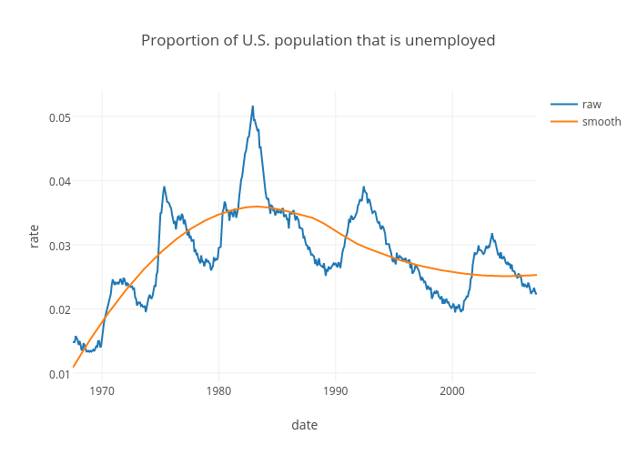

\newpage

# Problem Statement

> "[The web] has helped broaden the focus of statistics from the modeling stage to all stages of data science: finding relevant data, accessing data, reading and transforming data, visualizing the data in rich ways, modeling, and presenting the results and conclusions with compelling, interactive displays." - [@nolan-lang]

The web, as a platform, provides solutions to problems that have vexed statistical computing for decades, such as portability, reproducibility, and remote collaboration. However, in many cases, we lack the proper interfaces to leverage web services in a way that is practically useful for people doing data analysis and statistics research. Part of the problem is that web technologies evolve at a rapid pace, and new web services appear nearly everyday, so writing custom interfaces for every useful tool on the web takes a continuous and serious community effort. As evident by the [CRAN task view on web technologies and services](https://cran.r-project.org/web/views/WebTechnologies.html) [@web-task-view], there are many such interfaces for the R project, the world's leading open source statistical programming software [@RCore].

R has a long history of serving as an interface to computational facilities for the use by people doing data analysis and statistics research. In fact, the motivation behind the birth of R's predecesor, S, was to provide a direct, consistent, and interactive interface to the best computational facilities already available in languages such as FORTRAN and C [@S:1978]. This empowers users to focus on the primary goal statistical and exploratory data analysis, rather than the computational implementation details. By providing more and better interfaces to web services, we can continue to empower R users in a similar way, by making it easier to acquire/share data, create interactive web graphics, perform cloud computing, practice reproducible research, collaborate remotely, and share their work with a larger audience.

Reproducibility and portability have been a particularly big problem interactive statistical graphics. Historically, open source options are often hard to install since they typically assume non-standard software is available on users' systems. Modern web browsers with `HTML5` support are now ubiquitous, a provide an adequate platform for hosting interactive statistical graphics. However, interfacing web-based visualizations with statistical software remains difficult and often requires juggling a handful of languages and technologies. Again, by providing better interfaces for creating web-based interactive statistical graphics, we can make them more accessible, and therefore make it easier to communicate statistical concepts with a wider audience.

\newpage

# Overview

This section is a concise overview of my research on making web-based interactive graphics and data on the web more accessible. I currently maintain a number of software projects (including 7 different R packages) that address this common theme. It also provides some background on the area, describes similar work being done, points out remaining problems, and a bit on my vision for future work.

## What is an interface?

[@Unwin:1999vp] addresses this question and makes the important distinction of interfaces between software systems and interfaces between users and software. To emphasize the difference, the latter is called a user-interface. It is reasonable to judge a user-interface based on its effectiveness in aiding the user complete their task, but as [@Unwin:1999vp] points out, "There is a tendency to judge software by the most powerful tools they provide (whether with a good interface or not)". Good user-interfaces for statistical computing often abstract functionality from more powerful (lower-level) interfaces in a way that allow users to focus on their primary task, rather than the implementation details, without limiting the possible use case. Using [@tidy-data] as an example, [@Donoho:2015tu] argues that these abstractions "May have more impact on today’s practice of data analysis than many highly-regarded theoretical statistics papers".

<!-- TODO
More motivation via Bill Cleveland's Tool Evaluation?
http://www.stat.purdue.edu/~wsc/papers/datascience.pdf
-->

Well designed user-interfaces make data analysts more efficient, and also make software developers more efficient. To date, more than 500 R packages depend on the __Rcpp__ package which provides a seamless interface between R with C++ [@Rcpp]. R itself does provide some utilities to run Fortran/C/C++ code from R, but the implementation details are quite cumbersome and time-consuming in comparison. As far as interfacing R with other languages goes, some other notable efforts are the __rJava__ and __rPython__ packages [@rJava]; [@rPython]. These types of interfaces provide "low-level" bindings that make it _possible_ to interface R with other languages, which is a major contribution in its own right, but do not necessarily make certain tasks more _efficient_.

### Interfaces for Working with Data on the Web

R has a rich history of interfaces for acquiring data off the web. Extending ideas from [@Chambers:1999], Brian Ripley implemented the connections interface for file-oriented input/output in R [@Connections]. This interface supports a variety of common transfer protocols (HTTP, HTTPS, FTP), providing access to most files on the web that can be identified with a Uniform Resource Locator (URL). However, there are a few important limitations to this interface. Most importantly, connection objects are external pointers, meaning that they point to where the data is located, not the data itself. Thankfully there is a host of base R functions for reading from connections, such as `scan`, `readLines`, `read.table`, `read.csv`, etc. These functions work well for well-structured plain-text files, but do not work well for common file formats found on the web such as HTML, XML, and JSON. Another important limitation of the standard R connection interface is its support for interacting with web servers.

The __RCurl__, __XML__, and __RJSONIO__ packages were major contributions that addressed the interface limitations between R and popular web technologies [@nolan-lang]. The __RCurl__ package provides low-level bindings to the C library libcurl, making it possible to transfer data over more network protocols, interact with web servers (e.g., submit forms, upload files, etc.), process their responses, and handle other details such as redirects and authentication [@RCurl]. The __XML__ package provides low-level bindings to the C library libxml2, making it possible to download, parse, and create XML (and HTML) [@XML]. The __RJSONIO__ package provides a mapping between R objects and JavaScript Object Notation (JSON) [@RJSONIO]. These packages were ahead of their time, and heavily used for years, but for many reasons, several more modern interfaces have gained traction in recent years.

The __curl__, __httr__, __xml2__, and __jsonlite__ packages are more modern R interfaces for working with web technologies [@xml2]; [@jsonlite]. The __curl__ package provides a much simpler interface to libcurl that also supports streaming data (useful for transfering large data), and also has better performance than __RCurl__ [@curl]. The __httr__ package builds on __curl__ and organizes it's functionality around HTTP verbs (GET, POST, etc.) since most web application programming interfaces (APIs) do the same [@httr]. It also provides some useful facilities for handling HTTP errors. The __rvest__ package builds on __httr__ to make it easy to extract components of HTML/XML files which is quite useful since many web pages embed structured data within larger less-structured documents [@rvest].


However, the connections interface essentially treats everything as a character string, so special parsers 

The __htmlwidgets__ package provides a framework for creating HTML widgets that render in various contexts including the R console, 'R Markdown' documents, and 'Shiny' web applications [@htmlwidgets]. (TODO: use this a transition point for moving to GUI/shiny applications?)

Functional programming paradigm works well for computational problems with well defined input/output. With interactive web graphics you want to the output to be dynamic, meaning that users can modify the "inputs" even after the output has been determined.

## Acquiring Data on the Web

The R packages __pitchRx__, __bbscrapeR__, __XML2R__,  and __rdom__ all provide utilities for acquiring data hosted on the web. Amongst them, __pitchRx__ and __bbscrapeR__ have the highest level interface and are aimed at a known set of Uniform Resource Locators (URLs). Their interface is designed so that users do not need any understanding of underlying file formats that contain the data (e.g., `XML`, `JSON`). In order to acquire some data, users just need the package installed, so a very minimal amount of computational setup is required. If acquiring large amounts of data, to avoid memory limitations, users may divert incoming data to a database using any valid R database connection [@DBI].

For these reasons, __pitchRx__ and __bbscrapeR__ provide a nice resource for teaching and practicing applied statistics, and serve as a model for providing access to clean versions of messy datasets on the web [@Unwin:2010]. Providing _access_ to data in this way is more desirable than rehosting data for several reasons. In some cases, it helps avoid legal issues with rehosting copyrighted data. Furthermore, the packages are self-documenting, so users can inspect the cleaning and transformations performed on the data to ensure its integrity. They are also versioned, which makes the data acquisition, and thus any downstream analysis, more reproducible and transparent. Perhaps most importantly, the data that these packages provide access to are updated at least several times a day, so users can keep their local copies up to date without any assistance from the maintainer.

```{r, eval = FALSE, echo = FALSE}
library(rvest)
tabs <- read_html("https://ropensci.org/packages/") %>% 
  html_nodes("table") %>% lapply(html_table)
nrow(tabs[[2]])
# [1] 50
```

__pitchRx__ and __bbscrapeR__ are specific to sports data, but the same idea is used in many different domains. Perhaps the largest centralized effort in this direction is lead by [rOpenSci](https://ropensci.org), a community of R developers that, at the time of writing, maintains more than 50 packages providing access to scientific data ranging from bird sightings, species occurrence, and even text/metadata from academic publications. This provides a tremendous service to researchers who want to spend their time building models and deriving insights from data, rather than learning the programming skills necessary to acquire and clean it.

It's becoming increasingly clear that "meta" packages that standardize the interface to data acquisition/curation in a particular domain would be tremendously useful. However, it is not clear how such interfaces should be designed. The __etl__ package (a joint work with Ben Baumer) is one step in this direction and actually aims to provide a standardized interface for _any_ data access package that fits into an Extract-Transform-Load paradigm [@etl]. The package provides generic `extract`-`transform`-`load` functions, but requires developers to write custom `extract`-`transform` methods for the specific data source. In theory, the default `load` method works for any application; as well as other database management operations such as `update` and `clean`.

The Web Technologies and Service CRAN Task View does a great job of summarizing data access packages in R, and even breaks them down by their domain application (e.g., Government, Finance, Earth Science, etc) [@web-task-view]. It also details more general tools for requesting, parsing, and working with popular file formats on the web from R that many of the data access packages use to implement their functionality. Two other packages I maintain: __XML2R__ and __rdom__ fit into this broader category.

__pitchRx__ and __bbscrapeR__ leverage __XML2R__: a wrapper around the __XML__ package for transforming XML content into tables [@XML]. __XML__ provides low-level R bindings to the libxml2 `C` library for parsing XML content [@Veillard:2006]. __XML2R__ builds on this functionality and makes it possible to acquire, filter, and transform XML content into table(s) without any knowledge of the verbose `XPATH` and `XSLT` languages. These high-level semantics make it easier to maintain projects such as __pitchRx__ and __bbscrapeR__ since it drastically reduces the amount of code. Chapter [Taming Pitch f/x data with XML2R and pitchRx](#sec:pitchRx) details these abstractions, and how they are used in __pitchRx__, in more detail.

The __openWAR__ package provides high-level access to Pitch f/x data like __pitchRx__, but it is currently more limited in the range of data types it provides [@openWAR]. It also currently depends on the difficult to install __Sxslt__ package, which provides an R interface to libxslt [@Sxslt]. __openWAR__ depends on __Sxslt__ to help transform XML files to R data frames via XSL Transformations (XSLT). Without advanced knowledge of the very verbose XSLT specification, packages like __openWAR__ are forced into hard coding many assumptions about the XML format, such as the names of fields of interest. New fields have been added to the Pitch f/x XML source several times, and __pitchRx__ automatically picks them up, since its __XML2R__ transformations can accommodate new field names.

__rdom__ makes it easy to render dynamic web pages and access the Document Object Model (DOM) from R via the headless browsing engine phantomjs [@rdom]. This fills a void where other web scraping packages in R (e.g., __XML__, __xml2__, __rvest__) currently fall short. These packages can download, parse, and extract bits of the HTML page source, which is static, but they lack a browsing engine to fully render the DOM. If the DOM cannot be rendered, content that is dynamically generated (e.g., with `JavaScript`) cannot be acquired. The R package __RSelenium__ can also render dynamic web pages and simulate user actions, but its broad scope and heavy software requirements make it harder to use and less reliable compared to __rdom__. 

## Interactive Statistical Graphics

A fundamental limitation in data visualization is the 2D display of a computer screen. There are ways to perceive multi-variate relationships  

As [@Wilhelm:2008jb] points out, there are essentially four basic approaches to visualizing high-dimensional data. 

- Examples that illustrate why interactive is essential

- History

## Web-based Technology

What does it mean for a graphic to be _interactive_? The answer depends heavily on who is using the term, and the context in which it is used. Even within the statistical graphics community, the definition is not uniformly agreed upon, and one's requirement(s) to label a graphics system as interactive is quite variable [@swayne-klinke]. This section lays out some more precise language for discussing interactive graphics, motivates their existence, and explains where my work fits into this landscape.

Before investigating _what_ interactivity means, perhaps its better to ask why is it useful? Graphics are traditionally used to present information to a larger audience. Good statistical graphics ensure that information is portrayed accurately, and focuses particularly on conveying uncertainty. Historically, interactive statistical graphics are not used for present results of an analysis, but rather as a discovery tool, prior to, during, or even after the modeling stage. More specifically, interactive graphics are useful for identifying problems or refining preconceptions about a given dataset, gaining a deeper understanding of model fitting algorithms, and even as a model selection tool [@Wickham:2015ur]; [@Unwin:2003uy]; [@Gelman:2015wi].

With the rise of the web browser (and in particular `HTML5` technologies), like it or not, the role of interactive graphics is generally shifting from discovery to presentation. Nowhere is this more evident than at major news outlets like the New York Times and The UpShot, where interactive graphics are constantly used in web publications, to allow readers to explore data that supplement a narrative. There are some [exceptions to the rule](http://www.nytimes.com/2014/05/02/upshot/how-not-to-be-misled-by-the-jobs-report.html), but all too often, these graphics ignore measures of uncertainty, and instead focus on conveying the most amount of information is the most effective way possible. To some degree, this highlights the difference in goals between the statistical graphics and InfoVis communities [@Gelman:2013et].

Historically, open source interactive graphics software is often hard to install and practically impossible to distribute to a wider audience. The web browser provides a viable solution to this problem, as sharing an interactive graphics (and even a specific _state_ of the visualization) can be as easy as sharing a Uniform Resource Locator (URL). The web browser doesn't come without some restrictions; however, since it is impossible to maintain the state of multiple windows, a fundamental characteristic of most interactive graphics software. Fortunately, we can still produce linked views by putting multiple plots in a single window.

<!-- TODO
How to transition from why to what?
-->

Some early statistical literature on the topic uses interactive in the sense that interactive programming environments allow users to create graphics on-the-fly [@S:1984]. That is, the programming environment has a prompt, which can read a command to generate a plot, evaluates that command, and prints the result. 

The read–eval–print loop (REPL) is a generally useful quality for a statistical programming environment to possess, since in constrast to other programming paradigms, the emphasis is on exploring the content of the data, which is often riddled with imperfections that must be addressed before any statistical modeling takes place. Assuming that the print stage outputs a static plot, this "interactivity" is limited and can be time-consuming since commands must be modified in order to obtain new views or details.

Another common interpretation of interactivity involves a Graphical User Interface (GUI) which abstracts away the REPL from end users by providing widgets or controls to alter commands. In this sense, even for experienced statistical programmers, a GUI can still be useful when the REPL impedes our ability to perform graphical data analysis [@Unwin:1999vp]. 


A wide array of GUI toolkits have been available in R for years, and many of them interface to GUI construction libraries written in lower-level languages. A couple fairly recent and popular examples include the __RGtk2__ package which provides R bindings to the GTK+ 2.0 library written C  and the __rJava__ package which provides R bindings to Java. A more modern approach to GUI development is via the Web browser, and has been made quite easy thanks to the R package __shiny__ [@shiny].


[@Wilhelm:2003ei] "Information overload that would prevent perception can be hidden at the 1st stage and detailed information can be made available on demand by responding to interactive user queries"

[@ggobi:2007] "plots that respond in real time to an analyst's queries and change dynamically to re-focus, link to information from other sources, and re-organize information."


* Talk about rggobi and controling a standalone application from the command-line?
  * R bindings that talk to JSON specifications are most similar to this approach


The __animint__ package uses __RSelenium__ in order to test whether visualizations render correctly in a web browser. When I started on __animint__, we were only testing the R code that compiles __ggplot2__ objects as `JSON` objects, but had no way to programmatically test the `JavaScript` code that takes the `JSON` as input. If __animint__ were limited to static web-based graphics, we could use the lighter-weight __rdom__ for testing, but we need to simulate user actions to verify animations and interactive features work as expected.

<!-- TODO
  Explain details behind testing the renderer? 
-->

In addition to adding infrastructure for testing __animint__'s renderer, I've made a number of other contributions:

1. Wrote bindings for embedding __animint__ plots inside of knitr/rmarkdown/shiny documents, before the advent of __htmlwidgets__, which provides standard conventions for writing such bindings [@htmlwidgets]. At the time of writing, __htmlwidgets__ can only be rendered from the R console, the R Studio viewer, and using R Markdown (v2). For this reason, we decide to not use __htmlwidgets__ since users may want to incorporate this work into a different workflow. 

2. Wrote `animint2gist`, which uploads an __animint__ visualization as a GitHub gist, which allows users to easily share the visualizations with others via a URL link.

3. Implemented __ggplot2__ facets (i.e., `facet_wrap` and `facet_grid`) as well as the fixed coordinate system (i.e., `coord_fixed`).

4. Mentored and assisted Kevin Ferris during his 2015 Google Summer of Code project where he implemented theming options (i.e., `theme`), legend interactivity, and selectize widgets for selecting values via a drop-down menu.

When I started on __plotly__, it's core functionality and philosophy was very similar to __animint__: create interactive web-based visualizations using __ggplot2__ syntax [@plotly]. However, plotly's `JavaScript` graphing library supports chart types and certain customization that __ggplot2__'s syntax doesn't support. Realizing this, I initiated and designed a new domain-specific language (DSL) for using plotly's `JavaScript` graphing library from R. Although it's design is inspired by __ggplot2__'s `qplot` syntax, the DSL does not rely on __ggplot2__, which is desirable since its functionality won't break when __ggplot2__ internals change.

plotly's 'native' R DSL is heavily influenced by concepts deriving from pure functional programming. The output of a pure function is completely determined by its input(s), and because we don't need any other context about the state of the program, it easy to read and understand the intention of any pure function. When a suite of pure functions are designed around a central object type, we can combine these simple pieces into a pipeline to solve complicated tasks, as is done in many popular R packages such as __dplyr__, __tidyr__, __rvest__, etc [@pipelines].

__plotly__'s pure functions are deliberately designed around data frames so we can conceptualize a visualization as a pipe-able sequence of data transformations, model specifications, and mappings from the data/model space to visual space. With the R package __ggvis__ [@ggvis], one can also mix data transformation and visual specifications in a single pipeline, but it does so by providing S3 methods for __dplyr__'s generic functions, so all data transformations in a __ggvis__ pipeline have to use these generics. By directly modeling visualizations as data frames, __plotly__ removes this restriction that transformation must derive from a generic function, and removes the burden of exporting transformation methods on its developers.

__plotly__ even respects transformations that remove attributes used to track visual properties and data mappings. To demonstrate, in the example below, we plot the raw time series with `plot_ly()`, fit a local polynomial regression with `loess()`, obtain the observation-level characteristics of the model with `augment()` from the __broom__ package, layer on the fitted values to the original plot with `add_trace()`, and add a title with `layout()`. 

```{r, eval = FALSE}
library(plotly)
library(broom)
economics %>%
  transform(rate = unemploy / pop) %>%
  plot_ly(x = date, y = rate, name = "raw") %>%
  loess(rate ~ as.numeric(date), data = .) %>%
  augment() %>%
  add_trace(y = .fitted, name = "smooth") %>%
  layout(title = "Proportion of U.S. population that is unemployed")
```



To make this possible, a special environment within __plotly__'s namespace tracks not only visual mappings/properties, but also the order in which they are specified. So, if a __plotly__ function used to modify a visualization (e.g., `add_trace()` or `layout()`) receives a data frame without any special attributes, it retrieves the last plot created, and modifies that plot. 

__animint__ and __plotly__ could be classified as general purpose software for web-based interactive and dynamic statistical graphics; whereas __LDAvis__, could be classified as software for solving a domain specific problem. The __LDAvis__ package creates an interactive web-based visualization of a topic model fit to a corpus of text data using Latent Dirichlet Allocation (LDA) to assist in interpretation of topics. The visualization itself is written entirely with `HTML5` technologies and makes use of the `JavaScript` library d3js [@Bostock:2011] to implement advanced interaction techniques that higher-level tools such as __plotly__, __animint__, and/or __shiny__ do not currently support. 

<!-- TODO
  * Make argument that problem-driven vis requires lower-level tools?
  * Explain which parts I/Kenny did on LDAvis?
    * Designed and authored most of the initial implementation -> https://gallery.shinyapps.io/LDAelife
    * Helped implement the completely client-side application ->
https://cpsievert.github.io/LDAvis/reviews/vis/
-->


# Scope

This section describes work to be achieved before completion of the thesis. Most of the work involves writing and revising papers. I have a very early start on two papers that will summarize modern interfaces in R for interactive web graphics as well as curating data on the web.


In February 2015, I was invited to write a chapter on MLB Pitching Expertise and Evaluation for the Handbook of Statistical Methods for Design and Analysis in Sports, a volume that is planned to be one of the Chapman & Hall/CRC Handbooks of Modern Statistical Methods. I've since brought on Brian Mills as a co-author, and we submitted a draft in early November. This chapter uses data collection and visualization functionality in the __pitchRx__ package, but it more focused on modeling this data with Generalized Additive Models. The book likely won't be published until after this thesis is completed, and the chapter probably won't be included in the thesis, but I do intend on working on revisions of this chapter in the meantime.

Toby Dylan Hocking, Susan VanderPlas, and I have a paper in progress which outlines the design of __animint__ and it's interesting features <https://github.com/tdhock/animint-paper/>. We've submitted this paper to IEEE Transactions on Visualization and Computer Graphics, and were told to revise and resubmit. We intend on revising and submitting to the Journal of Computational and Graphical Statistics by January 2016. The revision includes a restructuring of the content/ideas and new features implemented during Google Summer of Code 2015. I also intend on adding a new case study on using ideas from cognostics in __animint__ for guiding visualizations that contain many states/views. The paper will be included as one of the chapters in my thesis.

We have a long [TODO list](https://github.com/tdhock/animint/blob/4257e8cf76eb5021a98010b6629b779a4f383b24/NEWS#L1-L177) with known bugs and features we'd like to implement in __animint__ after we submit to JCGS. As of writing, I'm working on numerous bug fixes in __plotly__, introduced by a massive reworking of __ggplot2__ internals in version 1.1. I intended on making similar fixes for __animint__ so users can rely on the CRAN version of __ggplot2__, rather than [our fork on GitHub](https://github.com/tdhock/animint). This work simply ensures packages are _usable_, but I'm also interested in expanding the scope of __animint__, which may lead to paper(s) after the thesis is submitted:

1. The current design of __animint__ requires pre-computation of every state the visualization can possibly take on. One benefit of this approach is that we don't need any special software besides a web browser for viewing, and bodes well for cognostic-like applications, but when the number of states is very large, pre-computation can take a long time, and the amount of data that the browser tries to upload can be very large. Instead of pre-computing these states, we could dynamically compute states, only when user requests them, using a HTTP requests. The __plumbr__ and __opencpu__ packages assist in creating a REST API providing the ability to execute arbitrary R functions over HTTP, allowing us to define endpoints at compile time, create/destroy them during the rendering/viewing stage, and all of this could be done on a viewer's machine if R is installed. This addition to __animint__ would be helpful for visualizations with many states, but in order to retain responsiveness, each state would need to be relatively cheap to compute.

2. Integrate crossfilter.js into __animint__. This should help relax current restrictions that summary statistics impose on showing/selecting values. 


I also intend being the sole author on two independent papers: one on strategies for testing interactive web-based graphics software from R, and one on curating data with R.


# Taming PITCHf/x Data with XML2R and pitchRx

Completed, and published in the RJournal. See <http://rjournal.github.io/archive/2014-1/sievert.pdf>

# Curating Open Data in R

Work in progress. See <https://github.com/cpsievert/thesis/blob/master/curate.Rmd>

# LDAvis: A method for visualizing and interpreting topics

Completed, and published in the Proceedings of the Workshop on Interactive Language Learning, Visualization, and Interfaces. See <http://nlp.stanford.edu/events/illvi2014/papers/sievert-illvi2014.pdf>

# Two new keywords for interactive, animated plot design: clickSelects and showSelected

Currently in revision. See <https://github.com/tdhock/animint-paper/blob/master/HOCKING-animint.pdf>

# Web-based Interactive Statistical Graphics

Work in progress. See <https://github.com/cpsievert/thesis/blob/master/web-graphics.Rmd>

# Testing interactive web-based graphics software from R

The current trend in web-based interactive statistical graphics is provide various language bindings to `JavaScript` charting libraries. To test whether the entire software stack is working as intended, it's common to verify properties of the data sent to the binding, but this does not guarantee that the end result is what we expect. A proper testing framework for this type of software should be able to construct and manipulate the Document Object Model (DOM) using technologies available to modern web browsers. To our knowledge, __animint__ is the first R package to implement this testing approach, and some of the lessons learned could be used to construct a more reliable and easier to use testing suite.

# Timeline

* January: Submit animint paper.
* Feburary: Submit curating data paper.
* March: Submit Web Graphics paper
* April:
* May:

# References
